In the [last article](/posts/actors-message-passing/), we saw how an actor/agent can help us with a concurrent system. As I mentioned, we did not implement a "true" actor. However, we have clarified one fact that distinguishes one from another - actors can spawn children and supervise them.

_One actor is no actor. They come in systems._

Today we are going to build upon what we left last time and add two important aspects of the actor model and systems based on it. We will implement a crucial feature of an actor model - ability to create children and supervise them. An `ActorRef` type will also be added - an indirection for our actors mailbox.

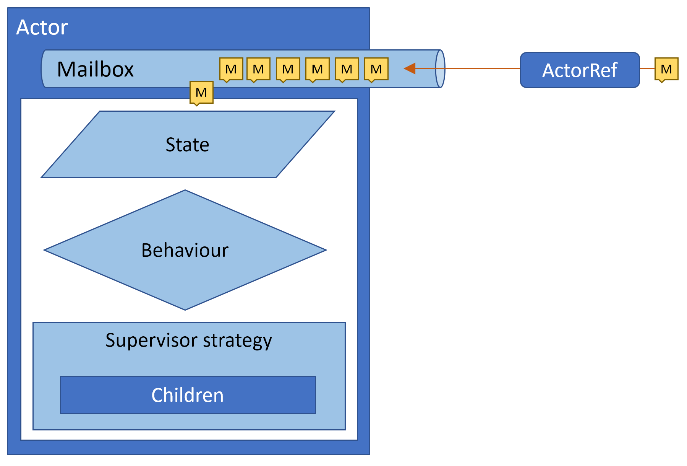

## Actor system

A true actor does not live alone, it is surrounded by other actors. All those actors we call a system. It usually has a tree-like structure with a single parent on top. It can create children, and children may create new ones too.

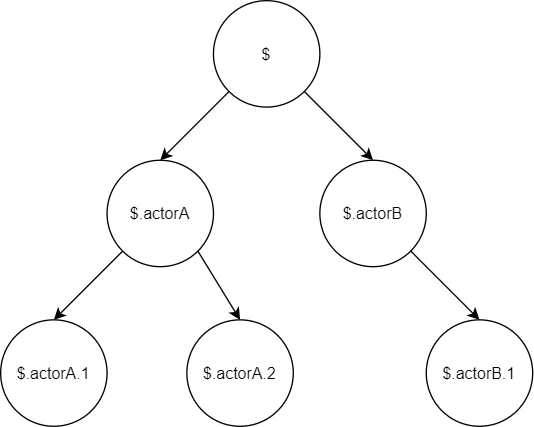

A child may be created at the start of the system, or as a result of a message being sent. Lifetime also depends on the purpose and type of actor. One can be created to be terminated seconds later, others will live for the entire lifespan of the system.

Parents not only spawn children, but they are also responsible for their behavior. If one misbehaves, the parent actor needs to react. We call this supervision policy.

## Idea of supervision

Erlang introduced “let it crash” philosophy. The idea is, that our code does not have to be defensive and handle all possible problems or exceptions. If something happens, it happens. This reduces code complexity and boilerplate.

So, what should happen if we divide by zero? Our actor is always being supervised by its parent who knows about any exception being thrown, regardless of where the message originated from. At this moment parent has several options on how to handle this situation:
- Allow to skip problematic message - actor will proceed to process another message from its mailbox.
- Forcefully stop child - actor will immediately abandon any messages and stop any children it is supervising.
- Restart the child - actor will be stopped and recreated again. The problematic message will be resubmitted.
- Notify grandparent - parent may not know how to solve the issue, so it escalates the problem higher. Grandparent again may do any of those 4 options.

Those 4 policies are borrowed from framework Akka.NET and simplified. Actual policies are much more complicated and different frameworks may introduce many others as well.

## Building our own framework

Like in the previous article we will try to write our own framework to better understand how such a system may work. This time, I am going to mimic Akka.NET approach. We are not going to cover a lot from its capabilities, rather focus on the basics.

https://getakka.net/

Code is available at https://github.com/tomwolanski/actormodel/tree/master/ActorSystem

## Actor vs ActorRef

As mentioned before, we are going to introduce a new "proxy" type `ActorRef`. It is not mandatory in simple systems but comes handy in countless situations. The basic idea is to decouple a mailbox from an actor and provide a small object that implements only method Tell. This is the only object presented to user code, the actual actor instance is never accessible.

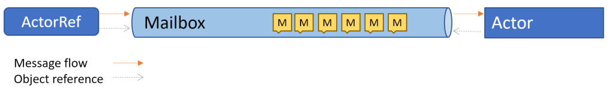

Mailbox (`System.Threading.Channels.Channel` in our case) becomes completely independent from our actor, who will receive a read-only endpoint as a parameter. In our scenario this allows us to easily restart the children without any messages lost or need to notify other actors. A new instance of an actor can be recreated and immediately start working on already scheduled messages. All other actors have access only to `ActorRef` object, so are not even aware of the actor being just restarted and can still send new messages.

`ActorRef` can also be embedded into messages. It allows actors to develop a complex network of communication and not use only parents or direct children as targets.

In distributed systems, this kind of proxy brings us another capability: location transparency. Since all actors sending messages use only `ActorRef`, there is no problem to introduce some additional transport between ActorRef and actors mailbox. Akka and Akka.NET use this to allow our actors to work on clusters of machines in such a way, that the programmer does not have to be aware where the actor actually resides.

Our implementation will simply wrap around `ChannelWriter` of our mailbox. An `Id` property is introduced for easier identification. It holds a path of an actor in form of `$.parent.child.subchild`.

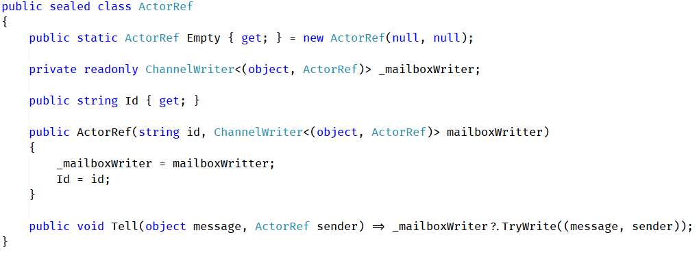

## Redesigning our actor base

Last time we saw our actor code, it was more "functional" - accepted our handler as a lambda parameter. It worked well for the previous article, today we are going to expand it a little bit. To make it easier on ourselves we change the paradigm. Our new object-oriented actor base will look like this:

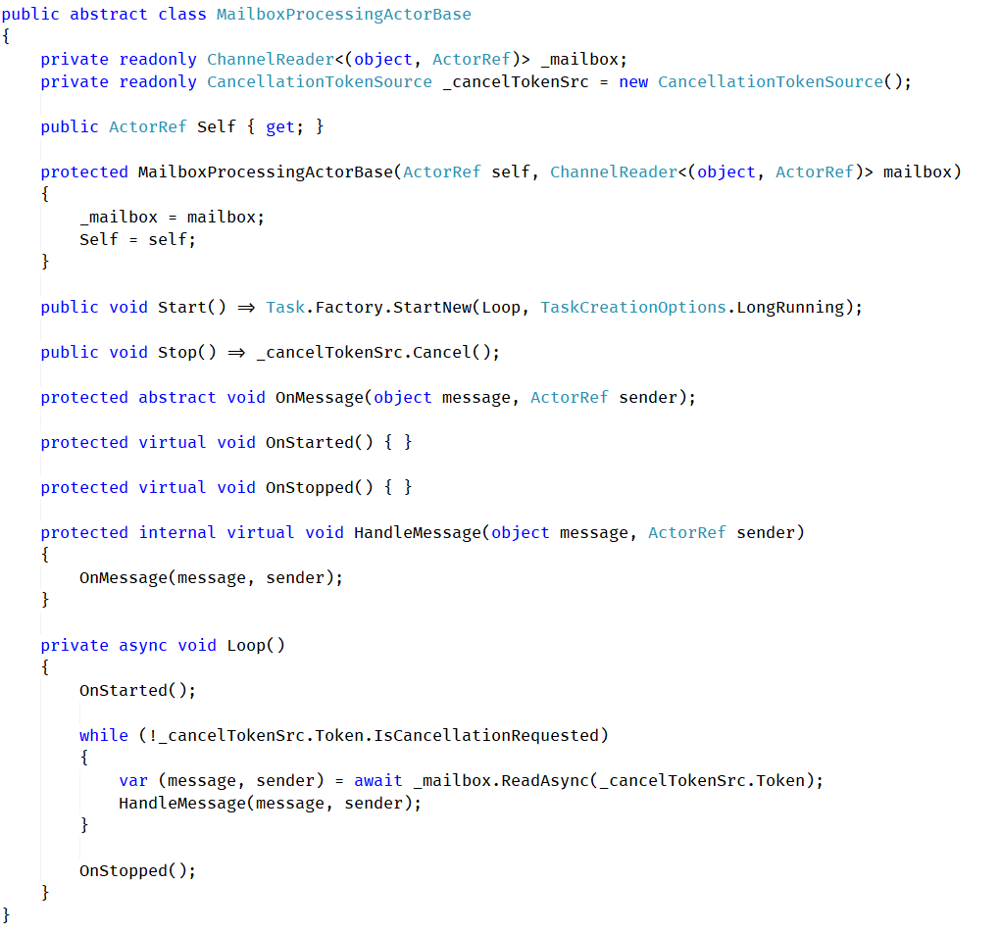

As we can see, we introduced some drastic changes to our code. The mailbox still accepts a pair of message and sender actor, but only read end is provided as a constructor parameter. We also need to manually iterate over the messages. This is due to the way how `ReadAllAsync` works internally ([link](https://source.dot.net/#System.Threading.Channels/System/Threading/Channels/ChannelReader.netstandard21.cs,cba14ccd7fceae72)). The cancellation token is not checked every message, rather it is used to fetch a batch of messages, that will be later iterated on.

`GracefulStop` method is omitted, but we introduced `Stop` - method to kill actor instantly. It will be used in supervision scenarios. A `Self` parameter and property allows actor to utilize its own `ActorRef` instance.

## Exception handling and reporting

Let's focus on a child actor for a moment. In case of exception, it needs to notify the parent immediately. This information cannot be sent via mailbox, it needs to delivered by a separate channel. In our scenario, we will utilize a simple callback invoked by child on its parent, where some info will be provided, like exception type or message being processed.

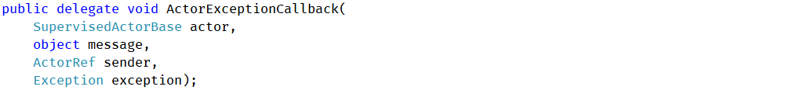

Our supervised child actor needs to receive this callback from its parent. It will be invoked on any exception that may occur during actors work.

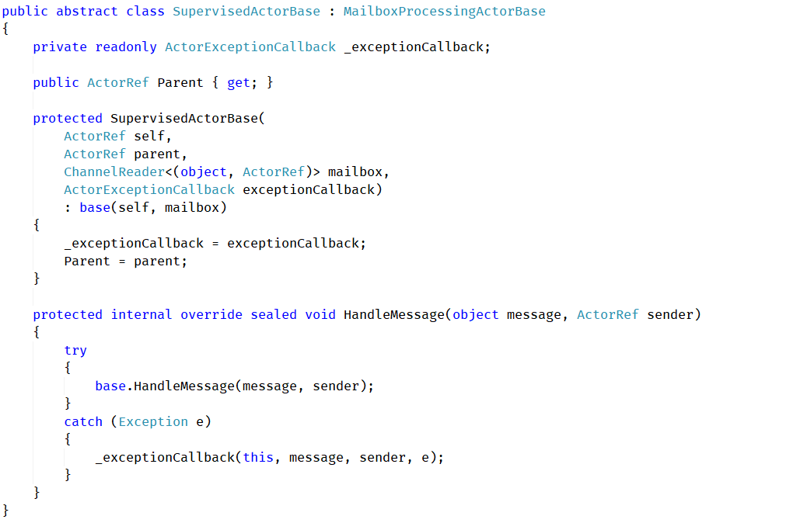

Child actor also receives a parent ActorRef instance, to be able to communicate and send messages.

## Creating children and parental supervision

Our exception callback would be useless if there was no parent to listen. Our parent will also be a child (even if directly under root), so we are going to inherit from `SupervisedActorBase`. There is no real reason for splitting the supervised and supervising types like that, I did this only for clarity of the code.

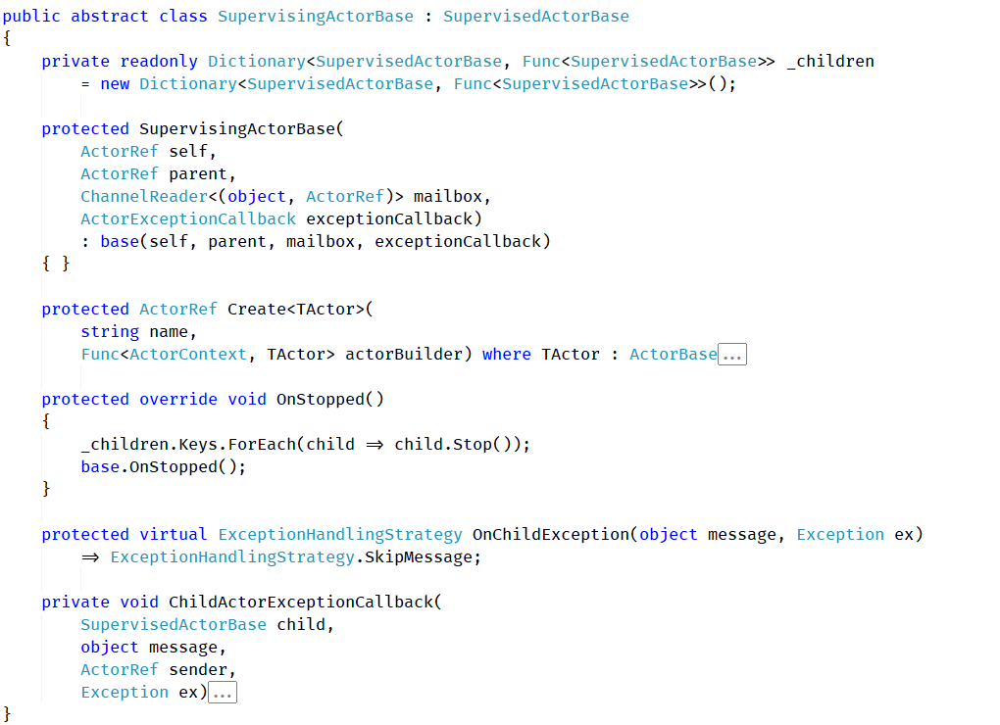

Except for the `ChildActorExceptionCallback` mentioned before two new methods were introduced. `Create` and `OnChildException`. Let's start with the latter one, it is a protected method that programmer can use to determine what should happen when an error occurs. Based on the message and exception we can pick one of the strategies mentioned earlier:

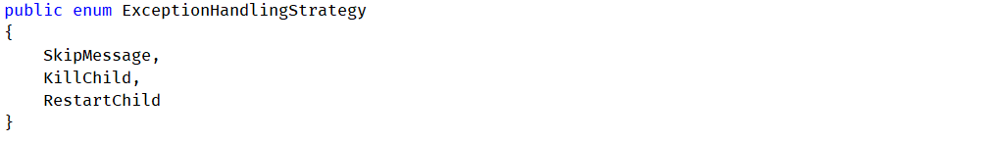

Before we continue with `Create` method, for sake of our own sanity, let's reduce the number of constructor parameters by wrapping them into `ActorContext`, and introducing a final base class for all our actors - `ActorBase`.

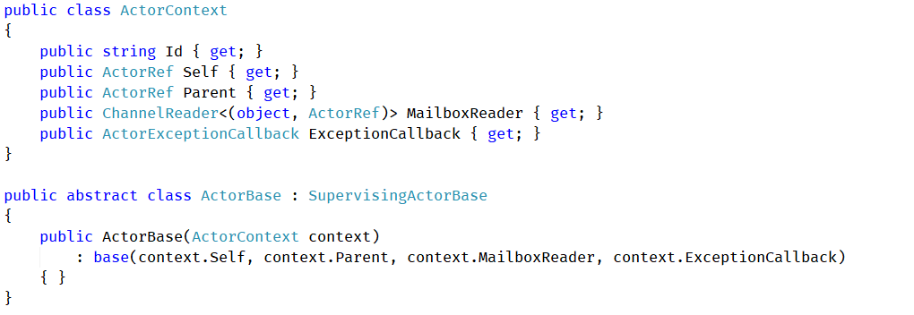

Back to `Create` method. We would like to be able to name a child and pass additional parameters to its constructor. One mandatory parameter will be our context:

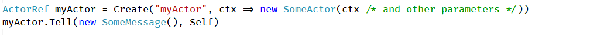

All custom actors will need to inherit from `ActorBase`. This will be enforced by `Create` method used to spawn children:

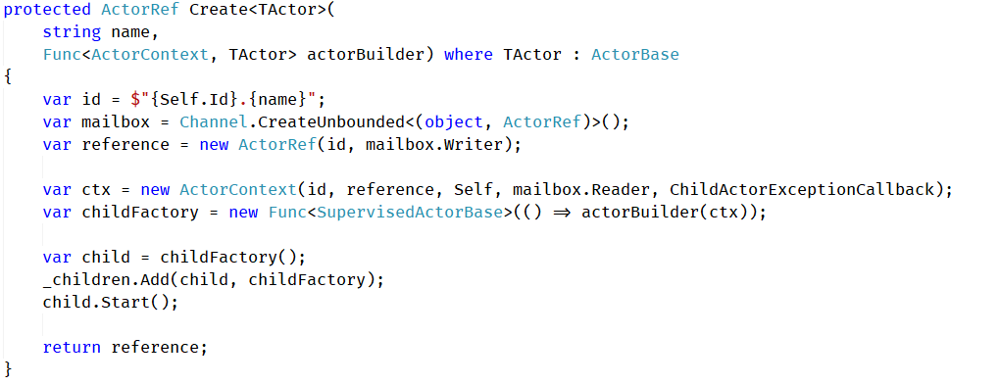

This is the place where all 3 components are created and brought together: mailbox, `ActorRef`, and actor instance itself.

I have to admit, that it could be more straightforward, however some additional code needed to be introduced to handle restart on exception scenario. Caution reader might probably wonder why `SupervisingActorBase._children` collection contains not only child instance but also a delegate to create a new one using the same parameters. This allows us to spawn an exact copy of the given actor if needed.

Speaking of restart scenario, we still have not implemented `ChildActorExceptionCallback`. Two of the cases are trivial, `SkipMessage` does nothing, `KillChild` stops sub-tree of actors and removes them from children collection. The most complicated scenario - restart stops faulted child and immediately replaces it with a new, fresh clone. To resubmit the problematic message we can simply use our internal method `HandleMessage`.

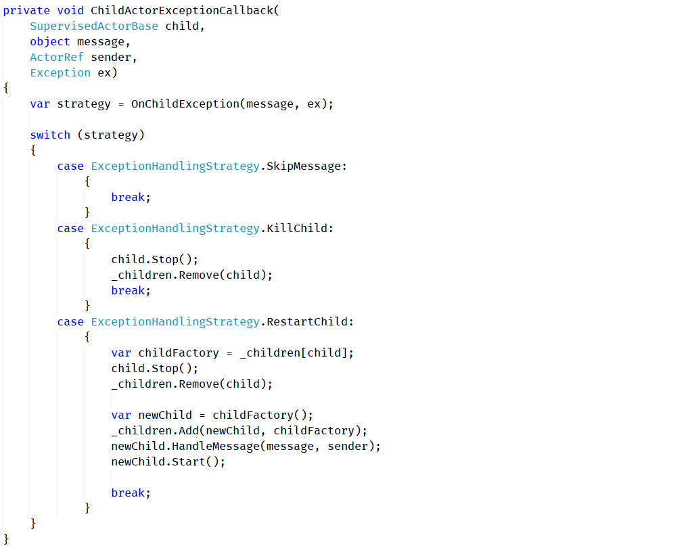

I feel obligated to mention, that his naive approach may result in an endless loop when a fresh copy of an actor is not able to handle the message. This is why proper policies also take into account number of attempts and many other variables. `OnStarted` method will also happen after the message is resubmitted. This should also be considered an issue, because resources required to handle the message may be allocated there. Since we are not trying to write a production-grade code, we will leave it here.

## One guardian to rule them all

One may ask how do we create the very first actor in the system? An actor named `$` is a special case of the supervising actor. It does not have a parent, and should not require context to be passed into the constructor.

It can also have more strict ways of handling children issues, so no exception would leak outside. For our needs, we can assume, that its default and only exception handling strategy is to permanently stop children. Because of that, it can be significantly simpler than other supervising actors.

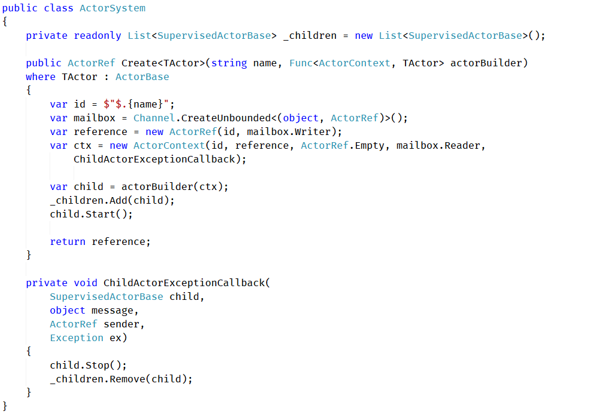

## Putting it all together

So, how we are going to use all of this to build a simple system? Let's try to recreate our previous exercise to estimate the value of π. This time, we create more than one actor, and arrange them in the hierarchy shown below:

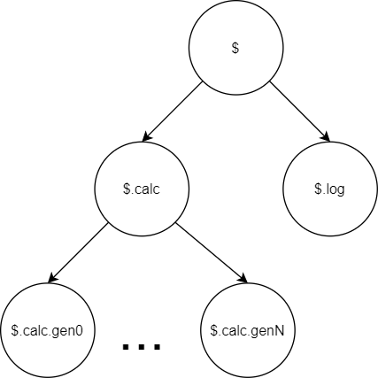

Our system we will start with 2 main actors:
- `calc` - the main actor that aggregates point info and estimates value of π in the same way as we did in the last article. It will create N children that will push random point information.
- `log` - the actor that will be polling value from calc and print it on the console output.

We are going to use the same messages as previously, and exact the same logic to in our `PiCalculatingActor`. One thing changed, we are utilizing `Create` method to build a collection of point generating actors
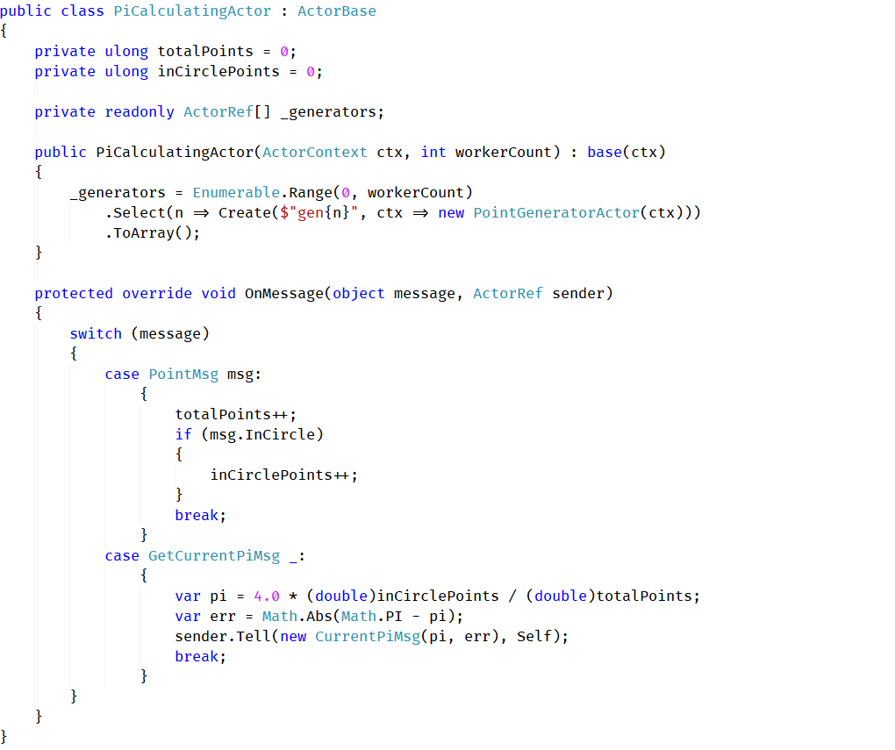

Because the `PointGeneratorActor` is a child of calc, it can push point messages directly to its parent:

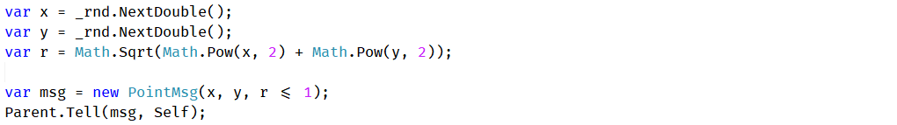

Things are a little bit more complicated with our logger actor. It is not directly related to `PiCalculatingActor`. In this siblings situation, we can simply pass `ActorRef` as a constructor parameter.

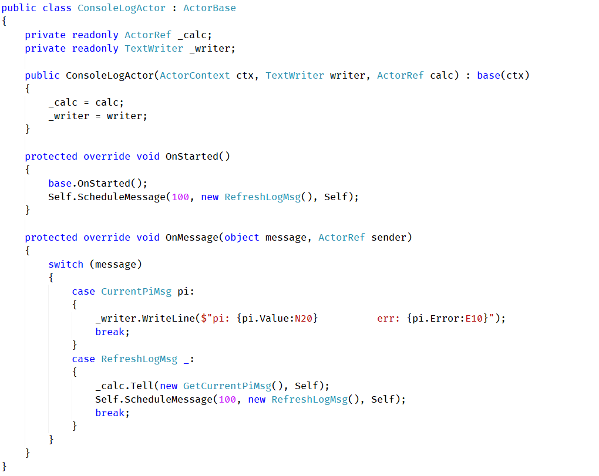

We also used here a neat actor trick to enable our periodic checking. Instead of creating a timer object, we can schedule a `RefreshLogMsg` message to our self when the actor has started. On handler of this message type we tell `PiCalculatingActor` to prepare a new estimation and send it back to us. Immediately after, we schedule another `RefreshLogMsg` message, so the whole operation can start once again.

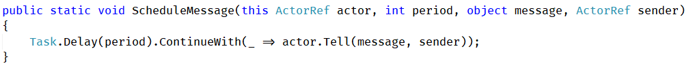

This is one of the patterns that occur quite often in actor system, also in most frameworks there is a dedicated message generator that can schedule messages after a specified delay or at an exact time. This makes sure that all code executed by our actor is a result of a message and any issue can be correctly handled by supervision policy. It also allows the system to efficiently schedule actors work and prevent thread pauses.

It is also important to notice, that we no longer use Ask. All communication between actors should be non-blocking. We told another actor to respond with some data, and instead of waiting for it, we can carry on with other work. The response will be delivered to our mailbox when it's ready.

Running the system could not be any simpler:

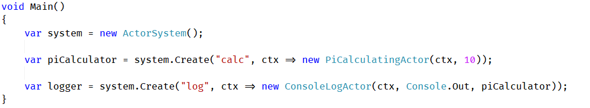

When run, we should be presented with a nice approximation of π:

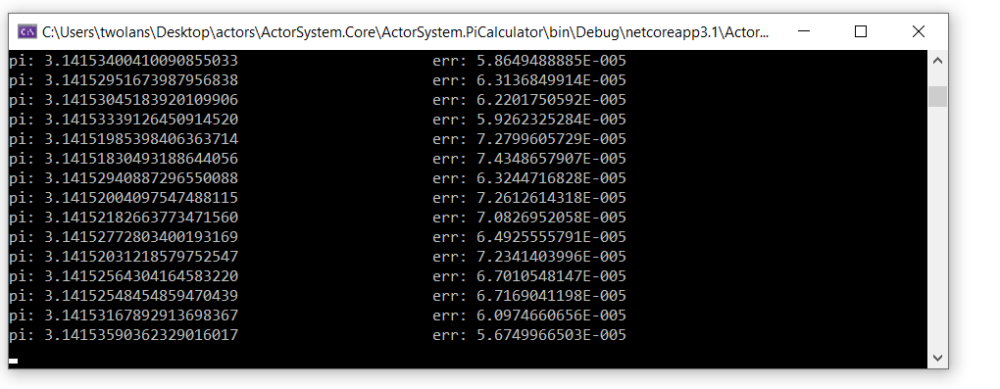

We spent all this time working on supervision and have not used it yet. Let's make an actor crash! We will add some print statements to `OnStarted` and `OnStopped` methods of `PointGeneratorActor` to better see what is happening:

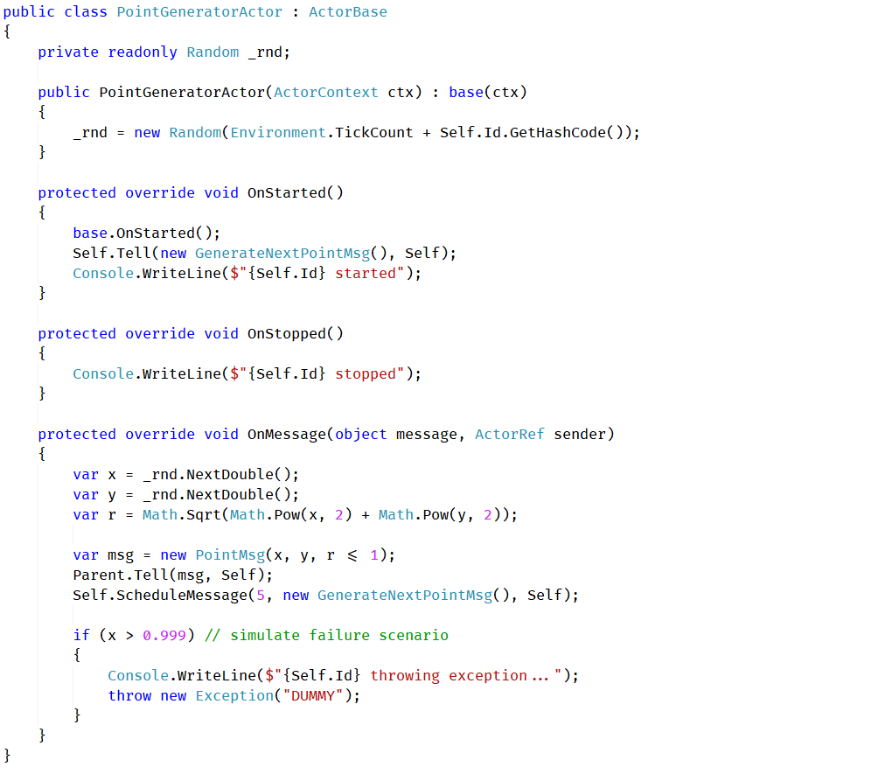

Our actor will fail at random messages. If we execute our code now, nothing special will happen, because we are using the default strategy of `PiCalculatingActor` - to skip problematic messages and continue to work. If we override it with something less forgiving:

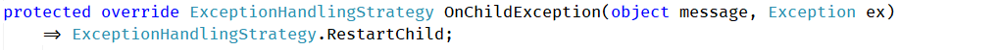

we will see much more interesting results. Our actors are correctly restarted:

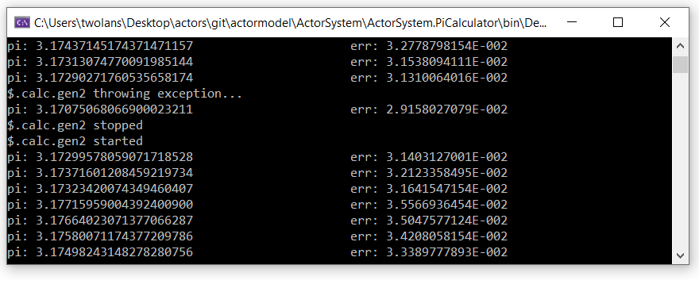

## Closing note

**This implementation is not close to being a proper production code.**

This whole project was written for fun and driven by the need to understand such a system in depth. It was not indented to be running any serious computations. As previously, `ConfigureAwait` was also omitted for code clarity and we still are using unlimited channels for mailboxes. We also utilize a naive and quite wasteful way of scheduling our actors and our supervision callback is not fully thread-safe.

For further reading on the topic, I can suggest many tutorials or other materials on Akka or Akka.NET, like this NDC talk:
[Akka.NET: The Future of Distributed Programming in .NET - Aaron Stannard](https://youtu.be/ozelpjr9SXE)

Like in the previous article, a lot of presented information was explained in:
[The Language of Actors - Vaughn Vernon](https://www.youtube.com/watch?v=KtRLIzG5c54)

