In early 2003 we experienced a change in IT world. Our hardware was different than before. The clock speeds stood still and to make our CPU faster we added more cores. Concurrency was already hard to deal with and now we needed to work with multi-threading machines as well. In times of modern CPUs like Xeon Phi with up to 288 threads and cloud computing the task of utilizing most of the clock cycles is a true challenge.

One of the possible solutions to work with concurrent/multi-threaded environments was proposed in 1973 - long time ago, yet it is still not widely adopted. Today we are going to take a peek into a message-driven computation approach called "actor model".

Probably the most well-known implementation of actor model was embedded into Erlang – Ericssons take to deal with problems of highly-concurrent telephony applications. It allowed to write distributed, fault tolerant, highly available and soft real-time systems. Since its creation in 1986, it raised awareness about the model and created a lot of interest in implementing similar approach. More languages followed and embedded actors into runtime, like Elixir (build on Erlang runtime) or F#. For many others frameworks were created like Akka, Akka.NET, or MS Orlean.

First, let’s check the definition:

- Conceptual model to deal with concurrent computation
- An actor is the primitive unit of computation
- Message driven
- On each message, it can do one of these 3 things:
    - Create more actors
    - Send messages to other actors
    - Designate what to do with the next message

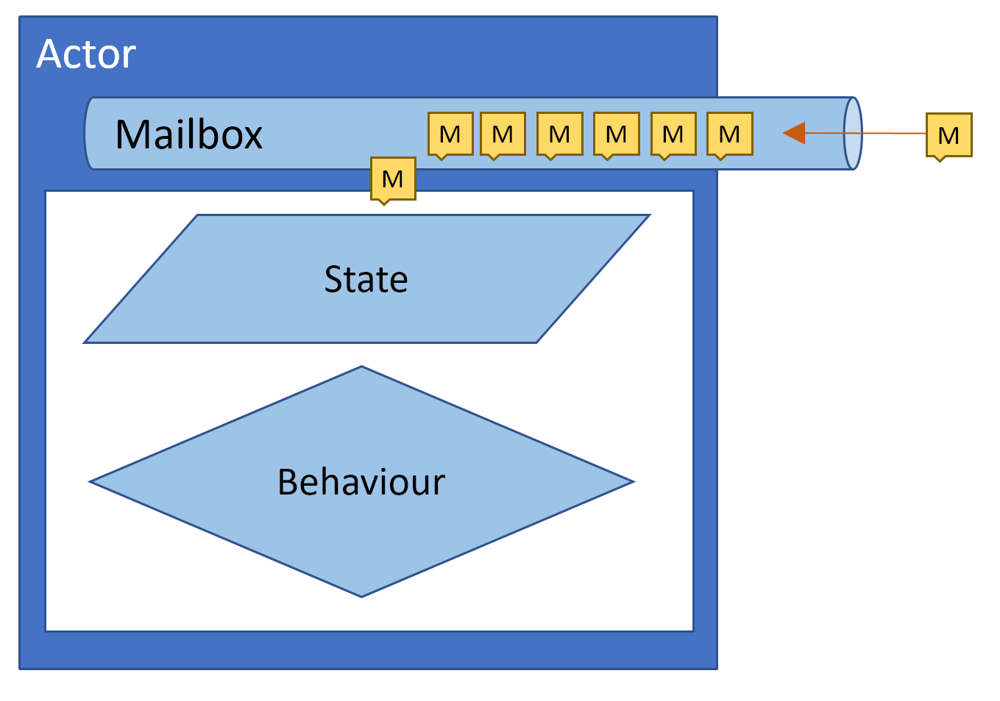

Actors are constructs that contains a queue (mailbox) and can receive and process messages. This message driven aspect is critical – messages are the only way that actors can communicate with each other or outside world. This gives us a couple of advantages:
- State being shared without locks
- Enforced single responsibly principle
- Units of computation are decoupled

From programmers perspective, messages are delivered sequentially and processed one by one, like on a single thread. This drastically reduces complexity of the code, since we do not have to care about concurrency and can focus on business logic. Our state is accessible only to the actor and no one else holds a reference to it. All attempts to read or update the data is a result of message being sent. That and the sequential way of handling messages guarantees that each action seems to be atomic for the outside world. Current state can be shared with other actors only via immutable messages that contain only a read-only snapshots of current data.

On the synchronization quadrant, we never fail into shared mutable corner:
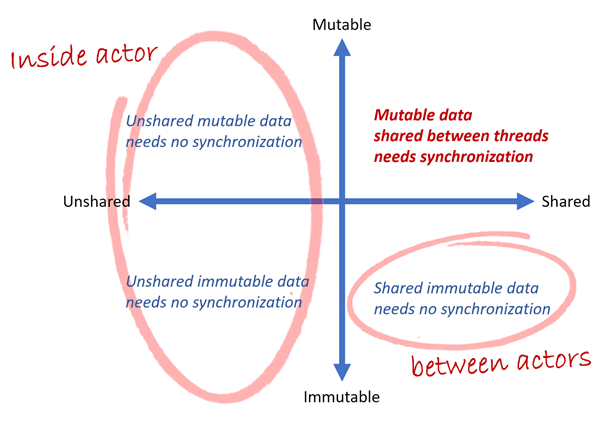

## Our own implementation

To better understand the model, let’s try to write our own actor in C#. Our implementation will try to mimic F# type MailboxProcessor.

Code is available at https://github.com/tomwolanski/actormodel/tree/master/Actors

Let’s start with our mailbox and message handler:
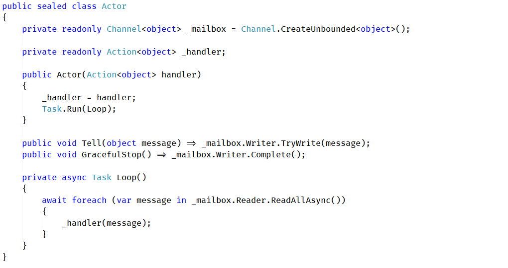

We have utilized new C# feature `System.Threading.Channels` for our mailbox. With this namespace, our scenario with multiple writers and single reader is effortless. We can grab sequence of messages as IAsyncEnumerable by calling `ReadAllAsync` and process them inside Loop method.

Our desired logic is passed into the constructor as a delegate that accepts a message. Messages can be sent by public method Tell.

Method GracefulStop, allows us to stop the actor, when there is no more messages to process.

With this, we can already create the simplest actor:
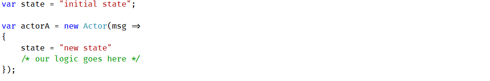

There is a huge problem with this implementation. If we create another actor, let’s say:
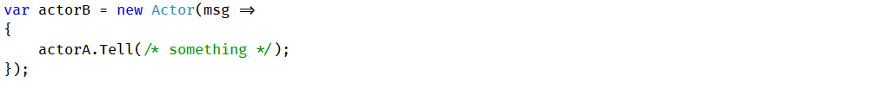

We have only one way communication. Actors can pass messages to other actors only, if they are captured by the lambda closure. Actor A is unable to send back a response. If we want two way of communication, we need to keep information about the sender of the original message.
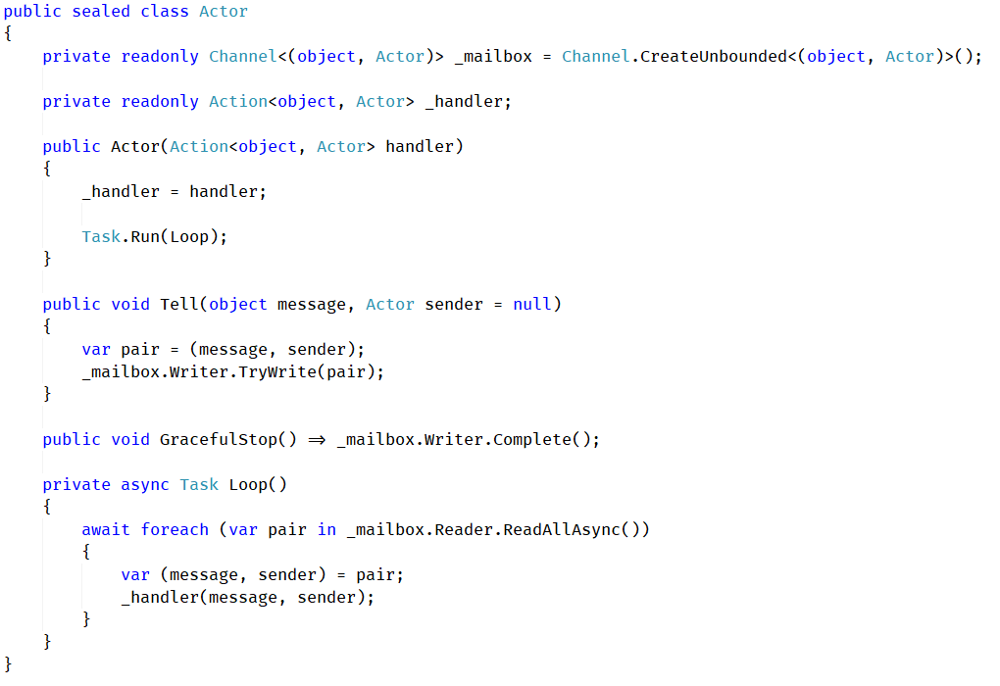

Instead of messages, we will store a pair – message and sender. That allows us to respond with another message (result of computation, etc.):
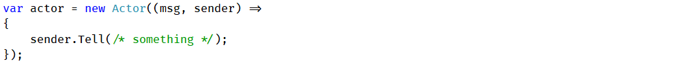

## Mandatory "Hello World"

We can now attempt to write a Hello World program. It will not serve any concrete purpose, other that proving that our actor works. It will just concatenate incoming messages into a single string.

Let’s define a new message type that will be used to fetch the current state:
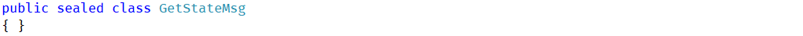

Our actor will be created in a separate method, to make sure that our state is private and not used anywhere else. Two types of messages will be handled: any string will be appended to our state, and `GetStateMsg` will result in a response with actual data.
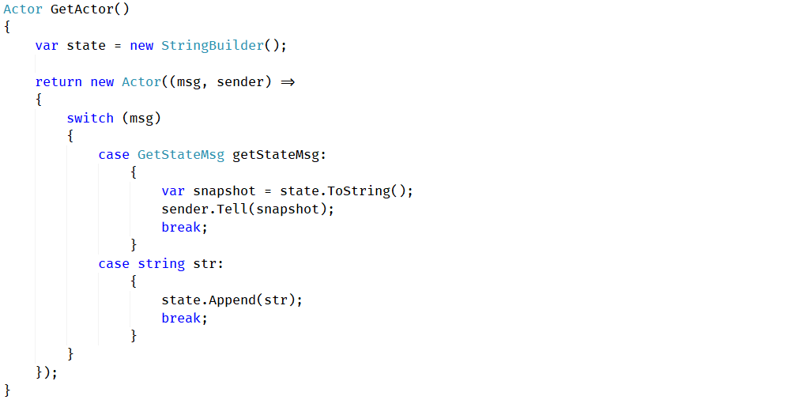

And finally, our `Main` method:
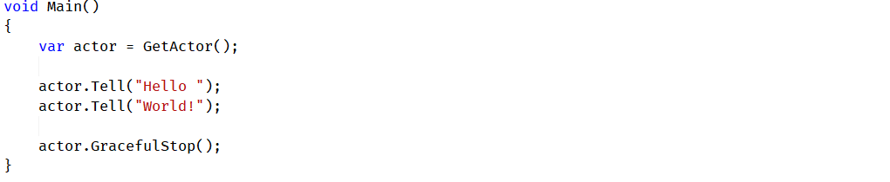

It is worth to notice, that the response to `GetStateMsg` is not an instance of `StringBuilder`, but materialized string. As mentioned before, all messages have to be immutable. They cannot contain any direct reference of a state, only a read-only snapshot.

Wouldn’t it be nice if we could write our “Hello World!” string to the console? It is well hidden from us, and we cannot simply access it, we need to send a GetStateMsg message to actor and wait for a response message. How can we do it? It can be achieved by introducing a **character actor**, a short-lived actor that serves a single purpose - in this case, to wrap request-response based communication into a Task. It forwards original message and sets itself as a sender. When a response is received, it completes the task and ends its own life:
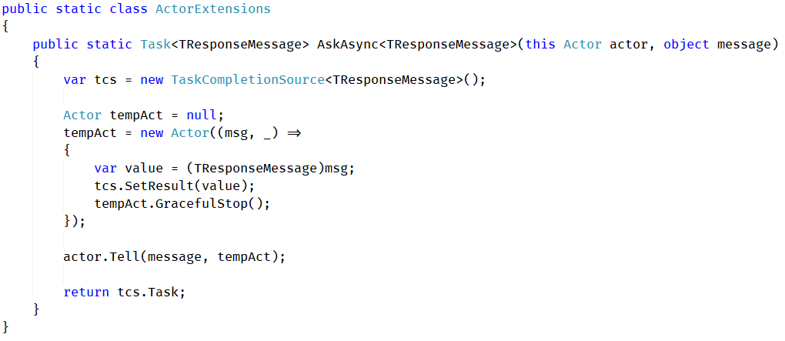

Updated `Main` method:
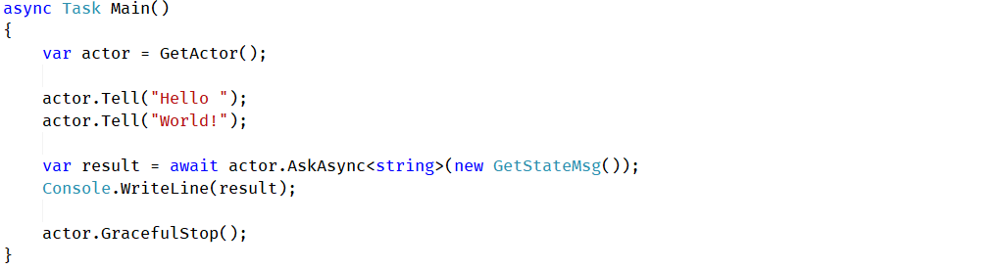

`Ask` is often considered an anti-pattern and should not be used in communication between actors. It is completely fine in our case, because we are on the edge of the actor and outside world (in ASP.Net Controller, for example).

## Taking it for a (multi threaded) spin

We have proven that our actor works, can receive messages, respond to them, and update its state. Let's test if it will work as a synchronization primitive in a simple scenario. We will implement a program to estimate value of π using Monte Carlo approach.
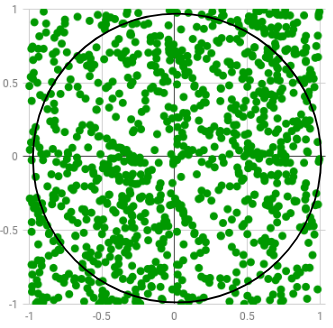

In this scenario, we will have N producers of random points. Our actor will keep track of total number of points generated, and count of those that landed inside circle.

Then estimated value of π can be calculated with the formula:
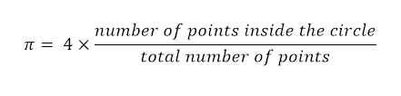

Let's start with definition of messages:
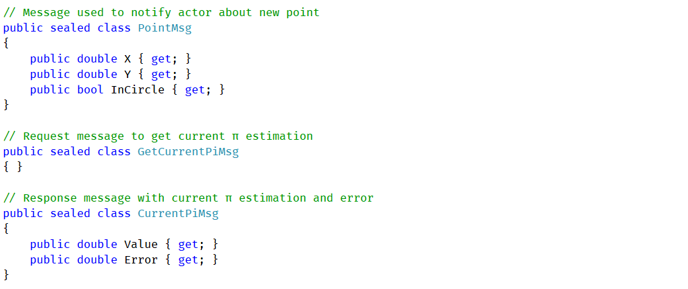

Our actor will need to handle 2 types of messages:

- `PointMsg` - information about new point being generated. It contains `InCircle` property, that determines whenever its distance from point (0, 0) is not grater than 1.
- `GetCurrentPiMsg` - request to calculate current estimated value using formula mentioned above. Result will be sent as a new `CurrentPiMsg` message.

Since, we do not need to worry about synchronization, our state can be as simple as possible and contain two separate counters. Message-passing approach will make sure, that any changes to both of them will appear to be atomic.
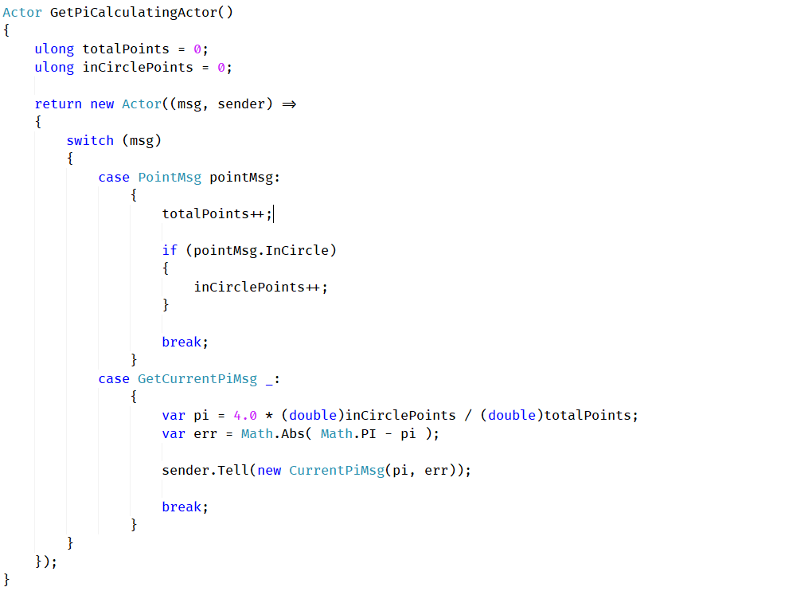

In our Main method, we will spin up multiple producers, that will constantly push new messages to our actor.
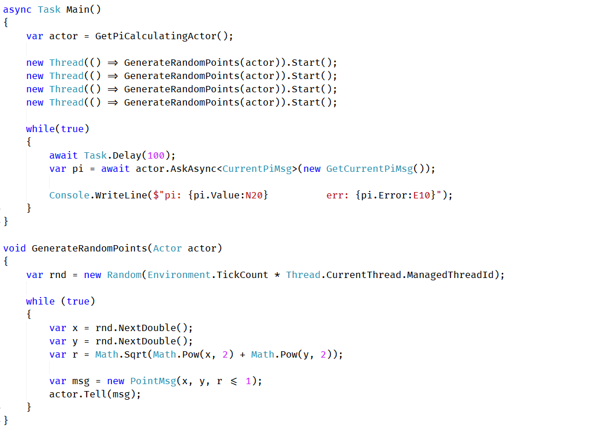

When executed, our program will present a near estimation of π:
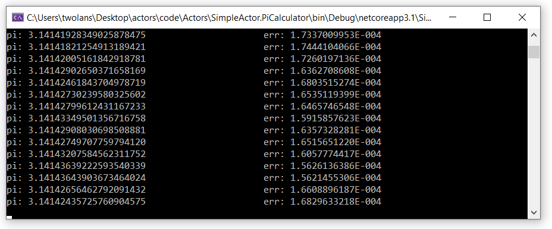

## Actor vs Agent

I was using name Actor, however Agent may be interchanged in the context of this article. From my understanding agents are local to single process and do not have a child supervisor capabilities. True actors, on the other hand, tend to be part of a distributed system. Actor can also track behavior of children via supervision policies (as in Functional Programming in C# by Enrico Buonanno).

My intention was not only to introduce reader to idea of message-passing concurrency but rather slowly build up interest in all possibilities of an actor system. Hopefully, in future texts I will cover child supervision, persistence and passivation of an actor.

## Closing note

**This implementation is not close to being a proper production code.**

We could significantly improve it by using proper `ChannelOptions.SingleReader` option, to reduce reader overhead. `ConfigureAwait` was also omitted for code clarity. Unbounded mailboxes could also be replaced with limited ones to prevent using too much resources.

More specialized scheduler ought to be used. `Task.Run(Loop)` used here will not work for a larger number of actors. `Task.Factory.StartNew(Loop, TaskCreationOptions.LongRunning)` may create too many unwanted threads.

I have omitted the children and supervision aspect of an actor model in this article on purpose. It deserves a separate text on its own.

For further reading on the topic, I can recommend __"F# For Fun and Profit"__ article dedicated to MailboxProcessor:
https://fsharpforfunandprofit.com/posts/concurrency-actor-model/

and amazing talk "The Language of Actors" by Vaughn Vernon:
https://youtu.be/KtRLIzG5c54
