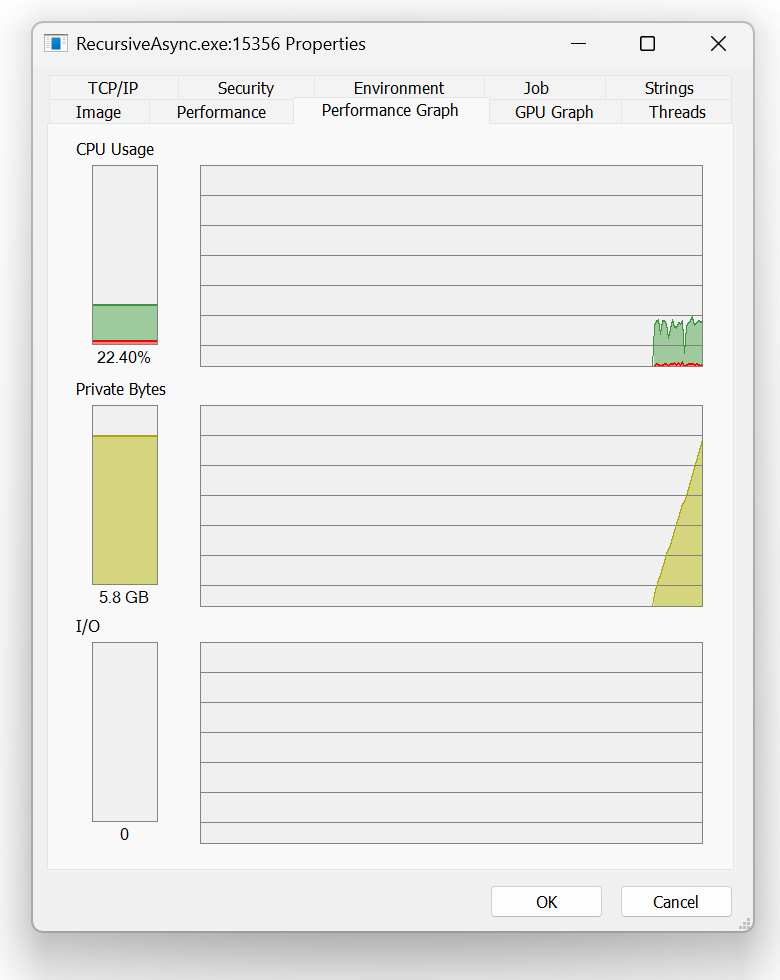

## Stack Overflow

Almost everybody knows what stack overflow is, un recoverable crash of the program caused by infoking too many nested methods.

Most of the time we do not need to think about the stack, especially in managed word, where it is almost impossible to corrupt the memory. We do not need to go deep into the stack and heap relation, let assume it is an [implementation detail](https://learn.microsoft.com/en-us/archive/blogs/ericlippert/the-stack-is-an-implementation-detail-part-one), that worss for us, not aginst. 

Untill we reach its limits. 

Recently I stumbled upon a piece of code that made me think. I would never write it, but it was there, in production code. 

// TODO - kod z fulfillmentu 

It did not crash the way I expected. I jumped into the rabbit hole.

We will be reviewing three scenarios of recursive method without a base case.
- synchronous functions
- asynchronous functions that return immediately
- asynchronous functions that perform real awaiting

## Synchronous methods - fast and ugly

First, lets consider the basic example we are all familiar with. A recursive synchronous function with no base case. 

```csharp
internal static class Program
{
    static void Main(string[] args)
    {
        using var cts = new CancellationTokenSource();
        Console.CancelKeyPress += (s, e) =>
        {
            cts.Cancel();
         
        };


        DoStuff();
    }

    public static void DoStuff()
    {
        DoStuff();
    }
}
```

There is no suprise here, the application crashed and was not able to recover:
```
Stack overflow.
Repeated 32130 times:
--------------------------------
   at Recursive.Program.DoStuff()
--------------------------------
   at Recursive.Program.Main(System.String[])
```

The original code had a cancellation token! 
The `CancellationToken` in the orignal code represented an application shutdown. We'd like to have our application running withut an issue for a long time, so for simplicity let's assume the token is never cancelled.
```csharp
internal static class Program
{
    static void Main(string[] args)
    {
        DoStuff(default);
    }

    public static void DoStuff(CancellationToken cancellationToken)
    {
        if (!cancellationToken.IsCancellationRequested)
        {
            DoStuff(cancellationToken);
        }   
    }
}
```

As expected, it crashed in simmilar manner:
```
Stack overflow.
Repeated 32123 times:
--------------------------------
   at Recursive.Program.DoStuff(System.Threading.CancellationToken)
--------------------------------
   at Recursive.Program.Main(System.String[])
```

## Asynchronous methods 

Our oryginal code was a long running service, that interacted with several remote systems like databases. Writing an IO code as an async code is now a standard, so let's check if there are any suprises.

### Immediate return - no difference here

Our simple example, changed into asynchronous functions may look like this:
```csharp
internal static class Program
{
    static async Task Main(string[] args)
    {
        await DoStuffAsync(default);
    }

    public static async Task DoStuffAsync(CancellationToken cancellationToken)
    {
        if (!cancellationToken.IsCancellationRequested)
        {
            await DoStuffAsync(cancellationToken);
        }       
    }
}
```

As previously, the application crashed due to overflowing the stack. We expected this, especially after the synchronouos test.
```
Stack overflow.
Repeated 4191 times:
--------------------------------
   at System.Runtime.CompilerServices.AsyncTaskMethodBuilder.Start[[RecursiveAsync.Program+<DoStuffAsync>d__1, RecursiveAsync, Version=1.0.0.0, Culture=neutral, PublicKeyToken=null]](<DoStuffAsync>d__1 ByRef)
   at RecursiveAsync.Program.DoStuffAsync(System.Threading.CancellationToken)
   at RecursiveAsync.Program+<DoStuffAsync>d__1.MoveNext()
   at System.Runtime.CompilerServices.AsyncMethodBuilderCore.Start[[RecursiveAsync.Program+<DoStuffAsync>d__1, RecursiveAsync, Version=1.0.0.0, Culture=neutral, PublicKeyToken=null]](<DoStuffAsync>d__1 ByRef)
--------------------------------
   at System.Runtime.CompilerServices.AsyncTaskMethodBuilder.Start[[RecursiveAsync.Program+<DoStuffAsync>d__1, RecursiveAsync, Version=1.0.0.0, Culture=neutral, PublicKeyToken=null]](<DoStuffAsync>d__1 ByRef)
   at RecursiveAsync.Program.DoStuffAsync(System.Threading.CancellationToken)
   at RecursiveAsync.Program+<Main>d__0.MoveNext()
   at System.Runtime.CompilerServices.AsyncMethodBuilderCore.Start[[RecursiveAsync.Program+<Main>d__0, RecursiveAsync, Version=1.0.0.0, Culture=neutral, PublicKeyToken=null]](<Main>d__0 ByRef)
   at System.Runtime.CompilerServices.AsyncTaskMethodBuilder.Start[[RecursiveAsync.Program+<Main>d__0, RecursiveAsync, Version=1.0.0.0, Culture=neutral, PublicKeyToken=null]](<Main>d__0 ByRef)
   at RecursiveAsync.Program.Main(System.String[])
   at RecursiveAsync.Program.<Main>(System.String[])
```

One may notice that our method does not do any real work. In the real service, we'd expect, database to be called at some point.

### Real async call - wait, what?

As stated before, our dummy method does not perform any actual work. Because it does not await any "real" asynchronous function, it could end synchronously. Thanks to this "hot path" optimization this scenario has extremly low memory usage, since nothing is boxed.

As described in [Dissecting the async methods in C#](https://devblogs.microsoft.com/premier-developer/dissecting-the-async-methods-in-c/) the async state machine states on the stack. Foreshadowing?

Let's force our code to not allow for this optimization. This can be done by calling any IO-bound operation like reading a file or making a web request, or using any of the methods provided by `System.Threading.Tasks.Task`. 

To save time when executing our example, I will be using [`Task.Yield()`](https://learn.microsoft.com/en-us/dotnet/api/system.threading.tasks.task.yield?view=net-9.0) method to force asynchronous execution of `DoStuffAsync`.

```csharp
internal static class Program
{
    static async Task Main(string[] args)
    {
        await DoStuffAsync(default);
    }

    public static async Task DoStuffAsync(CancellationToken cancellationToken)
    {
        await Task.Yield(); // forces the method to run asynchronously, simulates an async IO call

        if (!cancellationToken.IsCancellationRequested)
        {
            await DoStuffAsync(cancellationToken);
        }       
    }
}
```

The application does not crash! It seems like we solved the problem of limited stack trace. C# does not allow for tail-call optimization like F# does, so it must me something different.

The application works fine, but it slowly consumes almost all available resources.



Few seconds of execution consumed almost 6BG or memory. Did the GC misbehaved? We can easly enforce periodic collections, just to be extra sure.
```csharp
internal static class Program
{
    static async Task Main(string[] args)
    {
        using var _ = new Timer(_ =>
        {
            GC.Collect();
            GC.WaitForPendingFinalizers();

            Console.WriteLine($"used: {GC.GetTotalAllocatedBytes()} g0:{GC.CollectionCount(0)}, g1:{GC.CollectionCount(1)}, g2:{GC.CollectionCount(2)}");
        },
        default,
        TimeSpan.FromSeconds(3),
        TimeSpan.FromSeconds(3));

        await DoStuffAsync(CancellationToken.None);
    }

    public static async Task DoStuffAsync(CancellationToken cancellationToken)
    {
        await Task.Yield();

        if (!cancellationToken.IsCancellationRequested)
        {
            await DoStuffAsync(cancellationToken);
        }       
    }
}
```

For good measure, our code outputs number of garbage collection for each of the generations. I stopped the application when allocated memory reached almost 7GB. As we can see, the garbage collector was working extra hours:
```
used: 2136637120 g0:266, g1:265, g2:9
used: 3729335624 g0:458, g1:456, g2:10
used: 5148979816 g0:629, g1:626, g2:11
used: 6332684352 g0:772, g1:769, g2:12
used: 7505105352 g0:914, g1:910, g2:13
```

Memory profiler allows us to see what exactly happened:


By forcing the `DoStuffAsync` to finished asynchronously, the async state machine could no longer remain on the stack, had to be boxed into `syncTaskMethodBuilder+AsyncStateMachineBox<...>` type and moved to the heap. Unlike to stack, the heap can grow to accomadate all our boxed instances. 

The problem was not solved, it was just moved from stack to heap.

## Summary

The real code is way slower than our exaggerated example application. The `Task.Delay(...)` will slow things down. It was expected to execute few times a day. At this rate, leaking few extra kilobytes would not cause immediate harm, but will cause memory issues in a longer run.


