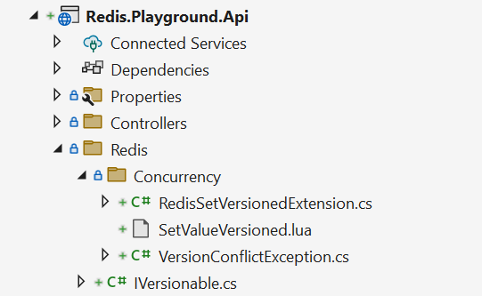
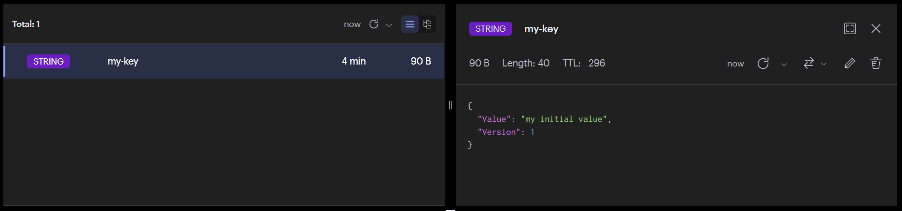
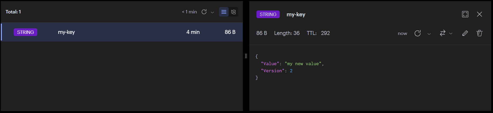
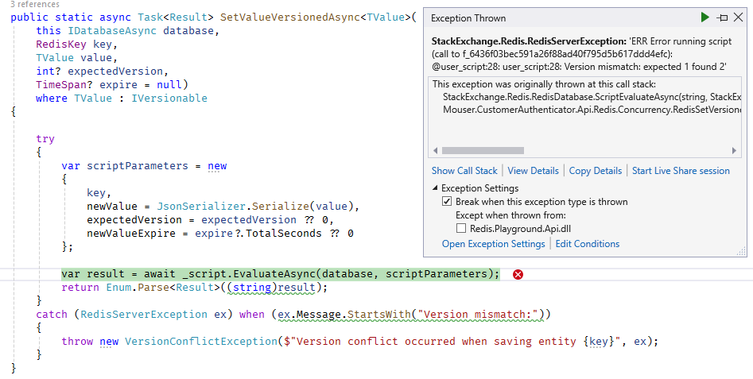
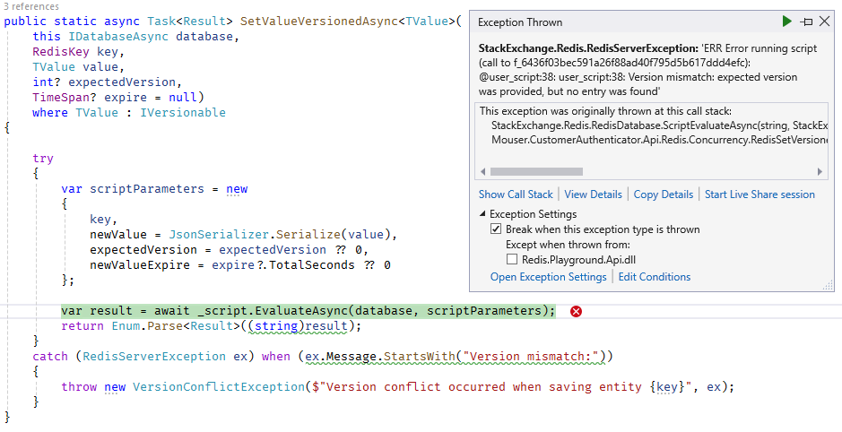

## Optimistic concurrency

When the same data gets modified at the same time, the data can become corrupted. To prevent such issues a way to handle multiple concurrent writes is needed. We can introduce two possible solutions for such a problem:

- pessimistic concurrency (locking) - before we attempt to write to a store, we want to lock it first, so no other client can modify it. 

- optimistic concurrency (versioning) - we want to keep our entry versioned, a 'expected version' is passed to a store, to validate that no one has changed our entry (and by doing so increase the version). If a version conflict occurs a client needs to solve it. 

In this article, I'd like to focus on a possible implementation of optimistic concurrency using Redis Lua scripting. We will try to mimic EF Core [PropertyBuilder.IsConcurrencyToken](https://learn.microsoft.com/en-us/dotnet/api/microsoft.entityframeworkcore.metadata.builders.propertybuilder.isconcurrencytoken?view=efcore-8.0) behavior.


## Complex commands using StackExchange.Redis

StackExchange.Redis is a dotnet client for Redis that makes work with the store much easier. Unfortunately, Redis does not allow us to write the complex queries or commands we are used to because of T-SQL servers. 

### Redis transactions and their limitations

Redis does support transactions, but they are quite limited. We can use a transaction to submit multiple commands to be executed atomically, but we cannot execute part of the transaction conditionally according to the current state of the entity.

Redis transaction allows an atomic write to multiple keys, for instance:

```csharp
using StackExchange.Redis;

IDatabase database = ...

var transaction = database.CreateTransaction();

_ = transaction.StringSetAsync("key_1", "value_1");

_ = transaction.StringSetAsync("key_2", "value_2");

await transaction.ExecuteAsync();
```

But any attempt to make a conditional statement a part of this transaction would result in deadlock. As a matter of fact, awaiting any of the tasks returned by `transaction.*Async()` before `transaction.ExecuteAsync()` finishes will cause a deadlock.
Deadlock is a quirk how the `StackExchange.Redis` works, but such a structure cannot even be expressed by Redis commands at all.

```csharp
using StackExchange.Redis;

IDatabase database = ...

var transaction = database.CreateTransaction();

// this task has no chance of being completed before transaction is executed...
var value = await transaction.StringGetAsync("key_1");   

if (value == "some_value")
{
    _ = transaction.StringSetAsync(
        "key_2"
        "value_2");
}

// ...which will never happen, because we never reach this line
await transaction.ExecuteAsync();   
```

This is because Redis transaction is not the same as a transaction we may know from T-SQL. It is just a way of grouping commands together and there is no way to translate such conditional statement to a valid set of commands.

From Redis website:
> A Redis Transaction is entered using the MULTI command. The command always replies with OK. At this point the user can issue multiple commands. Instead of executing these commands, Redis will queue them. All the commands are executed once EXEC is called.

### Lua scripting to the rescue

Fortunately, Redis supports another way of submitting a complex set of commands: [scripting](https://redis.io/docs/interact/programmability/eval-intro/). 
Any of the [commands supported by Redis](https://redis.io/commands/) can be referenced and executed from the Lua script by executing `redis.call( 'command', parameters ... )` function.
It is guaranteed that the whole script will be executed atomically. 

The previous impossible sample can now be rewritten as a Lua script:

```lua
local value = redis.call('get', 'key_1');
if (value == 'some_value') then
    redis.call('set', 'key_2', 'value_2');
end
```

And how to execute such a script from C# code? Here is a basic snippet:

```csharp
using StackExchange.Redis;

IDatabase database = ...

var script = LuaScript.Prepare(/* your script goes here */);

await _script.EvaluateAsync(database);
```

A Lua script can be treated as a stored procedure known from T-SQL world. It is a known fact, that such procedures would be quite useless without the ability to provide parameters. A set of parameters can be provided with `@parameter` syntax bound to a property of an anonymous object.

```lua
local value = redis.call('get', 'key_1');
if (value == @expectedValue) then
    redis.call('set', 'key_2', @newValue);
end
```

```csharp
using StackExchange.Redis;

IDatabase database = ...

var script = LuaScript.Prepare(/* your script goes here */);

var scriptParameters = new
{
    expectedValue = "some_value",
    newValue = "value_2"
};

await _script.EvaluateAsync(database, scriptParameters);
```

## Optimistic concurrency and conflict detection using script

Finally, we have all the pieces of the puzzle to start implementing our Redis concurrency conflict detection.

First, let's define an interface that holds a version of the entry. Any entry that we want to detect version conflicts should implement this interface.

```csharp
public interface IVersionable
{
    int Version { get; }
}
```

Also, let's assume that in case of a conflict detected, we'd like to raise an exception. To do so, we will define an exception that should be equivalent to [DbUpdateConcurrencyException] from EF Core.

```csharp
public sealed class VersionConflictException : Exception
{
    public VersionConflictException(string? message, Exception? innerException) : base(message, innerException)
    { }
}
```

We would like to store our entities as JSON strings for simplicity. However, we could also utilize [Redis Sets](https://redis.io/docs/data-types/sets/) to store our data. This example will also demonstrate how to return data from the script by declaring a `Result` enum that will hold information if an entry was added to the Redis store, or successfully updated.

```csharp
using System.Text.Json;
using StackExchange.Redis;

namespace Mouser.CustomerAuthenticator.Api.Redis.Concurrency;

public static class RedisSetVersionedExtension
{
    private static readonly LuaScript _script = PrepareLuaScript();

    /// <summary>
    /// Adds or updates any versionable document to the Redis store. During update an expected version is required. Update us executed ony if current and expected version of the entity match.
    /// </summary>
    /// <returns>A value indicating whenever the entry was added to the store (<see cref="Result.Added"/>) or if it was updated (<see cref="Result.Updated"/>) </returns>
    /// <exception cref="VersionConflictException">Exception raised when version conflict occurs</exception>
    public static async Task<Result> SetValueVersionedAsync<TValue>(
        this IDatabaseAsync database,
        RedisKey key,
        TValue value,
        int? expectedVersion,
        TimeSpan? expire = null)
        where TValue : IVersionable
    {
        try
        {
            var scriptParameters = new
            {
                key,
                newValue = JsonSerializer.Serialize(value),
                expectedVersion = expectedVersion ?? 0,
                newValueExpire = expire?.TotalSeconds ?? 0
            };

            var result = await _script.EvaluateAsync(database, scriptParameters);
            return Enum.Parse<Result>((string)result);  
        }
        catch (RedisServerException ex) when (ex.Message.StartsWith("Version mismatch:"))
        {
            throw new VersionConflictException(
                $"Version conflict occurred when saving entity {key}",
                ex);
        }
    }
}

/// <summary>
/// A result of the <see cref="SetValueVersionedAsync"/> operation. Indicates whenever the entry has been created or updated.
/// </summary>
public enum Result
{
    Undefined,
    Added,
    Updated
}
```

This code introduces an extension method over `IDatabase` that allows us to add or update a versioned entity. However, it only executes a Lua script, which does the heavy lifting. We could hardcode this script directly inside `PrepareLuaScript` method as w did before, however, we can do better. Since the script is not as trivial as previous examples, we'd like to have a syntax highlight. Does Visual Studio support syntax for Lua, yes, it does! Let's create a  new file, `SetValueVersioned.lua` for instance. It will hold our script that validates the versions and executes the writes.

```lua
-- reusable function to write a value of a key
-- sets expiration if provided
local function coreSet ()
    redis.call('set', @key, @newValue);

    if (tonumber(@newValueExpire) > 0) then
        redis.call('expire', @key, @newValueExpire);
    end
end

-- expected version parsed to a number
local expectedVersion = tonumber(@expectedVersion)

-- fetch existing value of an entry
local currentValueJson = redis.call('get', @key); 

-- attempt to update value when current entry was found
if (currentValueJson) then
    local currentValueObject = cjson.decode(currentValueJson);
    local currentVersion = tonumber(currentValueObject.Version);
    
    -- versions match so update the entry, fail otherwise
    if currentVersion == expectedVersion then	
        coreSet();
        return 'Updated';
    else
        error('Version mismatch: expected ' .. expectedVersion .. ' found ' .. (currentVersion or 'nil'));
    end

-- entry was not found and no expected version was provided, add a new one
elseif (expectedVersion == 0) then
    coreSet();
    return 'Added';

-- entry was not found, but a version was provided, fail
else
    error('Version mismatch: expected version was provided, but no entry was found');
    
end 
```

The script relies on `cjson` extension to Redis, which (at least at the time of the writing) is installed by default on Redis docker images, as well on Azure Redis instances.

We are missing one thing from the final solution - the implementation of `PrepareLuaScript``. Assuming our project hierarchy looks like this:



and the `.lua` file is set to be an embedded resource, we can pretty easily read them:

```csharp
private static LuaScript PrepareLuaScript()
{
    var assembly = typeof(RedisSetVersionedExtension).Assembly;
    var assemblyName = assembly.GetName().Name;
    
    var scriptPath = $"{assemblyName}.Redis.Concurrency.SetValueVersioned.lua";

    using var stream = assembly.GetManifestResourceStream(scriptPath);
    using var reader = new StreamReader(stream);

    var script = reader.ReadToEnd();
    return LuaScript.Prepare(script);
}
```

The script path is combined of the assembly name, `Redis.Playground.API` in our case, followed by a full path to our file joined with the dot character.

## Does it work?

To test our solution we can prepare a dummy `SomeVersionableEntity` type that can be manipulated by calling 2 endpoints:

```csharp
public class TestController(IDatabase database)
{
    [HttpPost("create")]
    public async Task<object> CreateAsync(
        [FromBody] Args args)
    {
        var entity = new SomeVersionableEntity
        {
            Value = args.Value,
            Version = 1
        };

        var result = await database.SetValueVersionedAsync(
            args.Key,
            entity,
            expectedVersion: null, // we expect no previous versions
            expire: TimeSpan.FromMinutes(5));

        return new { entity, result };
    }

    [HttpPost("update")]
    public async Task<object> UpdateAsync(
        [FromBody] Args args, 
        [FromHeader( Name = "Expected-Version")] int expectedVersion)
    {
        var entity = new SomeVersionableEntity
        {
            Value = args.Value,
            Version = expectedVersion + 1
        };

        var result = await database.SetValueVersionedAsync(
            args.Key, 
            entity, 
            expectedVersion: expectedVersion, 
            expire: TimeSpan.FromMinutes(5));

        return new { entity, result };
    }
}

public record Args(string Key, string Value);

public class SomeVersionableEntity : IVersionable
{
    public string Value { get; set; }
    public int Version { get; set; }
}
```

Now, we can create our first entry:

```
POST https://localhost:7191/create 
Content-Type: application/json

{
  "key": "my-key",
  "value": "my initial value"
}
```

after executing this web call we will be presented with a result indicating a successful addition to the Redis store:
```json
{
  "entity": {
    "value": "my initial value",
    "version": 1
  },
  "result": "added"
}
```

How does this look like in redis? We can peek the values using RedisInsights or any other client.



After this, let's simulate an update with a proper expected version
```
POST https://localhost:7191/update 
Content-Type: application/json
Expected-Version: 1

{
  "key": "my-key",
  "value": "my new value"
}
```

and the result also indicates that our entity has been updated to the second version. When we peek into Redis we can also see that the value has been successfully updated:



We are not here to validate a happy path, we should validate what will happen if we run an update command again, but with a previous expected version (it should be 2 now):
```
POST https://localhost:7191/update 
Content-Type: application/json
Expected-Version: 1

{
  "key": "my-key",
  "value": "my new value that I do not expect to see"
}
```

Our script has failed with a message `Version mismatch: expected 1 found 2`, exactly as we wanted. This exception will later be wrapped into `VersionConflictException` for easier use by the client.



We should fail when we provide an expected version and attempt to update a non-existing entry:
A similar exception is thrown but with a message: `Version mismatch: expected version was provided, but no entry was found`




## Performance considerations

One who is familiar with T-SQL stored procedures may argue, that this approach may be terribly inefficient since we send the script to Redis all the time. One may argue that we use Redis for efficiency and small response latency, but now we introduce a huge payload that needs to be sent all the time.

The good news is - that's not the case. A full script is send to Redis server during the first call. We can see it if we enable logging we can notice that it is sent twice. First time using `SCRIPT LOAD` to add it to script cache, later using `EVAL` to actually execute it. I assume this is done by the design of `StackExchange.Redis` to add the script to the cache and execute it during the same roundtrip. 


```
00:23:52.149 [0 89.64.40.188:10749] "SCRIPT" "LOAD" "-- reusable function to set a value of a key\r\n-- sets expiration if provided\r\nlocal function coreSet ()\r\n redis.call('set', ARGV[1], ARGV[2]);\r\n\r\n if (tonumber(ARGV[3]) > 0) then\r\n redis.call('expire', ARGV[1], ARGV[3]);\r\n end\r\nend\r\n\r\n-- expected version parsed to a number\r\nlocal expectedVersion = tonumber(ARGV[4])\r\n\r\n-- fetch existing value of an entry\r\nlocal currentValueJson = redis.call('get', ARGV[1]); \r\n\r\n-- attempt to update value when current entry was found\r\nif (currentValueJson) then\r\n local currentValueObject = cjson.decode(currentValueJson);\r\n local currentVersion = tonumber(currentValueObject.Version);\r\n \r\n -- versions match so update the entry, fail otherwise\r\n if currentVersion == expectedVersion then\t\r\n coreSet();\r\n return 'Updated';\r\n else\r\n error('Version mismatch: expected ' .. expectedVersion .. ' found ' .. (currentVersion or 'nil'));\r\n end\r\n\r\n-- entry was not found and no expected version was provided, add a new one\r\nelseif (expectedVersion == 0) then\r\n coreSet();\r\n return 'Added';\r\n\r\n-- entry was not found, but a version was provided, fail\r\nelse\r\n error('Version mismatch: expected version was provided, but no entry was found');\r\n \r\nend "
00:23:52.149 [0 89.64.40.188:10749] "EVAL" "-- reusable function to set a value of a key\r\n-- sets expiration if provided\r\nlocal function coreSet ()\r\n redis.call('set', ARGV[1], ARGV[2]);\r\n\r\n if (tonumber(ARGV[3]) > 0) then\r\n redis.call('expire', ARGV[1], ARGV[3]);\r\n end\r\nend\r\n\r\n-- expected version parsed to a number\r\nlocal expectedVersion = tonumber(ARGV[4])\r\n\r\n-- fetch existing value of an entry\r\nlocal currentValueJson = redis.call('get', ARGV[1]); \r\n\r\n-- attempt to update value when current entry was found\r\nif (currentValueJson) then\r\n local currentValueObject = cjson.decode(currentValueJson);\r\n local currentVersion = tonumber(currentValueObject.Version);\r\n \r\n -- versions match so update the entry, fail otherwise\r\n if currentVersion == expectedVersion then\t\r\n coreSet();\r\n return 'Updated';\r\n else\r\n error('Version mismatch: expected ' .. expectedVersion .. ' found ' .. (currentVersion or 'nil'));\r\n end\r\n\r\n-- entry was not found and no expected version was provided, add a new one\r\nelseif (expectedVersion == 0) then\r\n coreSet();\r\n return 'Added';\r\n\r\n-- entry was not found, but a version was provided, fail\r\nelse\r\n error('Version mismatch: expected version was provided, but no entry was found');\r\n \r\nend " "1" "tokens:my-key" "my-key" "{"Value":"my initial value","Version":1}" "300" "0"
00:23:52.149 [0 lua] "get" "my-key"
00:23:52.149 [0 lua] "set" "my-key" "{"Value":"my initial value","Version":1}"
00:23:52.149 [0 lua] "expire" "my-key" "300"
```

What about subsequent calls? The first time `SCRIPT LOAD` was called Redis returned a SHA of the script that can later be used as a reference. Any subsequent calls will be done  using `EVALSHA` command which does not require sending full script code.
All entries marked as `[0 lua]` are actual commands executed by the script.

```
00:34:01.046 [0 89.64.40.188:10749] "EVALSHA" "6436f03bec591a26f88ad40f795d5b617ddd4efc" "1" "tokens:my-other-key" "my-other-key" "{"Value":"my other initial value","Version":1}" "300" "0"
00:34:01.046 [0 lua] "get" "my-other-key"
00:34:01.046 [0 lua] "set" "my-other-key" "{"Value":"my other initial value","Version":1}"
00:34:01.046 [0 lua] "expire" "my-other-key" "300"
```

Redis script cache, however, has its eviction policies, and cannot quarantine that the script will be cached there forever. This is especially true when Redis is running as a cluster with multiple nodes that can be restarted. `StackExchange.Redis` handles this scenario without any manual interaction and inserts it back into the cache again.

Let's see this in action by manually removing all scripts from the cache using Redis CLI
```
> script flush
"OK"
```
and attempt to call our endpoint again.

What we will notice in the logs is that:
1. the client attempted to run the script using `EVALSHA` and SHA
1. we can assume the action failed since the client repeats the pattern we saw before `SCRIPT LOAD` and `EVAL` 

```
00:39:32.575 [0 89.64.40.188:10659] "script" "flush"
00:39:35.739 [0 89.64.40.188:10749] "EVALSHA" "6436f03bec591a26f88ad40f795d5b617ddd4efc" "1" "tokens:my-other-key3" "my-other-key3" "{"Value":"my other initial value","Version":1}" "300" "0"
00:39:35.895 [0 89.64.40.188:10749] "SCRIPT" "LOAD" "\r\n-- reusable function to set a value of a key\r\n-- sets expiration if provided\r\nlocal function coreSet ()\r\n redis.call('set', ARGV[1], ARGV[2]);\r\n\r\n if (tonumber(ARGV[3]) > 0) then\r\n redis.call('expire', ARGV[1], ARGV[3]);\r\n end\r\nend\r\n\r\n-- expected version parsed to a number\r\nlocal expectedVersion = tonumber(ARGV[4])\r\n\r\n-- fetch existing value of an entry\r\nlocal currentValueJson = redis.call('get', ARGV[1]); \r\n\r\n-- attempt to update value when current entry was found\r\nif (currentValueJson) then\r\n local currentValueObject = cjson.decode(currentValueJson);\r\n local currentVersion = tonumber(currentValueObject.Version);\r\n \r\n -- versions match so update the entry, fail otherwise\r\n if currentVersion == expectedVersion then\t\r\n coreSet();\r\n return 'Updated';\r\n else\r\n error('Version mismatch: expected ' .. expectedVersion .. ' found ' .. (currentVersion or 'nil'));\r\n end\r\n\r\n-- entry was not found and no expected version was provided, add a new one\r\nelseif (expectedVersion == 0) then\r\n coreSet();\r\n return 'Added';\r\n\r\n-- entry was not found, but a version was provided, fail\r\nelse\r\n error('Version mismatch: expected version was provided, but no entry was found');\r\n \r\nend "
00:39:35.895 [0 89.64.40.188:10749] "EVAL" "\r\n-- reusable function to set a value of a key\r\n-- sets expiration if provided\r\nlocal function coreSet ()\r\n redis.call('set', ARGV[1], ARGV[2]);\r\n\r\n if (tonumber(ARGV[3]) > 0) then\r\n redis.call('expire', ARGV[1], ARGV[3]);\r\n end\r\nend\r\n\r\n-- expected version parsed to a number\r\nlocal expectedVersion = tonumber(ARGV[4])\r\n\r\n-- fetch existing value of an entry\r\nlocal currentValueJson = redis.call('get', ARGV[1]); \r\n\r\n-- attempt to update value when current entry was found\r\nif (currentValueJson) then\r\n local currentValueObject = cjson.decode(currentValueJson);\r\n local currentVersion = tonumber(currentValueObject.Version);\r\n \r\n -- versions match so update the entry, fail otherwise\r\n if currentVersion == expectedVersion then\t\r\n coreSet();\r\n return 'Updated';\r\n else\r\n error('Version mismatch: expected ' .. expectedVersion .. ' found ' .. (currentVersion or 'nil'));\r\n end\r\n\r\n-- entry was not found and no expected version was provided, add a new one\r\nelseif (expectedVersion == 0) then\r\n coreSet();\r\n return 'Added';\r\n\r\n-- entry was not found, but a version was provided, fail\r\nelse\r\n error('Version mismatch: expected version was provided, but no entry was found');\r\n \r\nend " "1" "tokens:my-other-key3" "my-other-key3" "{"Value":"my other initial value","Version":1}" "300" "0"
00:39:35.895 [0 lua] "get" "my-other-key3"
```

## Summary

Redis can be really powerful data storage. Despite some limitations of the protocol, it allows the implementation of almost any logic via Lua scripting. One of the problems that can be solved that way is concurrency conflict detection, a technique well known from other databases.