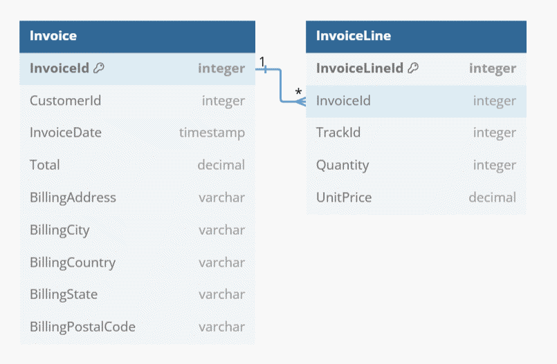
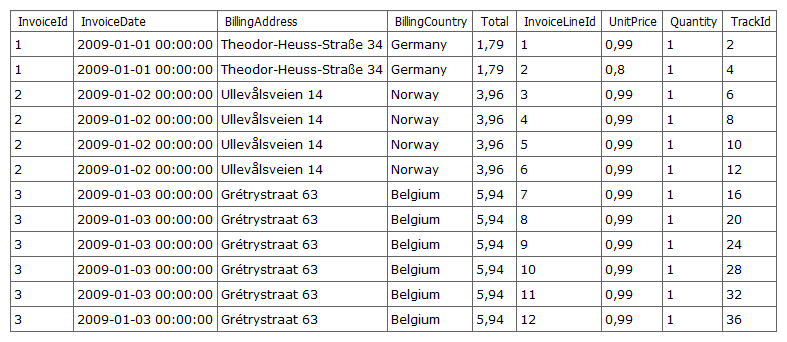
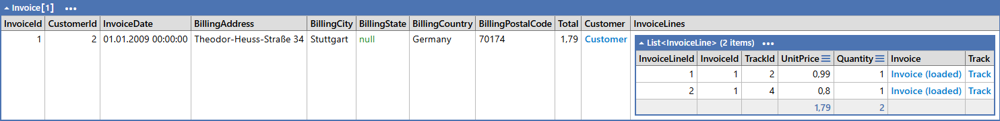
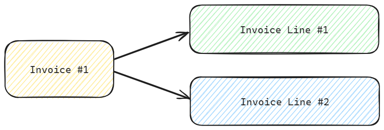
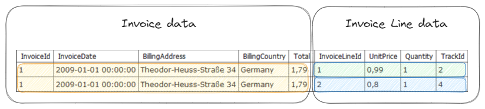
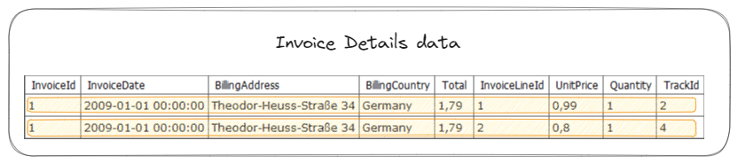

A colleague of mine noticed a strange behavior of our system he was working on and asked me for help. This article describes the issue we noticed, the cause and possible solutions. 

Before we start, I'd like to give some context - the system we will be looking at today uses a CQRS approach, where we have a few practices enforced:
- commands are always executed against the db tables
- queries are always using views to fetch data

Those practices led to a configuration issue that was hidden by other settings. 

You can fetch the script describing the issue using the 
sample LINQPad snippet .


## Problem

> The database in this article is not a real one where the issue occurred. 
> I am using a demo db to reproduce a simplified version of the problem.

Let's assume our database looks like this:


It has 2 main tables `Invoice` and `InvoiceLine`. Each invoice can contain multiple lines.

At some point, a view `FullInvoiceDetails` was added to allow reading invoice details in a single call.

```sql
select * from FullInvoiceDetails
```


This view was also registered into our `DbContext`:

```csharp
IQueryable<FullInvoiceDetails> InvoiceDetails => this.Set<FullInvoiceDetails>();

protected override void OnModelCreating(ModelBuilder modelBuilder)
{
	base.OnModelCreating(modelBuilder);

	modelBuilder.Entity<FullInvoiceDetails>(b => 
	{
	    b.ToView("FullInvoiceDetails");
	    // ... rest of the config ...
	});

    // ... rest of the config ...
}
```

and used to fetch the data:
```csharp
void Main()
{
	InvoiceDetails
		.Where(n => n.InvoiceId == 1)
		.ToArray()
		.Dump();
}
```

This yielded some suspicious results. Please note that both rows are identical—this is clearly wrong since the first rows in the raw output differ by the `TrackId` and `UnitPrice` columns.


There is something clearly wrong, the first thing we can do is examine the SQL query that EF produced:
```sql
SELECT "f"."InvoiceId", "f"."BillingAddress", "f"."BillingCountry", "f"."InvoiceDate", "f"."InvoiceLineId", "f"."Quantity", "f"."Total", "f"."TrackId", "f"."UnitPrice"
FROM "FullInvoiceDetails" AS "f"
WHERE "f"."InvoiceId" = 1
GO
```
The query is valid, and if run directly produces valid results. The problem is introduced by ORM.

## Investigation

Let's take a look into the view, this set is bound to. 
```sql
create view FullInvoiceDetails (InvoiceId, InvoiceDate, BillingAddress, BillingCountry, Total, InvoiceLineId, UnitPrice, Quantity, TrackId) as
select i.InvoiceId, i.InvoiceDate, i.BillingAddress, i.BillingCountry, i.Total, l.InvoiceLineId, l.UnitPrice, l.Quantity, l.TrackId
from Invoice i
join InvoiceLine l on i.InvoiceId = l.InvoiceId
```

When executed, the query returns exactly what we expect - tables `Invoice` and `InvoiceLine` joined together:


As those familiar with SQL know, data from the `Invoice` table will be returned multiple times, repeated for each `InvoiceLine`. This is the expected behavior of a join query. It is ORM's responsibility to read this flattened data and produce a meaningful object graph.

For instance, a query where we intend to fetch both `Invoice` and `InvoiceLice` data using tables only may look like this:
```csharp
void Main()
{
	Invoices
		.Include(i => i.InvoiceLines)
		.Where(n => n.InvoiceId == 1)
		.ToArray()
		.Dump();
}
```
and will also produce a query with `join` keyword, 
```sql
SELECT "i"."InvoiceId", "i"."BillingAddress", "i"."BillingCity", "i"."BillingCountry", "i"."BillingPostalCode", "i"."BillingState", "i"."CustomerId", "i"."InvoiceDate", "i"."Total", "i0"."InvoiceLineId", "i0"."InvoiceId", "i0"."Quantity", "i0"."TrackId", "i0"."UnitPrice"
FROM "Invoice" AS "i"
LEFT JOIN "InvoiceLine" AS "i0" ON "i"."InvoiceId" = "i0"."InvoiceId"
WHERE "i"."InvoiceId" = 1
ORDER BY "i"."InvoiceId"
GO
```

However, the result is different. We asked EF to fetch invoice with id equal to 1, so it know it should group the data rows together into a single `Invoice` object.


### Side excursion into EF Core Id Entity Resolution

How did the ORM manage to recreate the entity relationships from the flat database response? 

It is a core feature of every ORM - Id Entity Resolution, which allows to reuse a single entity instance when needed.

Our desired model when fetching `Invoices.Include(i => i.InvoiceLines)` looks like this:


EF Core is capable of recreating this model by marching specific columns into instances:


EF Core will realize that both rows are referring to the same `Invoice` instance and will merge them. As a matter of fact, it will simply reuse the first instance that was read (from the first data row).

How EF Core know how to relate both rows together? We instructed it to do it by stating which column is the primary key of the table:
```csharp
modelBuilder.Entity<Invoice>(b =>
{
	b.ToTable("Invoice");
	b.HasKey(n => n.InvoiceId);
});
```

In simplified words, we can say that EF will try to reuse a model instance for each data row that contains the same primary key. This makes perfect sense to the tables.

### The smoking gun - entity misconfiguration

How does the Id Entity Resolution relate to our issue? We know that our invalid ORM mapped result contains two objects with the same data. It is not a true statement, with further investigation we can notice that it is the same object returned twice:

```csharp
var rows = InvoiceDetails
	.Where(n => n.InvoiceId == 1)
	.ToArray();
		
ReferenceEquals(rows[0], rows[1]).Dump();  // prints `True`
```

This is the exact behavior we expect from an ORM to reuse an object when an object with the same key is detected. So, does this mean that EF Core reused the first row?

Some may noticed that I omitted part of the configuration, so here is the full view:
```csharp
modelBuilder.Entity<FullInvoiceDetails>(b => 
{
    b.ToView("FullInvoiceDetails");
	b.HasKey(n => n.InvoiceId); // smoking gun is right here
});
```

Someone who configured this entity assumed, that since it represents an invoice it will have a single entry per `InvoiceId`. As we remember this is not the case due to `join` in our view. Our view can return multiple rows related to a single invoice object, however since we instructed EF Core that `InvoiceId` is a primary key of the data set, it incorrectly assumed that the 2nd row represents the same object and can be discarded.


According to EF Core, both rows represent the same object (marked as orange).

## Solution

### Incorrect one - disable the Id Entity Resolution

After the investigation, we found that we were using views with a primary key specified in different places of the code, but the issue never surfaced.
This was due to other practice we enforced for our queries - since it was read-only call, the change tracker was not needed and was usually disabled:

```csharp
InvoiceDetails
	.AsNoTracking()
	.Where(n => n.InvoiceId == 1)
	.ToArray()
	.Dump();
```

With change tracker disabled ORM was not trying to resolve entities based on the primary key, and reading rows as they save from the SQL server.
While the queries work correctly it is easy to imagine that the change tracker could be reenabled again and the issue starts occurring. 

It is worth to mention, that it is possible to disable only change tracker, but still have the resolution by Id enabled - a query using `AsNoTrackingWithIdentityResolution` will still produce invalid results.

I would not consider this as a solution - we are sweeping the issue under the carpet.

### Correct but potentially dangerous - specify a compound key

Another solution is to understand the view we are using in the query and construct a better primary key for it. 
For instance, our view which groups tables `Invoice` and `InvoiceLine` could use primary keys from both joined tables:
```csharp
modelBuilder.Entity<FullInvoiceDetails>(b => 
{
    b.ToView("FullInvoiceDetails");
	b.HasKey(n => new { n.InvoiceId, n.InvoiceLineId });
});
```

I consider this solution a bit dangerous, especially when we do not own the underlying view an it is subjected to changes. It is possible that the join statements will change, while the returning set schema does not. In this case, we risk that the view can be changed in such a way that we will require adding another column to our compound key. If we miss this change, the issue may resurface.

### Correct but with limitation - view should not have a primary key

The simplest solution - a view should not have a primary key at all.
```csharp
modelBuilder.Entity<FullInvoiceDetails>(b => 
{
    b.ToView("FullInvoiceDetails");
	b.HasNoKey();
});
```

There is a limitation, however - EF Core will return multiple instances of the same `FullInvoiceDetails` entry even if we expected it to be reused. This can happen when executing twice the same query, or performing a manual join that involves the view.

Consider a scenario when the same query is executed twice on a table:
```csharp
var first = Invoices.First(n => n.InvoiceId == 1); // direct fetch from database
var second = Invoices.First(n => n.InvoiceId == 1); // reused from cache;

ReferenceEquals(first, second).Dump();  // prints `True`
```

EF Core was able to detect that the second query resulted in the same object, so it reused the existing one from the local cache. A matching entry is found by comparing the primary key of the objects.

The same will happen if we define a key for our view, EF Core will be able to match a cached instance and reuse it:
```csharp
modelBuilder.Entity<FullInvoiceDetails>(b => 
{
    b.ToView("FullInvoiceDetails");
	b.HasKey(n => new { n.InvoiceId, n.InvoiceLineId });
});
```
```csharp
var first = InvoiceDetails.First(n => n.InvoiceId == 1);
var second = InvoiceDetails.First(n => n.InvoiceId == 1);

ReferenceEquals(first, second).Dump();  // prints `True`
```

Opposite will happen if the entity has no key defined, EF Core is not able to cache the instance, thus having to construct a second instance of the same entity.
```csharp
modelBuilder.Entity<FullInvoiceDetails>(b => 
{
    b.ToView("FullInvoiceDetails");
	b.HasNoKey();
});
```
```csharp
var first = InvoiceDetails.First(n => n.InvoiceId == 1);
var second = InvoiceDetails.First(n => n.InvoiceId == 1);

ReferenceEquals(first, second).Dump();  // prints `False`
```

I would not consider this an issue, since I would not imagine a scenario where we are using a view and relying on reference resolution. If this is the case, one has to define w good primary key or consider creating a separate view better suited to the given query.