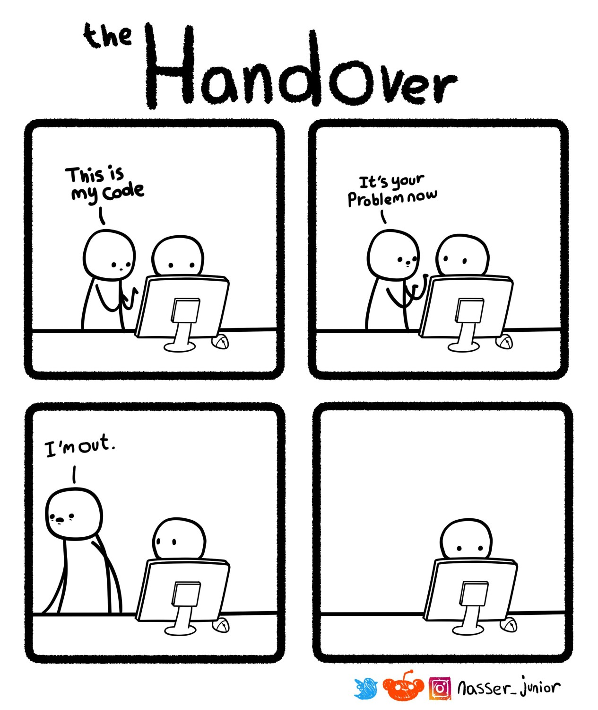

Recently as part of a quarterly retrospective, my colleagues were challenged with the problem of how to improve teamwork, reduce knowledge silos, and improve overall communication between teams and team members.

I decided to take an opportunity and sum up some of my thoughts and experiences collected across several projects for different clients.

# Part I - The Rockstar

We all heard about rockstar developers. Sometimes this is the way HR describes the job vacancy, the other time a person earns this position. Personally, I don't like this term, I also believe that the situations that lead to a person becoming one should be avoided as much as possible. Please forgive me, if you are a true rockstar language developer.

The book [The Phoenix Project](https://www.goodreads.com/book/show/17255186-the-phoenix-project) introduced a character named Brent. Because of his wide knowledge and experience, he became the only person who could solve an issue. In the short run, the fact that he was a go-to person that can fix anything in just a few minutes was beneficial, but from a wider perspective, it was a disaster waiting to happen. As the story reveals, Brent was a bottleneck in the IT department. Constant interruptions prevented him from doing his own work. The urgency of the tasks caused others to ask him for help and quite often they did not truly understand what the solution actually was. Brent was able to save the situation, but there was no time for him to share his knowledge with others. Even if he was the most helpful person in the room, he slowly became a problem ([1](https://www.freecodecamp.org/news/we-fired-our-top-talent-best-decision-we-ever-made-4c0a99728fde/), [2](https://startupsventurecapital.com/you-fired-your-top-talent-i-hope-youre-happy-cf57c41183dd)).

_Use the Source, Luke_

I have experienced a similar situation. I was a part of a local team with a tech lead located in a foreign office. He was the only person who knows the system best and was quite unwilling to share this mystery. To this day, I remember my pull request being completely rewritten during his shift and merged without any feedback left for me. Despite us trying to do our best to actively participate in project development, our knowledge was limited. Our lead has built a knowledge silo and shortly became a real bottleneck. He needed to be involved in any, even the simplest decision the team made. Because of this, one often spent most of the day waiting for an answer. Our involvement in the project lasted less than half of a year. Did any of us feel confident to commit any major changes? I don't think so.

In recent projects, I have seen this as well. A single developer working on a noticeably big and complex part of the system, where source code is independent of code base other teammates work on daily. Without frequent peer reviews, even if the code is unfinished and does not work yet, it is really easy to create a silo. This part of the codebase becomes unknown and not well understood by other members of the team. Gaining this knowledge just from the source or documentation (if even exists) may take longer, than the sum of time spent on frequent reviews of the system while it was being developed.

# Part II - The Bus

So what happens if, or when such a core person leaves the team? Whenever he or she decides to search for other challenges in a different company or needs to stop working for personal reasons. There may not always be time for a series of knowledge transfer sessions.

_'Cause there'll be no safety in numbers_
_When the right one walks out of the door_

This problem is sometimes called the bus factor - what will be the impact on the project if a given teammate is hit by a bus. This rather drastic exaggeration refers to any situation that may cause a person to be unable to work without early notice.

Last year, we witnessed an extreme example of this, when the maintainer of library core-js was [sentenced to spend 18 months in prison](https://www.theregister.com/2020/03/26/corejs_maintainer_jailed_code_release/). Since his library is a foundation of many other projects and frameworks, all of them could be in jeopardy. The situation forced Github to rethink their repository ownership model and introduced the ability to transfer rights to other people in case of the owner not being available. Surely, this will never happen in a corporate environment, where no single person manages a project, it is usually a team of several people. But of course, it happened!

Our project was referencing a .net library from our corporate Nexus server. It was a client for an in-house build protocol for near real-time data updates. As Murphy's Law states, certainly it will cause a problem. Quite soon, I was challenged with a task to reduce memory footprint and leaks inside the code. The whole team was nowhere to be found, everyone already left the company or moved to different positions. No one knew where the source code is hosted, the only thing I got is a dll file available on the Nexus server. In the end, I was forced to disassemble the binary, reconstruct the source code using [dotPeek](https://www.jetbrains.com/decompiler/) decompiler and make the changes myself. Was this action safe? No. Even though the changes needed were small it still was risky. Was this acceptable? Of course, no! But since the client was unwilling to extend memory of a hundreds client machines to make our app run, we had to resolve the core issue. Should this ever happen? No. We never should allow unmaintained dependencies in our projects. Including decompiled code, with barely any automatic tests, making your organization rely on a binary with no source code or responsible person should be unacceptable. But it happened.

I guess, can feel a little better, knowing that this [happened to MS too](https://www.bleepingcomputer.com/news/microsoft/microsoft-appears-to-have-lost-the-source-code-of-an-office-component/).

# Part III - The World Tour

Today we live in a smaller world, everyone can talk with anyone on the other part of the planet in just a few clicks. Collaboration applications like Jira, MS Teams, Zoom, or even the simplest messaging solution should solve our problems, don't they? But it is not the distance between the people that causes the problem. It is the time zones that could cause havoc with communication inside the team.

I was part of the team that had developers scattered across the world - from Japan to the United States. The open-source community proves that this should not be a problem. Individuals across the globe can write and maintain such a marble of GNU/Linux kernel. While I am not against multi-time zone cooperation, I am fully aware of the additional challenges it creates. How frequent and effective will be a knowledge transfer between people located in the west US and east Asia? This could require really strange working hours or overtime. Both of these solutions may not be acceptable in a corporate environment because of the law (or simply employee work-life balance), while such restrictions do not apply for voluntary work on an open-source project.

The need for effective cooperation between time zones and distant locations caused the creation of tools like Jira or Azure Boards. Raise of such tools triggered a movement of people unsure if agile is still a thing. This slowly creeps into development conferences like [this](https://www.youtube.com/watch?v=vSnCeJEka_s) one.

_Individuals and interactions over processes and tools_

According to this movement, the agile has lost its way. How can we interact within the team if the working hours of the team members do not overlap? Usually, we introduce tools like online boards, IM, and emails. Does it affect team speed and agility? Does it increase the chances of knowledge silos creation? Both questions have to be answered individually by the team.

# Part IV - The Final Countdown

What are the lessons I learned across my projects?

- Any board/wiki software is just a tool that should only aid the team, not become the main way of communication.
- The creation of a rockstar developer can be a problematic situation when the team relies on this person too much.
- People may not be able to communicate their knowledge. Not only because of their unwillingness to share, but also problems expressing the ideas or lack of time or opportunity.
- Knowledge transfer sessions often go wrong. Personally, I am not able to fulfill the "Tell us everything you know" challenge.
- People come and go, having whole knowledge stored in the mind of a single individual is a risk that may affect multiple teams.
- Having a lone developer in a remote time zone working on a big feature without frequent PR/KT sessions is not an ideal situation.
- Rubber duck sometimes is not enough. Everyone can get stuck and need help, but if there is no one available in the time zone a day is wasted.
- Frequent reviews of unfinished code prevent "the change was too big to review, so I accepted it" situations.
- Time spent on pair-programming is not wasted. Often it is more effective than KT sessions when the feature is already completed or trying to understand it when an author is no longer available.
- People's chronotype matters, APAC early bird may not be an effective member of a team based mostly in the US.

It is everyone's responsibility to prevent the collapse of the project when a person closes the door.

