LINQPad is one of the pieces of software that you keep using since you saw it for the very first time. Personally, It is my go-to tool for quick prototypes and data access.

It is lightweight and fast - works perfectly as a scratchpad for quick tests. As a matter of fact, its web page declares it to be "The Ultimate Scratchpad for C#, F# and VB".
- Querying databases with the power of Linq and .net.
- Powerful Dump methods for convenient data presentation.
- Ability to reference custom library or NuGet package.

The tool is free, however, it does not support intellisense, debugger, or NuGet integration until it is paid for. This can make it hard to discover the full set of abilities and features. This is one of the reasons I decided to show some of the tricks that are available for us today.

[https://www.linqpad.net/](https://www.linqpad.net/)
          

# Running pieces of code

LINQPad allows you to execute pieces of code in C#, F#, and VB. For those languages, it provides several options to reduce boilerplate code.

1. Expression - our piece of code is a single expression that returns an object or a collection. The result will be automatically displayed. This is the default option used by most of the queries.
1. Statement(s) - an option that allows to introduce more than one statement or variables. Results need to be manually rendered by using Dump methods. LINQPad automatically switches to this option when code contains at least one semicolon character.
1. Program - option that gives you the method Main and allows you to declare custom types. Asynchronous version of Main method is supported. Results have to be dumped manually.
For all of those options using are hidden away and available in Query -> References and Properties window.

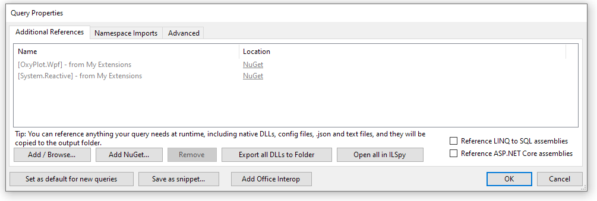

From this window, we manage added references (dlls and NuGet) and specify namespaces to import.

LINQPad allows also to create reusable code. A special query named "My Extensions" is automatically referenced to all other queries. This makes it a perfect place to define all custom extension methods and types used across many queries. Version 6 also supports [referencing other .linq files](https://www.linqpad.net/LinqReference.aspx).

# Querying the database

The core functionality of LINQPad is to query databases. The tool supports several database engines out of the box and can be extended with a number of plugins to support new engines and vendors.

We are not forced to use Linq and C# to write our queries, the tool supports SQL language as well.

The tool automatically builds a database context for us, utilizing linq2db under the hood. From here, we can query data, insert or update entities. Because we are already in .net world, we can also enrich our results with custom calculations.

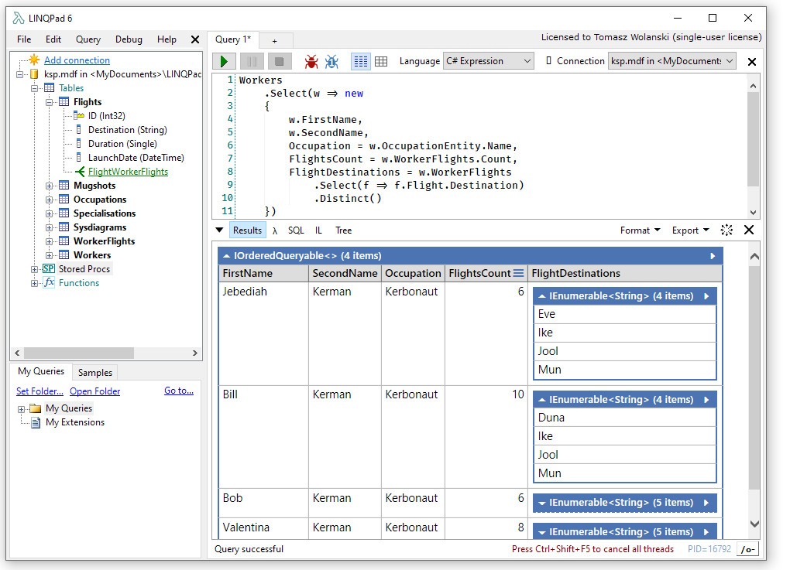

The fact, that our context and data types are automatically scaffolded for us, allows us to discover data much easier and quicker than using just SQL when we have to know the database schema in advance.

SQL Management Studio makes our life a little bit easier, by creating a db diagrams:

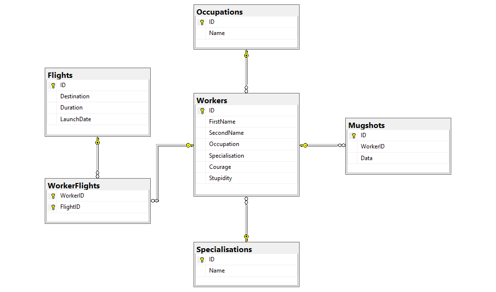

However, with LINQPad you can "discover" your data just by expanding it:

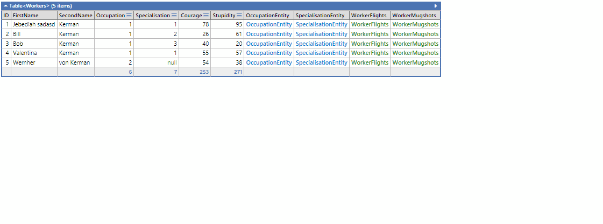

This data presentation form is extremely useful in "I am not sure what I am looking for" situations. SQL generated from our Linq query can be later reviewed, and adjusted for our needs if necessary.

# The Magnificent Dump

The data view we saw above is, at least for me, the biggest selling point of LINQPad. Any type will be presented as an HTML table with its data. It is worth to mention, that we have a lot of ways to customize what we see - [Customizing Dump Output](https://www.linqpad.net/CustomizingDump.aspx), or even include private fields.

Some of the object types are handled differently. Several of them are hidden in LINQPad library and are hard to find without code completion or reading documentation.

Almost all of the presented types can be nested in user objects, which makes this toolkit extremely flexible and easy to use.

## Custom styling, data highlight, images

Our data view is an HTML page, so LINQPad allows us to inject custom styles into our objects.
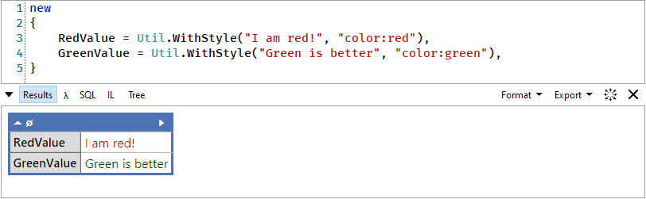

Util class allows us to also highlight certain rows of our data.
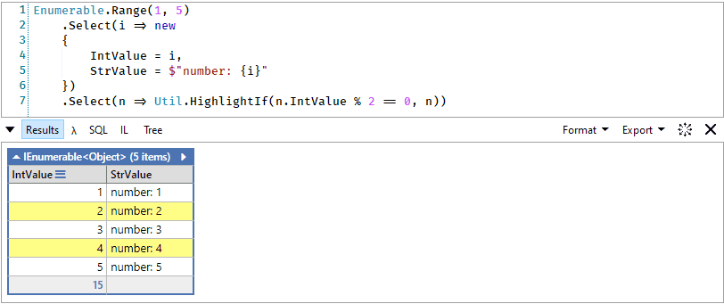

If needed we can embed images from URL or array of bytes.
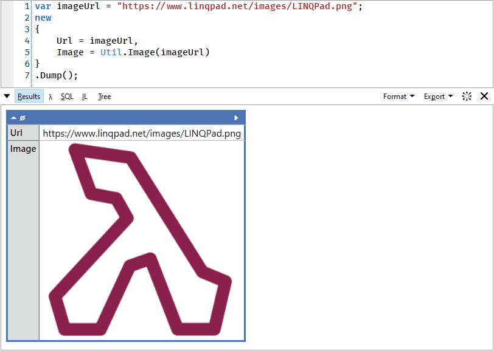

Because our view accepts HTML and JS we can do much more when it comes to formatting and presentation of our data. LINQPad sample collection contains examples of how to inject custom HTML element or utilize JS code.

## Special .net types
As we saw, not all objects are being presented as key-value pairs. Several types from BCL have a special way of rendering too.

**Lazy\<T\>** is not being automatically calculated and expanded - as desired, it will be calculated on demand. **Util.OnDemand** serves similar function but allows to specify custom text of the link.
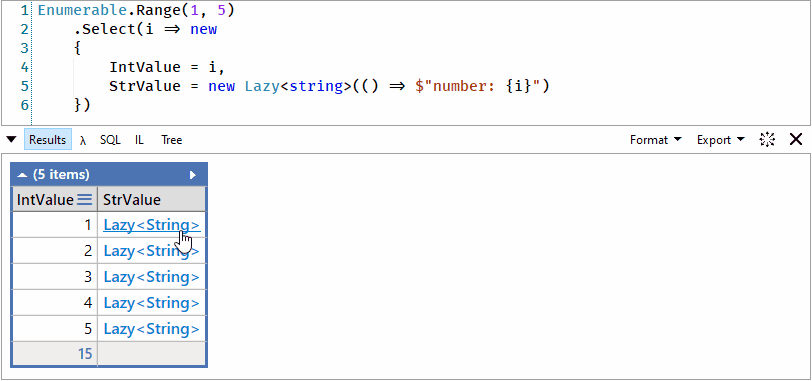

**Task**, **Task\<T\>** automatically updates its view on completion.
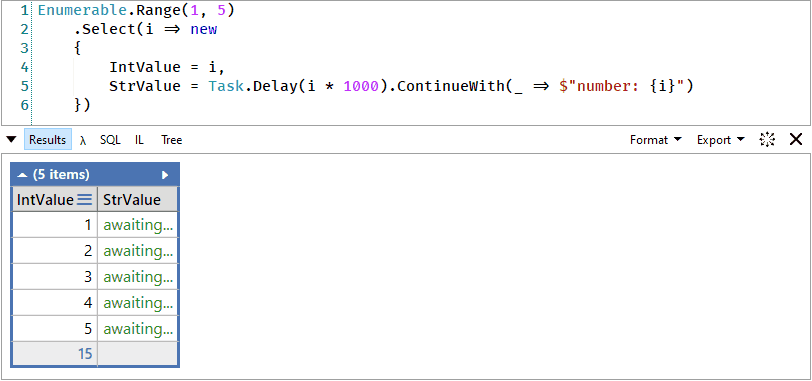

**2d arrays** are also a special case and are presented in a more convenient way.
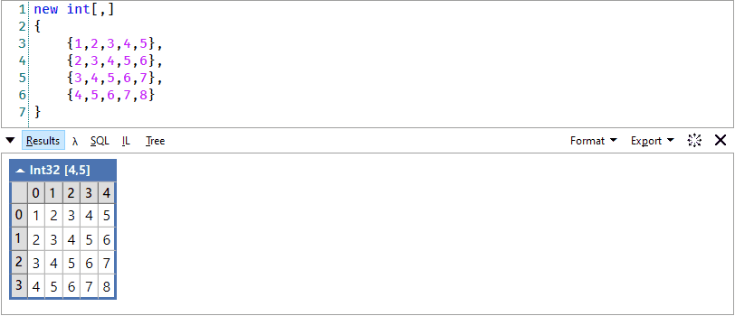

**IAsyncEnumerable\<T\>**, **IObservable\<T\>** were never easy to be displayed. LINQPad makes it a breeze, even notifies you about stream completion by changing the color.
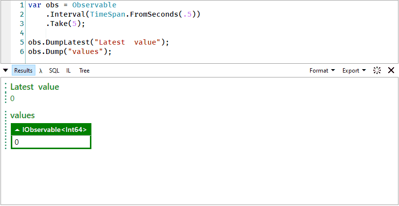

## Make queries more interactive

Sometimes we do not want to just display plain data. Every time you want to display progress of completion or perform data operations LINQPad got you covered.

**ProgressBar** gives you ability to report on long running operation.
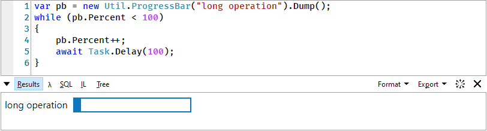

**DumpContainer** is a especial type that allows you to display data in the same place, instead of appending it to the output.

Let's see how LINQPad behaves when we want to dump multiple objects:
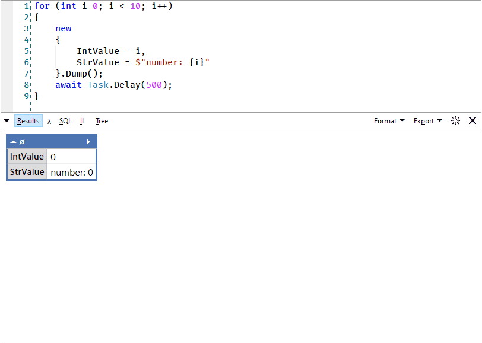

And now with a container:
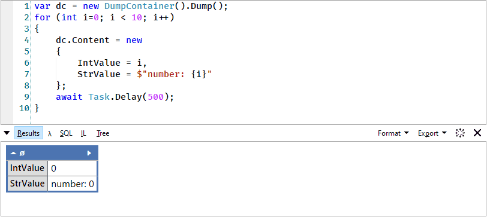

**Util.ReadLine** is the simplest way to provide user input. Unfortunately, there is no support for multi-line inputs.
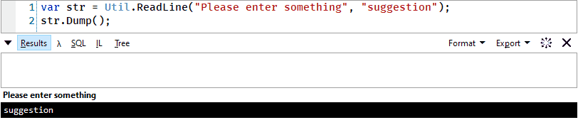

**Hyperlinq** produces a clickable link, that can point you to a web page, different query, or execute C# code.
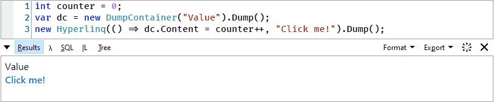

## Other utilities

**Util.GetPassword** - LINQPad is equipped with a secure place to store your secrets. This can be handy if your query creates custom connections to other services.

Passwords can be managed in File -> Password Manager window. When the password does not exist in the vault, the query will stop execution and ask the user to provide the value.
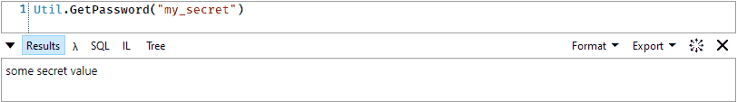

**Util.Cache** can save some value between executions of a query. It can be really useful, if you are working with some slow data source, or want to reduce the number of network calls.

**Util.Snapshot**, **Util.Dif** -pair of useful methods that allow you to detect changes. The first one creates a deep copy of an object (depth can be adjusted). The second one finds differences between the two objects. The result can also be displayed in a convenient way.
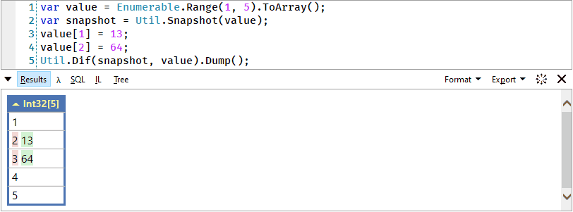

**Util.HorizontalRun** allows you to present objects horizontally instead of the default vertical arrangement.
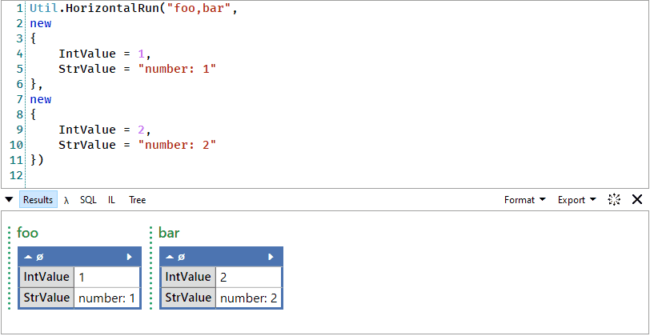

**Uncapsulate** is an extension method that makes it possible to access private fields and properties of an object.
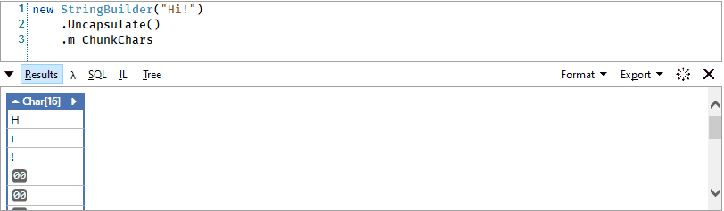

**PredicateBuilder** - each query has referenced a library designed to dynamically build queries. For more details see [C# in a Nutshell - PredicateBuilder](http://www.albahari.com/nutshell/predicatebuilder.aspx).
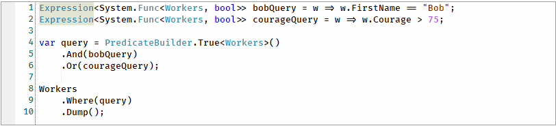

## Build-in charts

LINQPad has also a build-in ability to produce charts. By default, the chart will be presented in a separate result window. They can also be dumped inline, next to other objects.
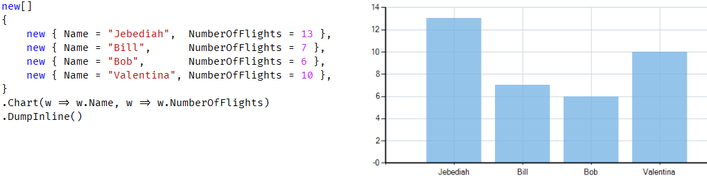

# Advanced UI controls

Quite recently I was surprised to discover something completely new for me. I am referring to LINQPad.Controls namespace. Previously I was utilizing **HyperLinq** and **Util.ReadLine** in my code to interact with it. The discovery of a complete set of UI controls made me sure, that LINQPad is the way to write most of my tools, even if they will be shared with other teammates.
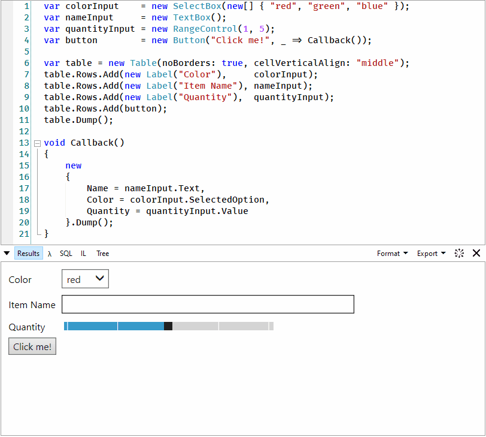

Build-in control set contains text box, password import, file picker, multi-select list, and many other.

# Never-ending possibilities

As I mentioned before LINQPad can be expended by installing new plugins to support new data sources - [Data Context Extensibility](https://www.linqpad.net/Extensibility.aspx). Another way we can expand its capabilities it is to write a custom visualizer - a completely new way to present our data and interact with it. LINQPad supports hosting of WPF and Win Forms controls - [Writing Custom Visualizers](https://www.linqpad.net/CustomVisualizers.aspx).

In samples provided with LINQPad, you can even find a Microsoft Dataflow sample that uses a build-in visualizer to present state of the queues.

# Summary

The article was written to present some of the features for LINQPad that may not be well-known, but (in my opinion) make it a very powerful tool. The fact, some of its features are available only in paid version (intellisense, debugger) may discourage new users, but I can assure you, this is one for the must-have tools (who needs code completion anyway?).

Why should we write SQL, if we can access our data like this?
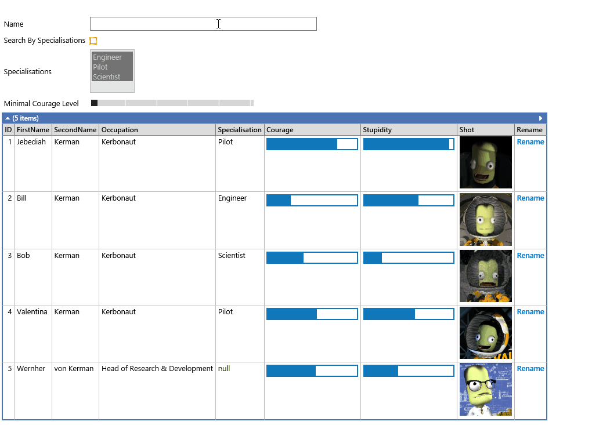

Database and .linq file for this sample are provided at [my github](https://github.com/tomwolanski/linqpad/tree/master/Kerbal%20Space%20Program%20UI%20sample).

For everyone, who wants to test LINQPad possibilities I strongly encourage them to download it and check the collection of samples in the left bottom part of the window. It contains not only executable tutorial and reference, but many authors also publish code related to their books to LINQPad samples repository - i.e. "C# in Depth", "Thinking in LINQ".
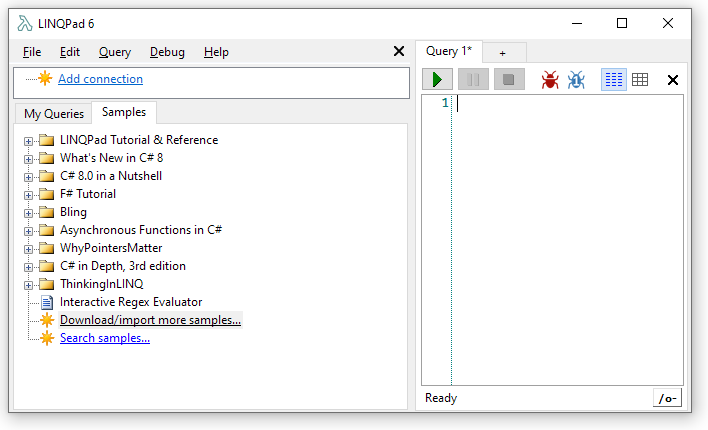

