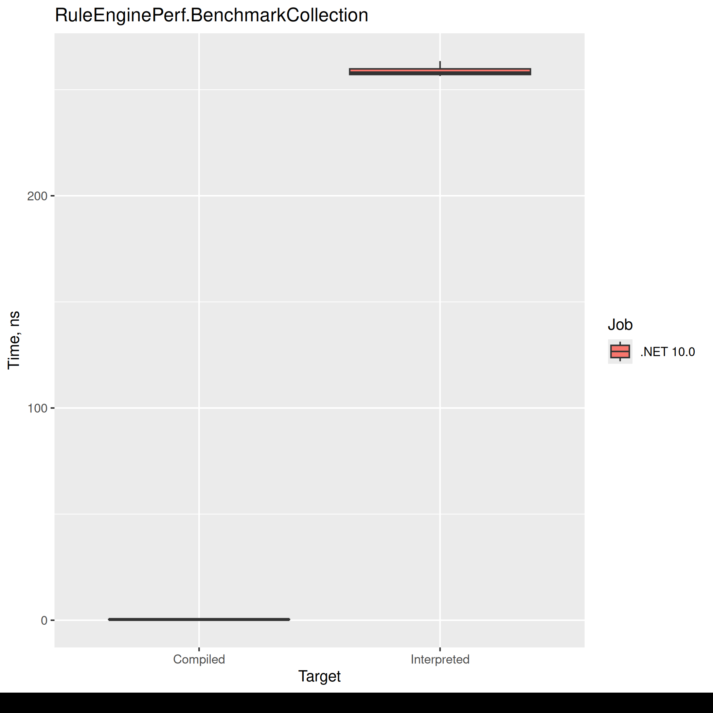
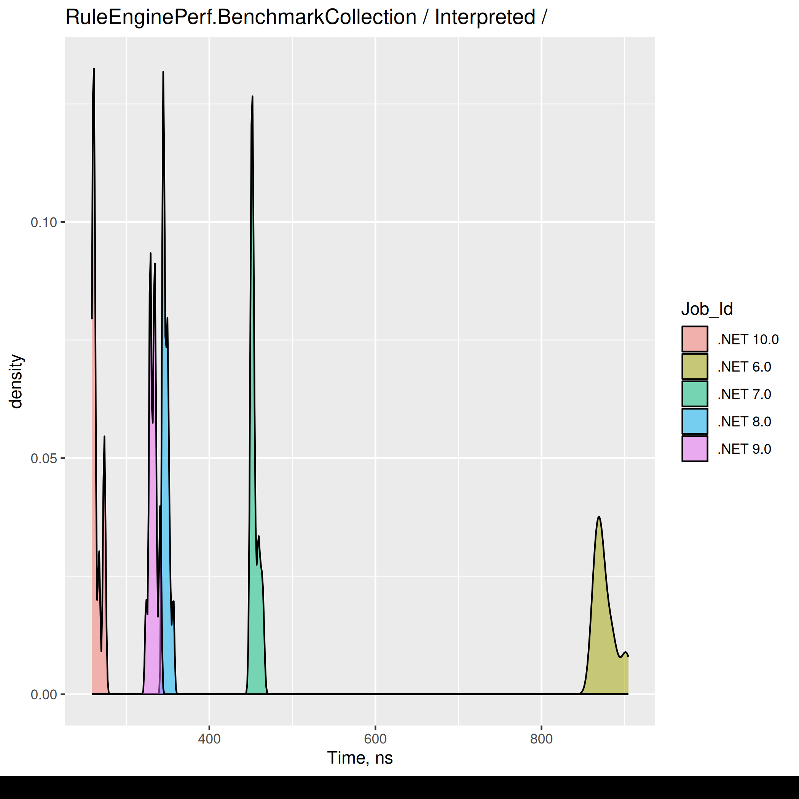

# Intro
I was once assigned to work with a team responsible for the maintenance of a system designed to synchronize multiple services. To achieve this task, a series of pipelines was orchestrated by Azure Data Factory. A few custom addons were introduced to one of the pipelines, including a hero of today’s story - a custom rules engine implementation.
In summary, the rule engine needed to evaluate each entry and perform a simple action on those that matched a predicate. To make the system more flexible, the logic was not hardcoded in C#, but rather provided as a separated json files describing the predicate, and pointing to the action that needs to be executed.
Consider an example entry, for instance, a User type with the following definition:
```csharp
public class User
{
    public bool IsFullTime { get; set; }
    public string? Title { get; set; }
    public string? ValidationResult { get; set; }
    
    /* many more members */
}
```

A simple JSON file containing the rule may look like this:
```json
{
  "CustomFunction": "SetFullTimeValidationStatus",
  "RuleCondition": {
    "SchemaItemPath": "User.IsFullTime",
    "Condition": "Equals",
    "ComparisonValue": "True",
    "NextOperation": {
      "OperatorType": "AND",
      "RuleCondition": {
        "SchemaItemPath": "User.Title",
        "Condition": "IsNotBlank"
      }
    }
  }
}
```

The rules are deserialized to the following types:

```csharp

public class RecalculationRuleDTO
{
    public string CustomFunction { get; set; }
    public RuleConditionDTO RuleCondition { get; set; }
}

public class RuleConditionDTO
{
    public string SchemaItemPath { get; set; }
    public Condition Condition { get; set; }
    public string ComparisonValue { get; set; }
    public NextOperationDTO NextOperation { get; set; }
}

public class NextOperationDTO
{
    public OperatorType OperatorType { get; set; }
    public RuleConditionDTO RuleCondition { get; set; }
}

public enum OperatorType : short
{
    AND = 1,
    OR = 2
}

public enum Condition : short
{
    Equals = 1,
    NotEquals,
    GreaterThan,
    LessThan,
    IsBlank,
    IsNotBlank,
    // and others
}

```

The rules were accompanied with a set of compiled, reusable handlers, which implemented the actual action to be performed. For instance, the rule from above references `SetFullTimeValidationStatus`, which may look like this:
```csharp
public static class RecalculationHandler
{
    public static void SetFullTimeValidationStatus(User value)
    {
        /* Do Some Work here */

        value.ValidationResult = "full time employee validated";
    }
}
```
There were also additional handlers defined, which implemented the conditional checks, i.e. `IsNotBlank` and `Equals`. 
Examples of those will be described later, when we take a deeper look into the implementation.

In a nutshell, the rule is equivalent to the following code:

```csharp
void Execute(User user)
{
    if (user.IsFullTime && !string.IsNullOrEmpty(user.Title))
    {
        RecalculationHandler.SetFullTimeValidationStatus(user);
    }
}
```
There was a significant number of rules like this, which needed to be evaluated one by one on an already huge set of data. As the title may already suggest, the process was slow. To process all the daily records using all the rules, it would need at least 6 hours.

Because of this, the process was executed once per day, during the night time. Daily executions was fine for the business perspective, and the client never requested any improvements; it was a low season, when there was not much to do. I decided to play a little bit with the system and find a way to improve it.

The result was astonishing; 6 hours were reduced to less than 5 minutes. All thanks to reducing one thing the original engine relied on - reflection. I can imagine that it would be possible to implement additional changes to improve the time even further, but at that point, I decided to call it done.

# Reflection
Many languages include some way to read “metadata” about the running code. This ability is called reflection. Reflection allows us to read information about our types, including names of members and other attributes associated with them. In this article, we will focus heavily on finding a member method and executing it with some parameters.

A minimal example of calling a method using reflection may look like this:

```csharp
public class MyTarget
{
    public int DoSomething(string[] argument)
    {
        return argument.Length;
    }
}

public class Program
{
    public static void Main()
    {
        // find method using its name
        var method = typeof(MyTarget).GetMethod("DoSomething");

        // 
        var target = new MyTarget();
        var arguments = new object[] { "hello!" };
        
        var result = (int) method.Invoke(target, arguments);
    }
}
```

More information about reflection can be found at the 
[learn.microsoft.com](https://learn.microsoft.com/en-us/dotnet/fundamentals/reflection/overview).

Reflection is powerful, but it is well-known source of bugs and performance issues. Because of this, a rule of thumb is to not use it for a hot path logic if possible.


# Original, "interpreted" implementation

It was relatively easy to spot a potential problem. Back in the day of dotnet 6.0, it was well known that reflection was slow and should not be used in time-sensitive scenarios. In the original implementation, the reflection was everywhere. Of course, it was needed, the JSON file containing a rule referenced to the concrete implementation only by method name. Some kind of reflection is necessary to find and execute the method when only the name is available.

I am referring to this approach as “interpreted” because of the way the rule engine works. It finds the necessary component as they are needed.
## Rule action

Let’s start with a code that is used to call the `CustomFunction` after the rule condition was evaluated, and we determined that the entity matches the rule. I am going to start from here, since it is shorter code, but it illustrates what we are going to face.

```csharp
public static class RecalculationRuleInterpreter<TEntity>
{
    const BindingFlags flags = BindingFlags.Public | BindingFlags.Static;

    public static void ExecuteRuleFunction(RecalculationRuleDTO rule, TEntity entity)
    {
        ArgumentNullException.ThrowIfNull(rule, "rule");
        ArgumentNullException.ThrowIfNull(rule.CustomFunction, "rule.CustomFunction");

        var method = typeof(RecalculationHandler).GetMethod(rule.CustomFunction, flags)!;

        method.Invoke(null, new object[] { entity });
    }
```

As we can see, the core of the method, is just utilizing reflection to execute a function. We are using `Type.GetMethod(string, BindingFlags)` and `MethodInfo.Invoke(object, object[])` for every single entity we are working with. Newer versions of dotnet made those methods faster than they used to be, but it is still a lot of unnecessary work. Potentially, we could cache the `MethodInfo` instances for each of the pairs of `rule.CustomFunction` and `TEntity` to gain some minor improvements.

## Rule predicate

A method responsible for evaluating the rule predicate is much more interesting. To perform the task, it needs to read values from public properties of the entity and compare them with the provided data. Depending on the rule, this can happen multiple times, where condition results are aggregated with `AND` or `OR` operators.

Before we start with actual rule engine logic, lets define some helper methods that will be later used.

```csharp

// A set of predicates that can be used by the rule conditions.
// Methods defined must match values defined in `Condition` enum. 
public static class ConditionHandler
{
    public static bool Equals(string value, string comparisonValue)
    {
        return value == comparisonValue;
    }

    public static bool IsNotBlank(string value, string comparisonValue)
    {
        return !string.IsNullOrEmpty(value);
    }
    
    /* and many more reusable predicates */
}

// Operators to combine results of nested rules.
// Mapped from `OperatorType` enum.
public static class OperatorTypeHandler
{
    public static bool AND(bool firstResult, bool secondResult)
    {
        return firstResult && secondResult;
    }

    public static bool OR(bool firstResult, bool secondResult)
    {
        return firstResult || secondResult;
    }
}
```

With those out of the way, let's check the actual rule engine.

```csharp

public static class RecalculationRuleInterpreter<TEntity>
{
    const BindingFlags flags = BindingFlags.Public | BindingFlags.Static;

    // Evaluates a single rule for a given entity
    public static bool ValidateRuleCondition(RecalculationRuleDTO rule, TEntity entity)
    {
        return ValidateRuleCondition(rule.RuleCondition, entity);
    }

    // Evaluates a single rule condition for a given entity
    private static bool ValidateRuleCondition(RuleConditionDTO ruleCondition, TEntity entity)
    {
        var typeEntity = typeof(TEntity);
        var entityType = ruleCondition.SchemaItemPath.Split('.').First();

        // read value of the property used by the rule
        var entityPropertyName = ruleCondition.SchemaItemPath.Split('.').Last();
        var entityProperty = typeEntity.GetProperty(entityPropertyName);
        var entityValue = entityProperty?.GetValue(entity)?.ToString() ?? string.Empty;

        // find and execute the condition (comparison) method
        var condition = ruleCondition.Condition.ToString();
        var comparisonValue = GetComparisonValue(ruleCondition, entityType, entity);
        var conditionMethod = typeof(ConditionHandler).GetMethod(condition, flags);
        var conditionResult = (bool)conditionMethod.Invoke(null, new object[] { entityValue, comparisonValue });
        var isValid = conditionResult;

        // continue with any nested conditions
        if (ruleCondition.NextOperation != null)
        {
            // execute nested condition
            var nextRuleCondition = ruleCondition.NextOperation.RuleCondition;
            var nextConditionResult = ValidateRuleCondition(nextRuleCondition, entity);

            // join both results using And or Or operators
            var operatorType = ruleCondition.NextOperation.OperatorType.ToString();
            var compareMethods = typeof(OperatorTypeHandler).GetMethod(operatorType, flags);

            isValid = (bool)compareMethods.Invoke(null, new object[] { conditionResult, nextConditionResult });
        }

        return isValid;
    }

    // When `rule.ComparisonValue` begins with the same type as entity, i.e. `User.OtherProperty` we need to read value of this property.
    // Otherwise the value is treated as a constant. 
    private static string GetComparisonValue(RuleConditionDTO ruleCondition, string type, TEntity entity)
    {
        if (ruleCondition.ComparisonValue != null && ruleCondition.ComparisonValue.Split('.').First() == type)
        {
            var comparisonPropertyName = ruleCondition.ComparisonValue.Split('.').Last();
            var comparisonProperty = typeof(TEntity).GetProperty(comparisonPropertyName);

            return comparisonProperty.GetValue(entity)?.ToString();
        }

        return ruleCondition.ComparisonValue ?? string.Empty;
    }
}
```

The way this code was intended to be used is as follows:
```csharp
foreach (var user in users)
{
    if(RecalculationRuleInterpreter<User>.ValidateRuleCondition(rule, user))
    {
        RecalculationRuleInterpreter<User>.ExecuteRuleFunction(rule, user);
    }
}
```


A few immediate issues can be spotted in the code:
1. __It is reflection-heavy__

   and methods like `Type.GetMethod(string, BindingFlags)` and `Type.GetProperty(string)` are executed for every entry. Those methods are known to be slow, and such usage in a loop is considered a bad practice.

1. __Duplicating trivial work__ 

   For example, calling `string.Split('.').First()` and `string.Split('.').Last()` just a few lines apart. In this scenario, it is insignificant, and maybe even optimized by the compiler. I decided to keep it for the record.

1. __All values passed and compared as strings__ 

   Almost all values are passed as strings. Even a check for boolean flag, effectively is performed as `ConditionHandler.Equals(value, "True")`. This causes a lot of boxing and unnecessary allocation. 

   It is also most likely one of the reasons why the `ConditionHandler` exists in the first place. A comparison of a numeric value `GreaterThan` needs to first parse both values into numeric values before performing the compare operation. This is significantly easier to implement in C# as a static helper method.

The biggest issue with the code performance was the heavy usage of reflection for every single entity. 

We could easily mitigate some of the issues by naive caching of the property information:

```csharp
public static class PropertyHelper
{
    private static readonly ConcurrentDictionary<string, PropertyInfo> _cache = new();

    public static PropertyInfo GetProperty(Type type, string name)
    {
        var key = $"{type}.{name}";
        return _cache.GetOrAdd(key, _ => type.GetProperty(key));
    }
}
```

Or even utilizing the fact that all of our condition methods are mapped 1-1 to an enum:
```csharp
public static class ConditionHandler
{
    // A helper function to be used instead of reflection to map a method name to the method implementation
    public static Func<string, string, bool> FindByConditionName(Condition condition)
    {
        return condition switch
        {
            Condition.Equals => Equals,
            Condition.IsNotBlank => IsNotBlank,
            // rest of the method mapping,
            _ => throw new ArgumentException("Invalid condition")
        };
    }
    
    public static bool Equals(string value, string comparisonValue) { ... }

    public static bool IsNotBlank(string value, string comparisonValue) { ... }
}
```

In newer .NET, we could also try a different approach. Since all the property names and entity types are known at compile time, we could create a Roslyn code generator to prepare such a map during compilation. This could allow us to have a fully reflection-free code. This is also the only way to implement this logic to be AoT-friendly.

Those attempts would not allow us to solve the other issue - storing values as strings and boxing. As a matter of fact, this implementation forces us to use a common type to store all of the values. In this situation, all of them are represented as `string`, but even passing data as `object` would introduce overhead due to boxing and increased GC pressure.


# Rewritten, "precompiled" implementation

To solve both issues with over-usage usage of reflection and boxed values, I chose an implementation that creates an in-memory code using expression trees. Such a tree can later be compiled to the IL, which has almost zero overhead, comparable to a standard "compiled" assembly.

## Solving issue 1 - reducing reflection to startup time

In the original implementation, every item was processed the same ineffective way - get the name of the property from the rule, use reflection to find the property with the same name, use reflection to get the value of said property. Repeat for each of the inner conditions defined in the rule. 
This repeated lookup of the type metadata has its penalty, so it would be beneficial to prepare it once and reuse it for each of the entities needed to be processed.

To create this reusable rule, we can define a type that would look like this. It consists of 2 fields:
- rule body - the action that should be executed if the rule is matched
- rule condition - the predicate we use to check if the rule matches the entity.

```csharp
public sealed class RecalculationRule<T>
{
    private readonly Action<T> _ruleBody;
    private readonly Func<T, bool> _ruleCondition;

    public RecalculationRule(Action<T> ruleBody, Func<T, bool> ruleCondition)
    {
        _ruleBody = ruleBody;
        _ruleCondition = ruleCondition;
    }

    public void ExecuteRule(T value) => _ruleBody(value);

    public bool MatchesRule(T value) => _ruleCondition(value);
}

public static class RecalculationRuleCompiler
{
    public static RecalculationRule<T> Compile<T>(RecalculationRuleDTO ruleDto)
    {
        var condition = CompileConditionLambda<T>(ruleDto);
        var body = CompileRuleBodyLambda<T>(ruleDto);

        return new RecalculationRule<T>(body, condition);
    }

    private static Func<T, bool> CompileConditionLambda<T>(RecalculationRuleDTO ruleDto)
    { ... }
    
    private static Action<T> CompileRuleBodyLambda<T>(RecalculationRuleDTO ruleDto)
    { .. }
}
```

The way this code was intended to be used is as follows:
```csharp
var compiledRule = RecalculationRuleCompiler.Compile<User>(rule);

foreach (var user in users)
{
    if(compiledRule.MatchesRule(user))
    {
        compiledRule.ExecuteRule(user);
    }
}
```
We no longer use static and stateless methods. Our rule is encapsulated in a reusable object.

Let's take a look how at this object is created. The constructor of `RecalculationRule<T>` expects parameters of type `Action<T>` and `Func<T, bool>`, which are both delegates pointing to a compiled method. We have started with named of the methods and properties, and we ended up with compiled code. All this is this possible thanks to expression trees.

### Rule action - using expression trees to call a method

Expression trees are mostly known by their usage in Linq, especially in ORMs like Entity Framework. 
This is even reflected in their namespace `System.Linq.Expressions`. They are used to "describe the code" without producing "actual executable code".

Consider two snippets:

```csharp
IEnumerable<Message> messages = new Message[] { ... };

var result = messages
             .Where(n => n.Text = "hello")
             .ToArray();
```
This snippet is using Lind to Objects - a flavor of Linq used to work on in-memory collections. 
It uses the `Where` [overload](https://source.dot.net/#System.Linq/System/Linq/Where.cs,12) accepting `Func<TSource, bool>` predicate, a compiled lambda or function. This predicate is compiled to IL and ready to be run (or passed to JIT, if we want to pedantic).

```csharp
IIQueryable<Message> messages = database.Messages;

var result = messages
             .Where(n => n.Text = "hello")
             .ToArray();
```
This, on the other hand, does not work on an in-memory sollection, but in ORMs data set. Our predicate has to be transpiled to SQL query. Because of this, ORMs do not work with `Action<>` types. This code uses another `Where` [overload](https://source.dot.net/#System.Linq.Queryable/System/Linq/Queryable.cs,48) accepting the `Expression<Func<TSource, int, bool>>` predicate.

The `Expression<T>` type is not compiled to IL, but rather "described" to a tree-like structure that looks more like a compiler [AST](https://en.wikipedia.org/wiki/Abstract_syntax_tree), instead of executable code.

How is this related to our Rule Engine situation? Expression trees can also be compiled to the IL!.
We can build them in the runtime, and compile them to executable code.

Now, let's take a look at our rule action. Again, I am starting with this action, since it is simpler, and easier to understand.

```csharp
private static Action<T> CompileRuleBodyLambda<T>(RecalculationRuleDTO ruleDto)
{
    // find the method by the name
    const BindingFlags flags = BindingFlags.Public | BindingFlags.Static;
    var method = typeof(RecalculationHandler).GetMethod(ruleDto.CustomFunction, flags)!;
    
    // create an expression representing a method parameter
    var valueParamExpr = Expression.Parameter(typeof(T), "value");
    
    // create an expression representing invocation of the method with the parameter
    var callExpr = Expression.Call(null, method, valueParamExpr);
    
    // create a lambda expression - a typed container for an expression tree
    var lambda = Expression.Lambda<Action<T>>(callExpr, valueParamExpr);

    // compile it!
    return lambda.Compile();
}
```

The code looks familiar, we are also using reflection to find a method by name, but we are not executing it immediately using the `Invoke` method. We are building a lambda - anonymous function which calls our method. Assuming we are still following our example rule and the `ruleDto.CustomFunction` has a value of `SetFullTimeValidationStatus`, we effectively end up with equivalent of:
```csharp
private static Action<T> CompileRuleBodyLambda<T>(RecalculationRuleDTO ruleDto)
{
    return (value) => RecalculationHandler.SetFullTimeValidationStatus(value);
}
```

### Rule predicate - advanced expression tree to model a complex boolean expression

The fact that we managed to optimize the rule action gives us a little benefit. It will be executed for just a fraction of the entities. The rule predicate will be invoked more often, so it also needs to be optimized.

Following our example and the rule predicate JSON:
```json
{
  "SchemaItemPath": "User.IsFullTime",
  "Condition": "Equals",
  "ComparisonValue": "True",
  "NextOperation": {
    "OperatorType": "AND",
    "RuleCondition": {
      "SchemaItemPath": "User.Title",
      "Condition": "IsNotBlank"
    }
  }
}
```
can also be modeled by code similar to this one:

```csharp
bool IsMatch(User value)
{
    return value.IsFullTime && !string.IsNullOrEmpty(value.Title);
}
```

While we could generate the expression tree that models exactly this code, I decided to still utilize the `ConditionHandler` type. This allows us to set breakpoints inside the handler methods (stepping through compiled expression trees is not possible with the debugger) and future expansion of those reusable methods.
With this in mind, our generated code will look more like this:
```csharp
bool IsMatch(User value)
{
    return ConditionHandler.Equals(value.IsFullTime, true) 
        && ConditionHandler.IsNotBlank(value.Title, default); // the 2nd parameter is ignored by the method, but still has to be provided because of the convention
}
```

The translation of the rule to a final expression is not very complex. We will reversibly visit each of the conditions and aggregate them into the final predicate.

```csharp

public static class RecalculationRuleCompiler
{
    private static Func<T, bool> CompileConditionLambda<T>(RecalculationRuleDTO ruleDto)
    {
        // create an expression representing a method parameter
        var valueParamExpr = Expression.Parameter(typeof(T), "value");

        // Build the condition expression
        var conditionExpr = GetConditionSetExpr(valueParamExpr, typeof(T), ruleDto.RuleCondition);

        // create a lambda expression
        var lambda = Expression.Lambda<Func<T, bool>>(conditionExpr, valueParamExpr);

        // compile it to a delegate
        return lambda.Compile();
    }

    // Build an expression representing merged comparison, i.e.:
    //
    // {
    //    "SchemaItemPath": "User.IsFullTime",
    //    "Condition": "Equals",
    //    "ComparisonValue": "True",
    //    "NextOperation": {
    //      "OperatorType": "AND",
    //      "RuleCondition": {
    //        "SchemaItemPath": "User.Title",
    //        "Condition": "IsNotBlank"
    //        }
    //    }
    // }
    //
    // should become expression representing code:
    // (value) => ConditionHandler.Equals(value.IsFullTime, true) && ConditionHandler.IsNotBlank(value.Title)
    //
    private static Expression GetConditionSetExpr(ParameterExpression valueParamExpr, Type entityType, RuleConditionDTO conditionDto)
    {
        var conditionExpr = GetSingleConditionExpr(valueParamExpr, entityType, conditionDto);

        // visit a nested condition if necessary
        if (conditionDto.NextOperation is { } nextOp)
        {
            var nextConditionExpr = GetConditionSetExpr(valueParamExpr, entityType, nextOp.RuleCondition);

            return nextOp.OperatorType switch
            {
                OperatorType.AND => Expression.AndAlso(conditionExpr, nextConditionExpr),
                OperatorType.OR => Expression.OrElse(conditionExpr, nextConditionExpr),
                _ => throw new InvalidOperationException("operator not found")
            };
        }

        return conditionExpr;
    }

    // Build an expression representing single comparison, i.e.:
    //
    // {
    //    "SchemaItemPath": "User.IsFullTime",
    //    "Condition": "Equals",
    //    "ComparisonValue": "True"
    // }
    //
    // should become expression representing code:
    // (value) => ConditionHandler.Equals(value.IsFullTime, true)
    //
    private static Expression GetSingleConditionExpr(ParameterExpression valueParamExpr, Type entityType, RuleConditionDTO conditionDto)
    {
        // get expression used to get value and type of the property
        var (propertyValueExpr, propertyType) = GetSchemaItemPathGetterExpr(valueParamExpr, entityType, conditionDto.SchemaItemPath);

        // get expression representing comparison value
        var comparisonValueExpr = GetComparisonValExpr(conditionDto, valueParamExpr, entityType, propertyType);

        // find the comparison method associated with the condition type
        var compareMethod = GetComparisonMethodCallExpr(conditionDto, propertyType);

        // build expression tree to call the comparison method with both values
        var callExpr = Expression.Call(null, compareMethod, propertyValueExpr, comparisonValueExpr);

        return callExpr;
    }

    // Find method info matching to our predicate condition, i.e. Equals or IsNotBlank
    private static MethodInfo GetComparisonMethodCallExpr(RuleConditionDTO conditionDto, Type propType)
    {
        const BindingFlags flags = BindingFlags.Public | BindingFlags.Static;

        var compareMethod = typeof(ConditionHandler)
                .GetMethod(conditionDto.Condition.ToString(), flags);

        return compareMethod switch
        {
            null => throw new InvalidOperationException("method not found"),
            { IsGenericMethod: true } => compareMethod.MakeGenericMethod(new[] { propType }),
            _ => compareMethod
        };
    }

    // Get expression representing the read access to the comparison value used in singe condition, i.e.:
    //
    // ComparisonValue of "User.Title"
    // will result of an expression to read the value of the property,
    //
    // ComparisonValue of "True"
    // will result of an expression representing a constant bool value `true`,
    //
    // empty ComparisonValue
    // will result of an expression representing a constant equal to default value of the type
    //
    private static Expression GetComparisonValExpr(RuleConditionDTO conditionDto, ParameterExpression valueParamExpr, Type entityType, Type conditionPropertyType)
    {
        if (string.IsNullOrEmpty(conditionDto.ComparisonValue))
        {
            return Expression.Constant(default, conditionPropertyType);
        }
        else if (conditionDto.ComparisonValue.StartsWith(entityType.Name))
        {
            var (propertyExpr, propertyType) = GetSchemaItemPathGetterExpr(valueParamExpr, entityType, conditionDto.SchemaItemPath);
            Debug.Assert(propertyType == conditionPropertyType);

            return propertyExpr;
        }
        else
        {
            var comparisonVal = Convert.ChangeType(conditionDto.ComparisonValue, conditionPropertyType);
            return Expression.Constant(comparisonVal, conditionPropertyType);
        }
    }

    // Get expression representing the read access to the property value used in singe condition and its type, i.e.:
    //
    // ComparisonValue of "User.Title"
    // will result of an expression to read the value of the property and its type `System.String`
    //
    private static (Expression, Type) GetSchemaItemPathGetterExpr(ParameterExpression valueParamExpr, Type entityType, string path)
    {
        const BindingFlags flags = BindingFlags.Public | BindingFlags.Instance;

        var propName = path.Split('.').Last();

        var property = entityType.GetProperty(propName, flags) ?? throw new InvalidOperationException("prop not found");

        return (Expression.Property(valueParamExpr, property), property.PropertyType);
    }
}
```

After all of this, let's compare if the expression matches our desired shape. Fortunately, lambda expressions can be represented by their string form. For instance, we can verify our predicate expression by adding 
```csharp
Console.WriteLine(lambda.ToString());
```
to our `CompileConditionLambda` method.

It should give us this presentation:
```
value => (Equals(value.IsFullTime, True) AndAlso IsNotBlank(value.Title, null))
```

which matches our desired one:
```csharp
bool IsMatch(User value)
{
    return ConditionHandler.Equals(value.IsFullTime, true) 
        && ConditionHandler.IsNotBlank(value.Title, default);
}
```


## Solving issue 2. - introduction of generics to the condition handlers


The ability to work on raw values without changing them into string allowed us to significantly improve our performance as well.
Any condition method can be reinterpret code to match the exact type of the value without casting them to strings for each operation.
This reduced unnecessary work and allocations.

From this:
```csharp
public static class ConditionHandler
{
    public static bool Equals(string value, string comparisonValue)
    {
        return value == comparisonValue;
    }
}
```
We can go to this:

```csharp
public static class ConditionHandler
{
    public static bool Equals<T>(T value, T comparisonValue)
    {
        return EqualityComparer<T>.Default.Equals(value, comparisonValue);
    }
}
```

# Benchmark results

I have written a simple benchmark to verify the improvements. 

It executes a similar rule as provided in the intro section against various versions of .NET.
```json
{
  "CustomFunction": "SetFullTimeValidationStatus",
  "RuleCondition": {
    "SchemaItemPath": "User.IsFullTime",
    "Condition": "Equals",
    "ComparisonValue": "True",
    "NextOperation": {
      "OperatorType": "AND",
      "RuleCondition": {
        "SchemaItemPath": "User.Title",
        "Condition": "IsNotBlank"
      }
    }
  }
}
```

```csharp
[SimpleJob(RuntimeMoniker.Net10_0)]
[SimpleJob(RuntimeMoniker.Net90)]
[SimpleJob(RuntimeMoniker.Net80)]
[SimpleJob(RuntimeMoniker.Net70)]
[SimpleJob(RuntimeMoniker.Net60)]
[MemoryDiagnoser]
[RPlotExporter]
[MarkdownExporter]
public class BenchmarkCollection
{
    private readonly RecalculationRuleDTO _rule;
    private readonly RecalculationRule<User> _compiled;

    private readonly User _user;
    
    public BenchmarkCollection()
    {
        var options = new JsonSerializerOptions();
        options.Converters.Add(new JsonStringEnumConverter());

        using var file = File.OpenRead("Rule.json");
        _rule = JsonSerializer.Deserialize<RecalculationRuleDTO>(file, options);
        _compiled = RecalculationRuleCompiler.Compile<User>(_rule);

        _user = new User { IsFullTime = true, Title = "Some Guy", };
    }

    [Benchmark()]
    public void Interpreted()
    {
        if (RecalculationRuleInterpreter<User>.ValidateRuleCondition(_rule, _user))
            RecalculationRuleInterpreter<User>.ExecuteRuleFunction(_rule, _user);
    }

    [Benchmark(Baseline = true)]
    public void Compiled()
    {
        if (_compiled.MatchesRule(_user))
            _compiled.ExecuteRule(_user);
   }
}
```

The results are as follow:
```
BenchmarkDotNet v0.15.2, Linux KDE neon User Edition
Intel Core Ultra 7 258V 4.80GHz, 1 CPU, 8 logical and 8 physical cores
.NET SDK 10.0.100
  [Host]    : .NET 10.0.0 (10.0.25.52411), X64 RyuJIT AVX2
  .NET 10.0 : .NET 10.0.0 (10.0.25.52411), X64 RyuJIT AVX2
  .NET 6.0  : .NET 6.0.36 (6.0.3624.51421), X64 RyuJIT AVX2
  .NET 7.0  : .NET 7.0.20 (7.0.2024.26716), X64 RyuJIT AVX2
  .NET 8.0  : .NET 8.0.19 (8.0.1925.36514), X64 RyuJIT AVX2
  .NET 9.0  : .NET 9.0.7 (9.0.725.31616), X64 RyuJIT AVX2
```

| Method      | Job       | Runtime   | Mean        | Error      | StdDev     | Ratio    | RatioSD |
|------------ |---------- |---------- |------------:|-----------:|-----------:|---------:|--------:|
| Interpreted | .NET 6.0  | .NET 6.0  | 866.3737 ns | 15.0672 ns | 14.0938 ns | 1,882.52 |   51.16 |
| Compiled    | .NET 6.0  | .NET 6.0  |   0.4605 ns |  0.0115 ns |  0.0107 ns |     1.00 |    0.03 |
|             |           |           |             |            |            |          |         |
| Interpreted | .NET 7.0  | .NET 7.0  | 462.0918 ns |  8.2606 ns |  7.3228 ns |   647.23 |   23.58 |
| Compiled    | .NET 7.0  | .NET 7.0  |   0.7147 ns |  0.0262 ns |  0.0245 ns |     1.00 |    0.05 |
|             |           |           |             |            |            |          |         |
| Interpreted | .NET 8.0  | .NET 8.0  | 344.1804 ns |  2.0669 ns |  1.8322 ns |   504.49 |    5.91 |
| Compiled    | .NET 8.0  | .NET 8.0  |   0.6823 ns |  0.0090 ns |  0.0075 ns |     1.00 |    0.01 |
|             |           |           |             |            |            |          |         |
| Interpreted | .NET 9.0  | .NET 9.0  | 316.2857 ns |  1.6904 ns |  1.4985 ns |   945.94 |   14.13 |
| Compiled    | .NET 9.0  | .NET 9.0  |   0.3344 ns |  0.0052 ns |  0.0049 ns |     1.00 |    0.02 |
|             |           |           |             |            |            |          |         |
| Interpreted | .NET 10.0 | .NET 10.0 | 270.1915 ns |  4.3739 ns |  3.8773 ns |   782.91 |   51.82 |
| Compiled    | .NET 10.0 | .NET 10.0 |   0.3466 ns |  0.0245 ns |  0.0241 ns |     1.00 |    0.09 |

What we can see, the improvements are significant, especially in older versions of .NET, which were lacking some reflection improvements.
However, even with the latest .NET version, we can see that the single execution time dropped from 270ms to almost nothing.




What I find especially interesting is how the execution speed of the interpreted version was affected by the .NET version.
The following graph shows how the runtime evolved to reduce the reflection penalty.



What we can also see, is how much potential improvement we would get for free just after updating .NET 6.0 to any newer version.

# Summary

It is possible to approach a problem from many angles. While the original implementation was working and was “good enough” for the case, it was relatively easy to introduce huge performance gains.

One additional thought to end the text. While it is nice to improve code to match business needs, such an improvement can also reduce the cost of the solution (needs less compute resources) and electricity usage.
While it is not stated in the requirements, an attempt to reduce the time spend on computation is worth it, even if the job needs to be executed just once per day.
