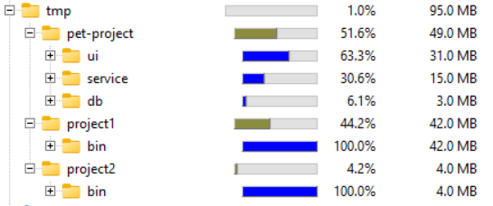
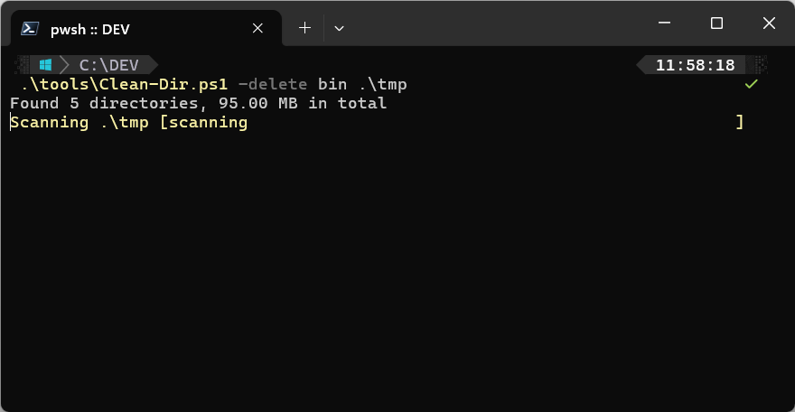
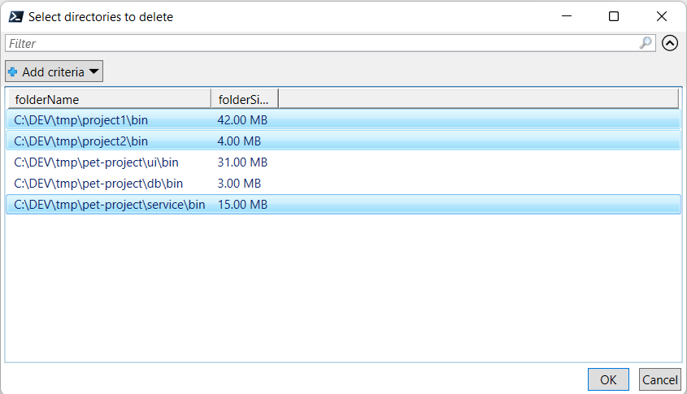
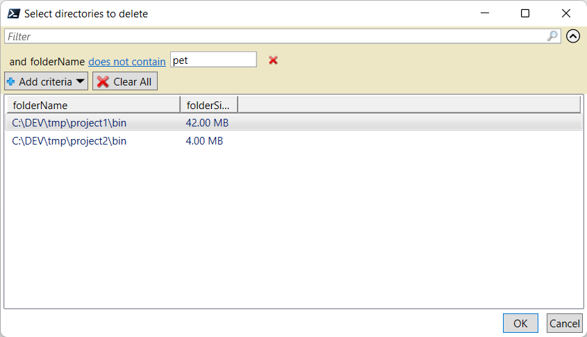
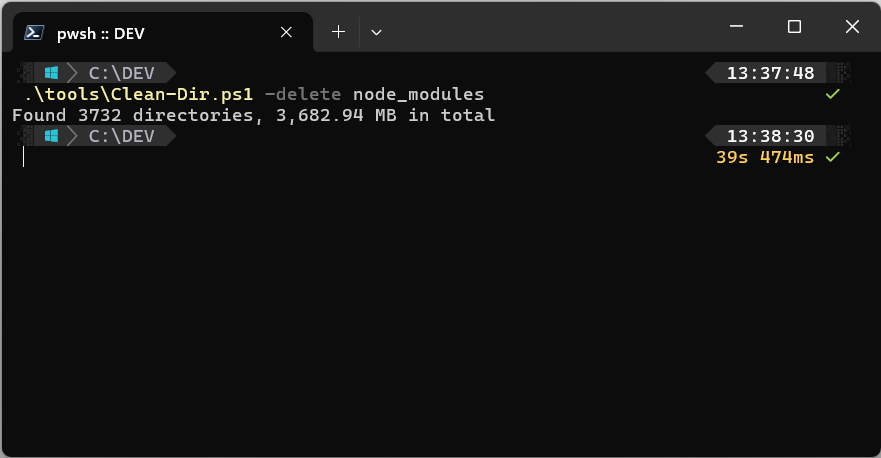

## Problem

With multiple projects stored on my drive, I started to run out of space. In such dire times I installed my first go-to tool in such situations is [WinDirStat](https://windirstat.net/). 
It is a great tool to search for bloated files and directories, from a "top-down" perspective. My case was different. I know that the majority of trash in my system are various `bin`, `obj`, and even some (shivers...) `node_modules`.

For instance, let's assume my work directory looks like this. For simplification, I added only directories that are useful for the demo (with some artificially bloated `bin` directories).

```
C:\DEV\TMP
├───pet-project
│   ├───db
│   │   └───bin
│   ├───service
│   │   └───bin
│   └───ui
│       └───bin
├───project1
│   └───bin
└───project2
    └───bin
```

With this problem, my trusty WinDirStat was not enough, since it would require me to expand all the directories I suspect to contain the `bin` folders. This would be tiresome, especially with a huge number of smaller `bin` folders that add up to bigger sizes.



What I'd like to have is a script that finds all `bin` directories, and allows me to pick what I need to keep and what can be safely removed.

## Solution

What I came up with is a script that searches the `targetDirectory` and lists all of the directories matching the name of `delete` param.

```
.\Clean-Dir.ps1 -delete {bin|obj|node_modules|.vs} [<targetDirectory>]
```

With a directory structure shown above, a sample usage may look like this:


After the target was scanned a list of found items is presented where I can pick folders to be deleted.

This is achieved by `Out-GridView` cmdlet. It is important to note.

```pwsh
$dataColl = $directories `
| ForEach-Object {
    # ...
    [PSCustomObject]@{
        folderName = $folderName
        folderSize = $folderSize
    }
}

$selected = $dataColl `
| Out-GridView -OutputMode Multiple -Title 'Select directories to delete'
```

Once the user clicks `OK` the `$selected` variable will contain the selected subset only. 
This single line makes it worth using PowerShell for this task.



This popup comes also with handy built-in filtering and ordering. Maybe I do not want to remove any files from my pet projects. I can easily filter them away:


## Script code

Listing of the script. As one may notice, the majority of code is dedicated to writing progress. This only shows how easy it is to write such a script.

```pwsh
param(
    [Parameter(
        Mandatory=$true,
        HelpMessage = "Directories to look for, i.e. bin, obj, node_modules, .vs, etc.")]
    [ValidateSet("bin", "obj", "node_modules", ".vs" )] #validation just to have suggestions
    [String]$delete,

    [Parameter(
        Position=0, 
        HelpMessage = "Directory to clean up")]
    [String]$targetDirectory = "."
)


# ----------------------------------------------------------------------------
# Scan `target directory` for all subdirectories that match `delete` parameter

Write-Progress -PercentComplete 0 `
        -Activity "Scanning $targetDirectory" `
        -Status 'scanning'

$directories = Get-ChildItem -Recurse -Filter $delete -Force $targetDirectory -Directory -ErrorAction SilentlyContinue `
| %{
    Write-Progress -PercentComplete 0 `
        -Activity "Scanning $targetDirectory" `
        -Status $_.FullName
  $_}


# ----------------------------------------------------------------------------
# Calculate sizes of each of found directories

$done = 0
$count = $directories.Count
$totalSize = 0

$dataColl = $directories `
| ForEach-Object {

    $folderName = $_.FullName

    Write-Progress -PercentComplete ($done/$count*100) `
        -Status $folderName `
        -Activity "Calculating sizes"

    $done = $done + 1

    $size = Get-ChildItem -Recurse -Force $_.FullName -File -ErrorAction SilentlyContinue `
    | Measure-Object -Property Length -Sum `
    | Select-Object -ExpandProperty Sum
    
    $totalSize += $size

    $folderSize = '{0:N2} MB' -f ($size / 1Mb)

    [PSCustomObject]@{
        folderName = $folderName
        folderSize = $folderSize
    }
}


# ----------------------------------------------------------------------------
# Present the results for the user

$totalSizeString = ('Found {0} directories, {1:N2} MB in total' -f $count,($totalSize / 1Mb))
Write-Host $totalSizeString

$selected = $dataColl `
| Sort-Object -Descending -Property folderSize `
| Out-GridView -OutputMode Multiple -Title 'Select directories to delete'


# ----------------------------------------------------------------------------
# Remove selected items

$done = 0
$count = $selected.Count

$selected `
| ForEach-Object {
    
    Write-Progress -PercentComplete ($done/$count*100) `
        -Status $_.folderName `
        -Activity "Deleting"

    $done = $done + 1

    Remove-Item -Force -Recurse $_.folderName
}

Write-Progress -PercentComplete 100 `
        -Status "done" `
        -Activity "done"
```


## Summary

Was it worth investing the time to write such a script? When looking at the sample directory structure one may think it is much easier to clean up directories manually.
However, if you run it against the real repositories it may become more useful. 

Try to find and remove 3.6 GB of `node_modules` in under a minute.
