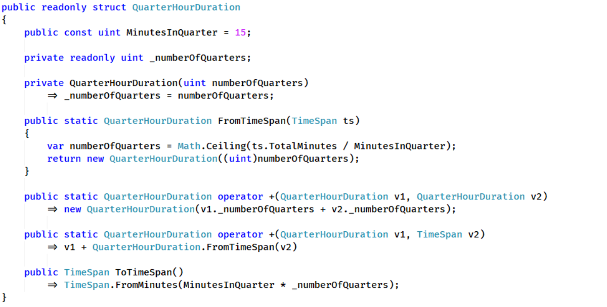
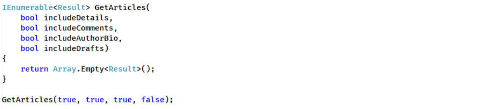
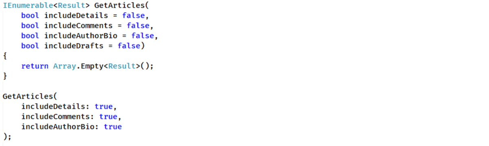
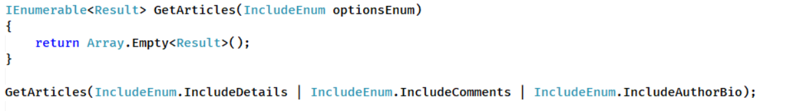
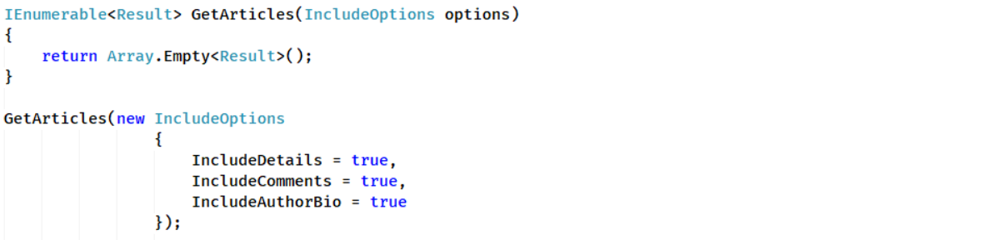
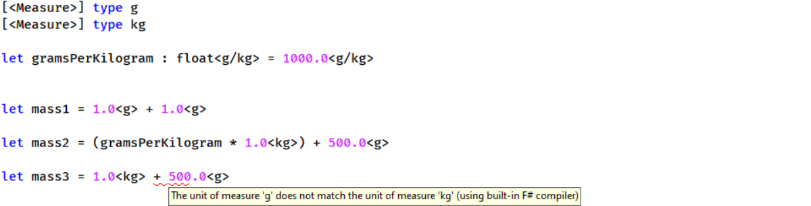
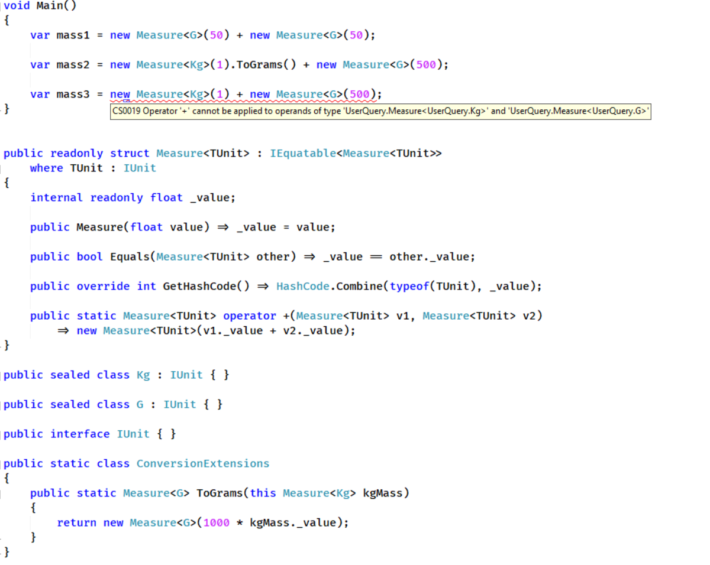
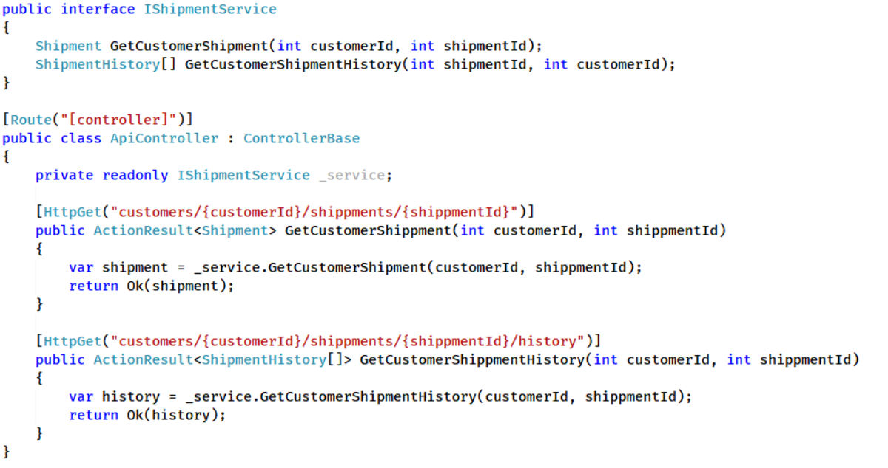
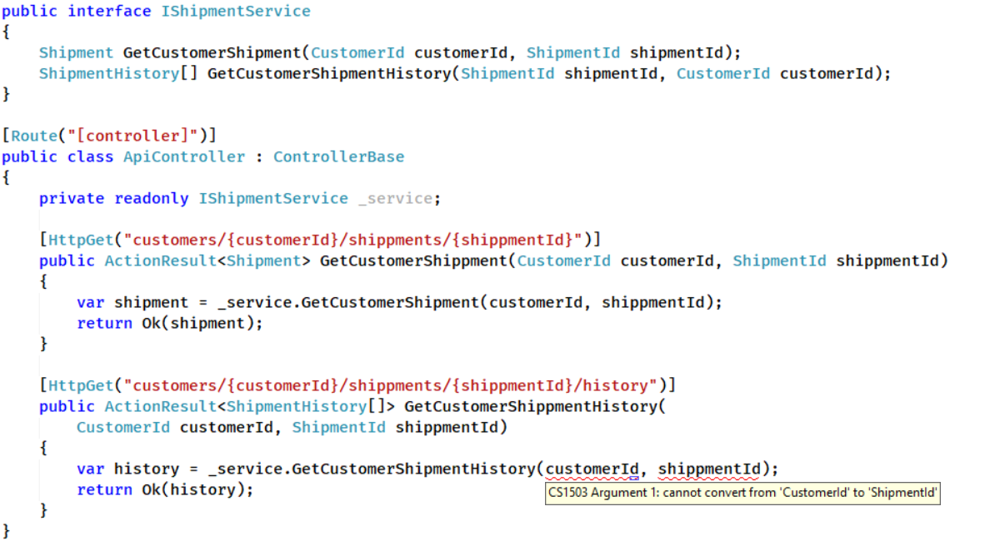

During the last few projects, I felt that something is wrong, but I could not quite put my finger on it. In countless places, we had validation logic checking if our integer values fit a given range or called custom code that ensured that our duration is always rounded to 15 minutes as the requirement stated. Later this repeating code was extracted into helper methods like `DurationUtils.RoundToHourQuarter(TimeSpan)`, which were easier to maintain, but were still sprinkled across the whole codebase. It was clear that we did something wrong - we trusted that duration values should be of type System.TimeSpan. The fact was that our requirement of 15-minutes increments did not play well with the system type, we desperately needed a custom type to store our duration values that would support this internally.

Quite recently I learned that this code smell has its name and in fact, it is quite common. It is called "primitive obsession". Since I finally know the name I started to think about what problems it can cause and what solutions can we adapt to save our projects.

## Custom requirements

As mentioned earlier problem with durations measured in 15-minutes intervals could be solved in many ways. As previously stated we could stick to the default approach and keep using System.TimeSpan, however, it would not guarantee that there is no place where rounding was missed. A much better way is to introduce a custom type to store duration value.

There is also an additional benefit - a custom type can contain internal validation that would never allow the creation of an instance with an invalid state or value. A classic example of this is an email address. The most common way is to pass it around as a string. Unfortunately, strings can hold any value, that forces all the functions that accept email as a parameter to validate it before any work can be started. A custom type guarantees that the value was already tested and is ready to be used. Another common example is a date range, which consists of a pair of 2 dates with validation that ensures that the end date is always greater than the start one.

## Overwhelmed by method parameters

Almost all code analyzers would warn us if our method has too many parameters, but I have never seen a warning about overusing primitive types in the argument list. We all have seen a code like this:

This kind of method is not written at once, they slowly evolve. When a new requirement comes in it is very tempting to just add another argument. It does not have to be boolean values, we would face the same problem with multiple strings passed as parameters. Let's imagine a refactoring task when parameters are reordered. The number of arguments is the same, code compiles, but (hopefully) most of our tests went red. Otherwise, in the worst case instead of author biography, we will leak draft articles that should not be presented to a public audience.

This exact problem was tackled by IDEs like Rider or the latest Visual Studio that inlines parameter names in the code:

However, I have doubts if this is a proper solution to the problem. In my opinion, it is sweeping the problem under the carpet instead of solving the root cause. Surely a feature like this makes code more readable in the IDE, but it can remain unreadable in a different editor or other tools like GitHub which does not support the inline hints feature.

So how can we prevent this problem by code, instead of IDE tricks? In C# there are several options. The easiest one to introduce would be to make our arguments optional and use names when invoking the function.

This approach is easy to introduce but requires an agreement on the coding style of the team since it is not enforced by the compiler. Every member has to use argument names when invoking a method, otherwise, we are back on square one. 

Another approach is to change our arguments to flag enumeration type:

This approach makes sense only in the case of multiple boolean arguments. If our methods accept multiple strings or integers we cannot use flags. Also, many developers find working with flag enumerations cumbersome. The most effective solution is to wrap arguments into a single object passed to the method:

This approach solves all our problems - any change in arguments will immediately break all calls to our method. The compiler requires us to provide an argument name in code, so it will be visible in any editor. This approach may be quite heavy for strongly typed languages like C# since it requires a new type to be created, but it became very common in the JavaScript world.

## Is 1 second equal to 1 gram or 1 pizza?

Errors caused by mixing values with different domain meaning but sharing the same underlying type can be hard to find and hard to prevent. We all assume that we know what our code does and we immediately would be suspicious of routine that adds order quantity to some duration in seconds. Both values are presented as integers, so the compiler will not warn us, we need to catch this issue during review or testing.

Sadly, sometimes we overestimate our ability to track the meaning of numbers. This tendency to omit units of measure caused a life-threatening situation when on July 23, 1983, [Air Canada Flight 143](https://nowiknow.com/how-a-unit-conversion-error-turned-and-airplane-into-a-glider/) was forced to perform an emergency landing with no fuel on board. The situation was caused by a mistake made by the ground crew while calculating the amount of fuel needed. The airline was undergoing a transformation to a metric system at that time - the pilot requested an amount of fuel in kilograms as protocol required, while the ground crew was still working with pounds. 

A similar situation may happen with our code - CPU does not care about the meaning of a value - a double is a double and always will be treated in the same way. Even NASA had to learn this the hard way when [Mars Climate Orbiter](https://www.simscale.com/blog/2017/12/nasa-mars-climate-orbiter-metric/) launched in 1998 was lost due to unit mismatch. The spacecraft was built by Lockheed Martin Astronautics in cooperation with Jet Propulsion Laboratory. Failure of the mission was caused by lack of agreement on a common system used by both companies - JPL used the metric system, while Lockheed worked with inches, feet, and pounds.

Some of the languages and compilers provide an ability to define units of measure that will not allow the code to compile when the units do not match. Consider an example of F# code:

While the statement 1+500 is completely valid, the compiler produced an error - it was not able to match grams and kilograms. This adds another layer on top of already strongly typed language, a floating-point value can have a different meaning in different contexts. Values with not matching units cannot be mixed until it is explicitly allowed, so we can be sure that our code will not try to add mass to duration multiplied by the number of pizza slices bought by the customer.

Sadly, this powerful feature is not available in C# but it can be recreated by custom types with necessary arithmetic operators provided. A sample implementation may look like this:

While F# uses units of measure only during compilation and does not leave any information in the compiled IL it will not affect the performance. C# solution introduces new types that will be kept in IL and may degrade execution speed if compared to raw floating-point operations. A simple benchmark based on mass2 calculation proves it:
|   Method |      Mean |     Error |    StdDev | Ratio | RatioSD |
|--------- |----------:|----------:|----------:|------:|--------:|
| RawFloat | 0.0534 ns | 0.0124 ns | 0.0116 ns |  1.00 |    0.00 |
| WithUnit | 1.7616 ns | 0.0221 ns | 0.0196 ns | 35.61 |   14.46 |

## Strongly typed all the way

Multi-layered architecture may introduce a similar problem described before, when ASP.NET controllers, services, and repositories accept multiple identifier values it is easy to introduce errors visible only during runtime. Let's try to spot the issue:

In the snippet above it is quite easy to notice that invalid values are being passed to the `GetCustomerShipmentHistory` service method, which would cause invalid records to be returned. In real life, however, it is not always so easy when API controllers and services are located in different files and were not introduced in the same pull request. Since both ids are integer values we can only find the issues in the runtime by our tests.

Fortunately, the most common stack used in projects like this - ASP.NET Core + Entity Framework Core we can help ourselves and introduce custom identifier types.

Strongly typed identifiers are supported by the stack:
- API controllers - implementing a [custom model binding](https://docs.microsoft.com/en-us/aspnet/core/mvc/advanced/custom-model-binding?view=aspnetcore-5.0)
- DB context - using a [value conversion](https://docs.microsoft.com/en-us/ef/core/modeling/value-conversions)

An excellent introduction to strongly typed API was described at [.NET Escapades blog](https://andrewlock.net/series/using-strongly-typed-entity-ids-to-avoid-primitive-obsession/).

## Summary

While described techniques introduce additional boilerplate code and may not be useful in simple applications, they are worth considering when working with more complex domains.

- Custom value containers - allow reducing duplicated code because parsing and validation are moved to a single place. Simplifies value usage, since it guaranteed that data was already validated.
- Method argument as options type - makes code more readable when passing a big number of values. Simplifiers future refactoring and changes. Allows parameter validation in compile time.
- Units of measure - help in science and computation-heavy applications where values may have different meanings and may not be compatible.
- Custom identifier types - can prevent data leaks and crashes caused by passing invalid id values.

