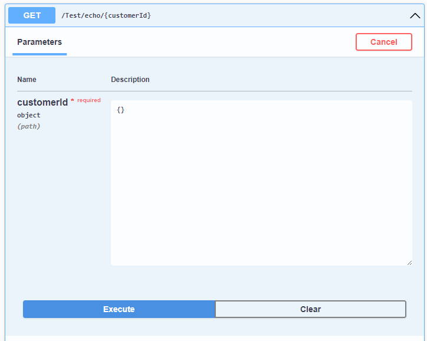
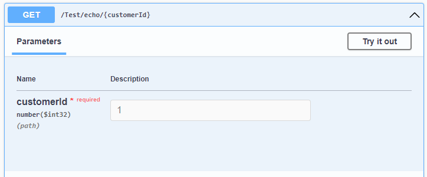

## The Problem

This article will show a practical example of how to reduce [primitive obsession](/posts/primitive-obsession) in web APIs by introducing strongly typed value objects.
Let's assume we are working on a shipment management solution. One of our projects may have such a service, the implementation does not matter:

```csharp
interface IShipmentService
{
    ShipmentDetails GetShipmentDetails(int shipmentId, int customerId);
}
```

and the controller that consumes this interface this:
```csharp
[ApiController]
[Route("[controller]")]
public class ShipmentController : ControllerBase
{
    private readonly IShipmentService _service;

    [HttpGet("api/{customerId}/shipments/{shippingId}")]
    public ShipmentDetails EchoCustomerIdFromUrl(int customerId, int shipmentId)
    {
        return _service.GetShipmentDetails(customerId, shippingId);
    }

    ...
}
```

This code compiles, but the careful reader can easily spot the issue - we swapped the values of `customerId` and `shipmentId`. Such an issue can only be noticed during testing, but some tests are not bulletproof. What if some lazy developer uses `1` as a value for both parameters? The tests will pass, but the issue will be pushed to production.

There is a clear division between developers, we have a group that prefers strongly typed languages, like C#, and others who thrive in dynamically typed languages, like Java Script. Since this post is about dotnet, we will stick to strongly typed languages. However, as we have seen, it does not prevent making a silly mistake like the one shown above. 

It is like using your car registration plate numbers to make a phone call. Both of them are some kids of ID, but they should not be mixed.

## Solution

Can we make a strongly typed language even more strict? F# shows that you can!


While the statement 1+500 is completely valid, the compiler produced an error - it was not able to match grams and kilograms. Unfortunately, this is only F# feature and cannot save us from making our silly mistake. The hope is not lost yet, there is a different approach, that works quite well for our case.

### Web API

I'd like to suggest a wrapper for our primitive type, for instance:

```csharp
public readonly struct CustomerId
{
    public readonly int Value;

    public CustomerId(int value)
    {
        Value = value;
    }
}
```

and use such a type in our controller and service:
```csharp
interface IShipmentService
{
    ShipmentDetails GetShipmentDetails(ShipmentId shipmentId, CustomerId customerId);
}

[ApiController]
[Route("[controller]")]
public class ShipmentController : ControllerBase
{
    private readonly IShipmentService _service;

    [HttpGet("api/{customerId}/shipments/{shippingId}")]
    public ShipmentDetails EchoCustomerIdFromUrl(CustomerId customerId, ShipmentId shipmentId)
    {
        return _service.GetShipmentDetails(customerId, shippingId);
    }

    ...
}
```

Sadly, this will not work. ASP.Net, does not understand this type and will try to parse it from the request body, or even resolve it from DI service container. This of course will fail. 

This can be fixed by writing a custom [model binder](https://learn.microsoft.com/en-us/aspnet/core/mvc/advanced/custom-model-binding), which is quite a painful experience. However, since dotnet 7.0 there is a different way. A new `System.IParseable<T>` type was added to our toolbox and ASP.Net makes good use of it.


```csharp
public readonly struct CustomerId : IParsable<CustomerId>
{
    public readonly int Value;

    public CustomerId(int value)
    {
        Value = value;
    }

    public static CustomerId Parse(
        string s, 
        IFormatProvider? provider)
    {
        int val = int.Parse(s, provider);
        return new CustomerId(val);
    }

    public static bool TryParse(
        [NotNullWhen(true)] string? s, 
        IFormatProvider? provider, 
        [MaybeNullWhen(false)] out CustomerId result)
    {
        if (int.TryParse(s, provider, out var val) 
            && val > 0) // <-- additional constraints! 
        {               // Our IDs should not hold negative or 0 
            result = new CustomerId(val);
            return true;
        }

        result = default;
        return false;
    }
}
```

To test it, we will simply our endpoints. The response will contain the original ID, to make it easy to validate.
```csharp
[ApiController]
[Route("[controller]")]
public class TestController : ControllerBase
{
    [HttpGet("api/{customerId}")]
    public string EchoCustomerIdFromUrl(CustomerId customerId)
    {
        return customerId.Value.ToString();
    }

    [HttpGet("test/header")]
    public string EchoCustomerIdFromHeader([FromHeader] CustomerId customerId)
    {
        return customerId.Value.ToString();
    }
}
```

a simple call to the endpoints proves that the value is correctly parsed:
```powershell
>> (Invoke-WebRequest -Uri "https://localhost:7181/Test/echo/1234").content  
1234
``` 

```powershell
>> $headers = @{
>>    'customerId' = '5678'
>> }
>> (Invoke-WebRequest -Uri "https://localhost:7181/Test/echo/header" -Headers $headers).content  
1234
```

If we use those types to present our IDs across the full stack, the compiler will make sure the types always match.

### OpenAPI

There is one issue - libraries like `Swashbuckle` often used to generate Swagger/OpenAPI specifications, still have no knowledge about our type and try to present them as a request body:


To fix this, we need to tell swasbuckle how our `CustomerId` type should be represented. I, personally like to have it in an extension method to not pollute startup code too much:
```csharp
public static class SwaggerGenOptionsExtensions
{
    public static SwaggerGenOptions AddCustomerId(this SwaggerGenOptions options)
    {
        OpenApiSchema BuildOpenApiSchema()
        {
            var schema = new OpenApiSchema
            {
                Type = "number",
                Format = "int32",
                Example = new OpenApiString("1"),
                Minimum = 1
            };

            return schema;
        }

        options.MapType<CustomerId>(BuildOpenApiSchema);
        return options;
    }
}
```
and usage is clear and easy:
```csharp
builder.Services.AddSwaggerGen(ops => 
{
    ops.AddCustomerId();
});
```

Now, SwaggerUI is able to understand the new type.


### Validation

Since this is a concrete type, not a primitive, we can attempt to make a custom validation for it. Sample of FluentValidator making sure the IDs are even:
```csharp
class CustomerIdValidator : AbstractValidator<CustomerId>
{
    public CustomerIdValidator()
    {
        RuleFor(x => x.Value)
            .Must(val => val % 2 == 0)
            .WithErrorCode("Id must be even");
    }
}
```

### DB layer

As it was mentioned before, this approach shines when strongly-typed IDs are used across the stack. Eventually, any ID value will need to be written to the database. Entity Framework allows us to still use `CustomerId` even in the database layer.
```csharp
public  class CustomerEntity
{
    public CustomerId CustomerId { get; set; }
    ...
}

public class CustomerEntityTypeConfiguration : IEntityTypeConfiguration<CustomerEntity>
{
    public void Configure(EntityTypeBuilder<CustomerEntity> builder)
    {
        builder
            .Property(b => b.CustomerId)
            .HasConversion(
                id => id.Value,
                dbValue => new CustomerId(dbValue));
    }
}

```

## Summary

C# as a strongly typed language helps developers with daily tasks. Type checker is often taken for granted. We can step up our type safety by reducing primitive obsession and introduction wrapper types to hold our primitive values. 

At first glance, this seems like a lot of mundane work. Thank another introduction of the new dotnet will help us - all the repetitive code can be done by source generators, like [StronglyTypedId](https://github.com/andrewlock/StronglyTypedId).