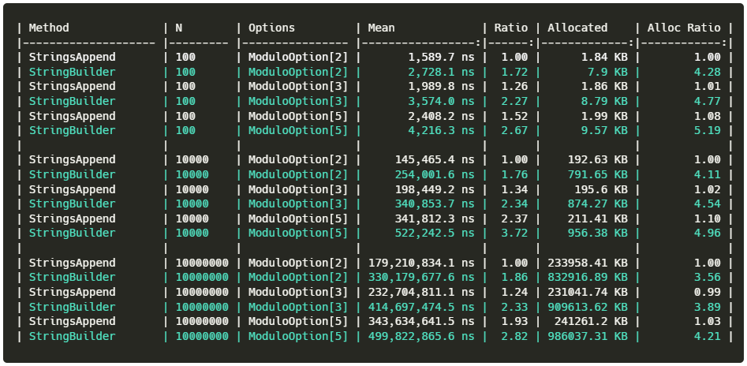

YouTube algorithm is full of surprises, it may present you with a really randomized set of videos. Recently a video [How to NOT Fail a Technical Interview](https://www.youtube.com/watch?v=1t1_a1BZ04o) caught my attention, it told a story of a technical interview where the candidate was asked to write a FizzBuzz puzzle.

Almost everyone knows what FizzBuzz is, a simple algorithm that is supposedly often used as an interview question.

```python
print numbers in range 1 .. 100
print "Fizz" if divisible by 3
print "Buzz" if divisible by 5
print "FizzBuzz" if divisible by 3 and 5
```

The tone of the video and the way the author presents the interview as a hellish experience got me thinking. How one could make this puzzle harder, and what additional requirements I could add to make the interviewee hate me? Or, how candidates can overthink FizzBuzz and end up down a rabbit hole perfecting the solution.

First things first, how might the minimal working code look like?

```csharp
public class Program
{
    static void Main(string[] args)
    {
        var values = Enumerable.Range(1, 100).Select(FizzBuzz);

        foreach (var value in values)
        {
            Console.WriteLine(value);
        }
    }

    private static string FizzBuzz(int value)
    {
        return (value % 3, value % 5) switch
        {
            (0, 0) => "FizzBuzz",
            (0, _) => "Fizz",
            (_, 0) => "Buzz",
            _ => value.ToString()
        };
    }
}
```

Just to be extra sure, we can write unit tests for our FizzBuzz method. Maybe extract it to a dedicated file? Add XML comments?

Done, did I get this job?

I immediately put my interviewer hat on, I may say something like this:
>Your solution looks good, I like that you used pattern matching and linq. Unit tests are also a good idea, but... can you also add 'Fazz' when the number is divisible by 7?

Got it, we need to add just an additional modulo check. Easy, I even rearranged the modulo operators so my pattern matching is clearer.

```csharp
private static string FizzBuzz(int value)
{
    return (value % 7, value % 5, value % 3) switch
    {
        (0, 0, 0) => "FizzBuzzFazz",
        (0, 0, _) => "BuzzFazz",
        (0, _, 0) => "FizzFazz",
        (0, _, _) => "Fazz",

        (_, 0, 0) => "FizzBuzz",
        (_, 0, _) => "Buzz",
        (_, _, 0) => "Fizz",

        _ => value.ToString()
    };
}
```

I got this job, right?


>Um... Yeah... I just got a new requirement. Our stakeholders want to also cover number 11. It should print "Yazz". Ah, can you also estimate how much time it would take to add 13 mapped to "Zazz"?

Adding new cases to my switch statement started to be problematic. It is doable but is getting hard to maintain. Hopefully, this will be the last change in this method. How often do we anticipate to add new cases to this algorithm?

>Our logic depends on multiple factors, we may have to change it every release. The solution should be easy to extend, so we do not spend much time altering it.

So, do we need to support an arbitrary number of options? It will have to be configurable. I have to pass some configuration to my algorithm, so I will define a ModuloOption type that will keep mappings.

```csharp
public sealed class StringsAppendFizzBuzzer
{
    private readonly ModuloOption[] _options;

    public StringsAppendFizzBuzzer(params ModuloOption[] options)
    {
        _options = options.OrderBy(op => op.Divider).ToArray();
    }

    public string Execute(int value)
    {
        var returnString = string.Empty;

        for (int i = 0; i < _options.Length; i++)
        {
            var option = _options[i];
            var modulo = value % option.Divider;
            if (modulo == 0)
            {
                returnString += option.Text;
            }
        }

        var result = returnString.Length != 0
            ? returnString
            : value.ToString();

        return result;
    }
}
```

Then I can pass desired mappings and call it a day...

```csharp
public class Program
{
    static void Main(string[] args)
    {
        var fizzBuzzer = new StringsAppendFizzBuzzer(
            new(3, "Fizz"),
            new(5, "Buzz"),
            new(7, "Fazz"));

        var values = Enumerable.Range(1, 100).Select(n => fizzBuzzer.Execute(n));

        foreach (var value in values)
        {
            Console.WriteLine(value);
        }
    }
}
```

>Looks good, but can you make sure that we can sustain [some fictitious number] FizzBuzz calculations per second? This calculation is quite critical for our business.

Can we distribute it to multiple machines?

>No, currenlty we are running a monolithic application on a single server, so our FizzBuzz implementation must be as efficient as possible.

But... this was not part of any code puzzle I was training before. The interviewer is not impressed, what is wrong with my code? I know! String concatenation. This is what is wrong, I should not join them, but use a StringBuilder, it will be way more efficient!

I heard about [benchmark dotnet](https://benchmarkdotnet.org/) maybe I can use it to get additional points if I compare both implementations?

With this knowledge I wrote another implementation, now using StringBuilder, as described by some best practices article I saw some time ago:

```csharp
public sealed class StringBuilderFizzBuzzer
{
    ...

    public string Execute(int value)
    {
        StringBuilder? sb = null;

        for (int i = 0; i < _options.Length; i++)
        {
            var option = _options[i];
            var modulo = value % option.Divider;
            if (modulo == 0)
            {
                sb ??= new StringBuilder();

                sb.Append(option.Text);
            }
        }

        var result = sb is not null
            ? sb.ToString()
            : value.ToString();

        return result;
    }
}
```

I have also designed a parametrized benchmark to compare both implementations.

I want to test how both implementations behave when producing N values when N is equal to 100, 10 000, and 10 000 000 values.

A number of options will also affect the result, so we will be running benchmarks against:
- 2 options - Fizz and Buzz
- 3 options - Fizz, Buzz and Fazz
- 5 options - Fizz, Buzz, Fazz, Yazz and Zazz

```csharp
[MemoryDiagnoser]
public class RuntimeConfigurables_BenchmarkCollection
{
    [Params(100, 10_000, 10_000_000)]
    public int N { get; set; }

    private int[] _values = Array.Empty<int>();

    [ParamsSource(nameof(ValuesForOptions))]
    public ModuloOption[] Options { get; set; }

    public static IEnumerable<ModuloOption[]> ValuesForOptions()
    {
        yield return new ModuloOption[] { new(3, "Fizz"), new(5, "Buzz") };

        yield return new ModuloOption[] { new(3, "Fizz"), new(5, "Buzz"), 
                                          new(7, "Fazz") };

        yield return new ModuloOption[] { new(3, "Fizz"), new(5, "Buzz"), 
                                          new(7, "Fazz"), new(11, "Yazz"), 
                                          new(13, "Zazz") };
    }


    private StringsAppendFizzBuzzer _stringAppendImpl;
    private StringBuilderFizzBuzzer _stringBuilderImpl;
    
    [GlobalSetup]
    public void Setup()
    {
        _values = Enumerable.Range(1, N).ToArray();

        _stringAppendImpl = new StringsAppendFizzBuzzer(Options);
        _stringBuilderImpl = new StringBuilderFizzBuzzer(Options);
    }

    [Benchmark(Baseline = true)]
    public int StringsAppend()
    {
        return _values.Select(_stringAppendImpl.Execute).Count();
    }

    [Benchmark]
    public int StringBuilder()
    {
        return _values.Select(_stringBuilderImpl.Execute).Count();
    }
}
```

After some time we got our answer:


Wait, what?! If we look at the Ratio column, we can see that my StringBuilder implementation is almost twice as slow and allocates more than 4 times more memory (Alloc Ratio). I thought it was supposed to be more efficient. Did the article with these best practices lie? I hope the interviewer did not notice. What else can I do? Maybe I can reuse the StringBuilder? I will use [Microsoft.Extensions.ObjectPool](https://www.nuget.org/packages/Microsoft.Extensions.ObjectPool/) to reuse the instances, it has to work!

```csharp
public sealed class PooledStringBuilderFizzBuzzer
{
    private static readonly ObjectPool<StringBuilder> _stringBuilderPool = new();

    ...

    public string Execute(int value)
    {
        var sb = _stringBuilderPool.Get();

        try
        {
            for (int i = 0; i < _options.Length; i++)
            {
                var option = _options[i];
                var modulo = value % option.Divider;
                if (modulo == 0)
                {
                    sb.Append(option.Text);
                }
            }

            return sb.Length != 0
                ? sb.ToString()
                : value.ToString();
        }
        finally
        {
            _stringBuilderPool.Return(sb);
        }
    }
}
```
and new benchmark results:


And... what? Is it worse or better? Memory footprint is reduced, but the mean duration is way worse. I guess using the pool has its overhead. Maybe I can somehow reduce the allocation? `Span<T>` is a new fancy thing, maybe I can give it a try? Allocate what I need on the stack. Let's try it!

```csharp
public sealed class StackAllocFizzBuzzer
{
    ...

    public StackAllocFizzBuzzer(params ModuloOption[] options)
    {
        _options = options.OrderBy(op => op.Divider).ToArray();
        _capacity = _options.Sum(op => op.Text.Length);

        // stack has limitations, 
        // so lets assume we do not have more than 100 characters max
        if (_capacity > 100) throw new InvalidOperationException("too big");
    }

    public string Execute(int value)
    {
        Span<char> buffer = stackalloc char[_capacity];

        // length of added strings combined together
        int length = 0;

        for (int i = 0; i < _options.Length; i++)
        {
            var option = _options[i];

            // slice is a window on top of buffer, 
            // it is moved after adding ech new word
            var slice = buffer[length..];

            var modulo = value % option.Divider;
            if (modulo == 0)
            {
                var txt = option.Text;
                txt.AsSpan().CopyTo(slice);
                length += txt.Length;
            }
        }

        return length > 0
            ? new string(buffer[..length])
            : value.ToString();

    }
}
```

Benchmark execution yielded the following results:


What?! Why? How come? This implementation is not much better. It is faster than pooling StringBuilder instances, but I hoped for reduced allocations. So far the simplest string concatenation wins, but why?

I grab my favorite rubber duck and stare at the code. The interviewer is not in the room. I have no idea what I am doing.


Deep-stare debugging is starting to work, I think I know what is wrong. I am allocating unnecessary strings. Each time I want to return simple "Fizz" or "Buzz", I create a new string instance. A quick test proves the point:

```csharp
Span<char> characters = new char[] { 'F', 'i', 'z', 'z' };

var s1 = new string(characters);
var s2 = new string(characters);

Console.WriteLine(object.ReferenceEquals(s1, s2));
```

My optimization has failed me. But I have one additional trick in my sleeve! I need to reuse my string instances. String.Intern() does not work for me because it does not accept spans, but [CommunityToolkit.HighPerformance](https://www.nuget.org/packages/CommunityToolkit.HighPerformance/) nuget has a nice StringPool type that I can use. With a name like this sure it will help me!

```csharp
public sealed class CommunityToolkitStringPoolFizzBuzzer
{
    ...

    private static readonly CommunityToolkit.HighPerformance.Buffers.StringPool _pool = new();

    public CommunityToolkitStringPoolFizzBuzzer(params ModuloOption[] options)
    {
        _options = options.OrderBy(op => op.Divider).ToArray();
        _capacity = _options.Sum(op => op.Text.Length);

        // stack has limitations, 
        // so lets assume we do not have more than 100 characters max
        if (_capacity > 100) throw new InvalidOperationException("too big");
    }

    public string Execute(int value)
    {
        Span<char> buffer = stackalloc char[_capacity];
        int length = 0;

        for (int i = 0; i < _options.Length; i++)
        {
            var option = _options[i];

            var slice = buffer[length..];

            var modulo = value % option.Divider;
            if (modulo == 0)
            {
                var txt = option.Text;
                txt.AsSpan().CopyTo(slice);
                length += txt.Length;
            }
        }

        return length > 0
            ? _pool.GetOrAdd(buffer[..length])
            : value.ToString();

    }
}
```


The allocations much look better now, but it is slower than the basic implementation with just string concatenation. Which one is more important in our scenario? Maybe I should ask the interviewer.

>Hey, are you ready yet?

No, not yet! Just a moment, please! I have one more idea to try! I can generate code using System.Linq.Expressions. That way, I do not need to loop through our options for each of the values. I can generate code that will do it as fast as the version written manually!

First, the basics, how do I check if a number is divisible by a divider? So far, so good:
```csharp
// returns an expression of "value % divider == 0"
private static Expression GetIsDivisibleByExpression(Expression parameterExpr, int divider)
{
    return  Expression.Equal(
                Expression.Modulo(
                    parameterExpr,
                    Expression.Constant(divider)),
                Expression.Constant(0));
}
```

I'll also need to call int.ToString() at some point, so maybe better to write it now:
```csharp
// returns an expression of "value.ToString()"
private static Expression GetValueToStringExpression(Expression parameterExpr)
{
    var toStringMethod = typeof(int).GetMethod("ToString", Array.Empty<Type>())
        ?? throw new InvalidOperationException("ToString() not found");
    return Expression.Call(parameterExpr, toStringMethod);
}
```

Now, all I need to do is to write the rest of the code, where I will iterate over my modulo options and create a nested if statement for each of them. Once done, this expression can be compiled into a `Func<int, string>` delegate. This delegate should have performance as good as manually written code.
```csharp
// Classic "draw rest of the owl" :)

public sealed class ExpressionTreesFizzBuzzer
{
    private readonly Func<int, string> _impl;

    public ExpressionTreesFizzBuzzer(params ModuloOption[] options)
    {
        _impl = GenerateExpression(options).Compile();
    }

    public string Execute(int value) => _impl(value);

    private static Expression<Func<int, string>> GenerateExpression(IReadOnlyList<ModuloOption> options)
    {
        // define input parameter of our method
        var parameterExpression = Expression.Parameter(typeof(int), "value");

        // according to System.Linq.Expressions.Expression a return statement is just a glorified goto,
        // it needs to have a label and target we can reference later
        var returnTarget = Expression.Label(typeof(string));
        var returnExpression = Expression.Label(
            returnTarget,
            Expression.Constant(string.Empty)); // return empty string as default value, needed just to satisfy Expression.Label(...) method

        var bodyExpression = Expression.Block(
            GenerateOptionsMatchingExpression(options, parameterExpression, returnTarget, 0, null),
            returnExpression);

        return Expression.Lambda<Func<int, string>>(bodyExpression, parameterExpression);
    }

    // Recursively visit all options and build expression tree containing nested If Else statements:
    private static Expression GenerateOptionsMatchingExpression(
        IReadOnlyList<ModuloOption> options,
        Expression parameterExpr,
        LabelTarget returnTarget,
        int currentIndex,
        string? returnString)
    {
        // we are not finished with options, keep building the tree, concatenating the texts of matched options
        if (currentIndex < options.Count)
        {
            var (divider, text) = options[currentIndex];

            var nextIndex = currentIndex + 1;

            return Expression.IfThenElse(
                GetIsDivisibleByExpression(parameterExpr, divider),
                GenerateOptionsMatchingExpression(options, parameterExpr, returnTarget, nextIndex, returnString + text),
                GenerateOptionsMatchingExpression(options, parameterExpr, returnTarget, nextIndex, returnString));
        }
        // we finished all options, return string that contains concatenated option texts
        else if (returnString is not null)
        {
            return Expression.Return(
                returnTarget,
                Expression.Constant(returnString));
        }
        // we did not matched any options, return value as string
        else
        {
            return Expression.Return(
                returnTarget,
                GetValueToStringExpression(parameterExpr));
        }
    }
}

```

A quick test to validate it is working:
```csharp
public class Program
{
    static void Main(string[] args)
    {
        var fizzBuzzer = new ExpressionTreesFizzBuzzer(
            new(3, "Fizz"),
            new(5, "Buzz"),
            new(7, "Fazz"));

        var values = Enumerable.Range(1, 100).Select(n => fizzBuzzer.Execute(n));

        foreach (var value in values)
        {
            Console.WriteLine(value);
        }
    }
}
```

Luckily, expressions provide a nice debug view, that shows what tree I have designed and what will be compiled:
```
.Lambda #Lambda1<System.Func`2[System.Int32,System.String]>(System.Int32 $value) {
    .Block() {
        .If (
            $value % 3 == 0
        ) {
            .If (
                $value % 5 == 0
            ) {
                .If (
                    $value % 7 == 0
                ) {
                    .Return #Label1 { "FizzBuzzFazz" }
                } .Else {
                    .Return #Label1 { "FizzBuzz" }
                }
            } .Else {
                .If (
                    $value % 7 == 0
                ) {
                    .Return #Label1 { "FizzFazz" }
                } .Else {
                    .Return #Label1 { "Fizz" }
                }
            }
        } .Else {
            .If (
                $value % 5 == 0
            ) {
                .If (
                    $value % 7 == 0
                ) {
                    .Return #Label1 { "BuzzFazz" }
                } .Else {
                    .Return #Label1 { "Buzz" }
                }
            } .Else {
                .If (
                    $value % 7 == 0
                ) {
                    .Return #Label1 { "Fazz" }
                } .Else {
                    .Return #Label1 { .Call $value.ToString() }
                }
            }
        };
        .Label
            ""
        .LabelTarget #Label1:
    }
}
```

Looks nice, we must compare it with the rest:


It is the fastest solution! Allocation is also low, only int.ToString() allocates memory. This is the limit that we cannot reduce. I am finally done.


>Impressive, I have to admit. Oh, by the way we are also building a UWP application that will need to use this code. Can you make sure it will work there as well? And with AOT compilation?

UWP? Why would it be a problem? Oh no... [this cannot be true...](https://github.com/dotnet/runtime/issues/17973)

-----

So, I am back to square one? AOT does ring a bell, Ahead of Time compilation, I read somewhere that Source Generators are used to make AOT work. I shall write a source generator then!


My [source generator](https://github.com/tomwolanski/Overthinking_FizzBuzz/blob/main/FizzBuzz/FizzBuzz.SourceGenerator/FizzBuzzGenerator.cs) works as follows: one just needs to decorate a partial class with custom attributes describing the dividers.

```csharp
public sealed partial class SourceGeneratedFizzBuzzer
{
    [FizzBuzzGenerator.ModuloOption(3, "Fizz")]
    [FizzBuzzGenerator.ModuloOption(5, "Buzz")]
    [FizzBuzzGenerator.ModuloOption(7, "Fazz")]
    public partial string Execute(int value);
}
```

and the generated code will look like this:
```csharp
partial class SourceGeneratedFizzBuzzer
{
	public partial string Execute(global::System.Int32 value)
	{
		return (value % 3, value % 5, value % 7) switch
		{
			(0, 0, 0) => "FizzBuzzFazz",
			(0, 0, _) => "FizzBuzz",
			(0, _, 0) => "FizzFazz",
			(0, _, _) => "Fizz",
			(_, 0, 0) => "BuzzFazz",
			(_, 0, _) => "Buzz",
			(_, _, 0) => "Fazz",
			(_, _, _) => value.ToString(),
		};
	}
}
```

How does it compare to previous attempts? Since the source-generated implementation accepts just 3 options, the benchmark will also test against "Fizz", "Buzz" and "Fazz" only.


It is not as efficient as expression-based, but the difference is small. Isn't pattern matching expanded into nested ifs as well? Interesting, but I think I got my final solution. Where is the interviewer?

The office is empty, the lights are off, and I am the only one in the building.

-----

It is late, my last bus home left hours ago. What can I do? To occupy myself through the night, I can write another attempt. What is faster than a CPU? A CPU supporting SIMD instructions of course! Let's get to work!

I think my laptop supports `System.Runtime.Intrinsics.Vector256`, I can work with this.

There is one problem, I cannot work on reference types here, so let's think out of the box and think of a workaround. FizzBuzz works on natural numbers only, so maybe I can use negative values somehow? To not overcomplicate, let's work with only 2 dividers: "Fizz" and "Buzz".

I defined an enum to work as a return type. Negative numbers will hold my "Fizz" and "Buzz", while positive numbers will be treated as numbers.
```csharp
// any positive value should be threated as numeric value
public enum FizzBuzzResultEnum
{
    Fizz = -1,
    Buzz = -2,
    FizzBuzz = -3
}
```

The first problem - System.Runtime.Intrinsics.Vector256 does not expose a Modulo operation. I have to write my own. Ok, it is doable:
```csharp
/// <summary>
/// Using formula 'x - m * floor(x / m)' a new vector is calculated with values set if input is divisible by divider.
/// </summary>
/// for instance:
/// input: [1, 2, 3, 4, 5, 6], divider: 3
/// result [0, 0,-1, 0, 0,-1]
static Vector256<int> CalcIsDivisible(Vector256<int> input, int divider)
{
    var x = Vector256.ConvertToSingle(input);
    var m = Vector256.Create((float)divider);

    var r = Vector256.ConvertToInt32(x - m * Vector256.Floor(x / m));

    return Vector256.Equals(r, Vector256<int>.Zero);
}
```

Since SIMD operations work on multiple data, I will no longer work with a method that calculates FizzBuzz for a single number. A new method will accept the count parameter - how many numbers we need to process.

To process [1..count] numbers I need to group them into vectors of the size supported by CPU. For my machine, it can hold 8 integer values.
```csharp
public FizzBuzzResultEnum[] Execute(int count)
{
    var output = new FizzBuzzResultEnum[count];
    
    int i;

    // Iterate over vectors that contain vectorSize of integers. Perform CalculateFizBuzz on each of them;
    for (i = 0; i < count - VectorSize; i += VectorSize)
    {
        var outSpan = output.AsSpan().Slice(i, VectorSize);

        CalculateFizBuzz(i, outSpan);
    }

    // If any value was left, perform a failback
    for (; i < count; i++)
    {
        output[i] = (i % 3, i % 5) switch
        {
            (0, 0) => FizzBuzzResultEnum.FizzBuzz,
            (0, _) => FizzBuzzResultEnum.Fizz,
            (_, 0) => FizzBuzzResultEnum.Buzz,
            _ => (FizzBuzzResultEnum)i
        };
    }

    return output;
}
```

The whole magic happens in CalculateFizBuzz how does it work? It is far from simple and probably may be more optimized. Maybe in the future...
```csharp
static void CalculateFizBuzz(int index, Span<FizzBuzzResultEnum> output)
{
    // Generate next vector by starting with vector filled with index value
    // Then add [0, 1, 2 ... 7] to get vector with raising sequence
    var input = Vector256.Create(index) + RaisingSequence;

    // Calculate new vectors, multiply them by our enum value
    // Fizz calculation:
    // input:  [1, 2, 3, 4, 5, 6], divider: 3, FizzBuzzEnum.Fizz: -1
    // result: [0, 0,-1, 0, 0,-1]
    // Bazz calculation:
    // input:  [1, 2, 3, 4, 5, 6], divider: 5, FizzBuzzEnum.Bazz: -2
    // result: [0, 0, 0, 0,-2, 0]
    Vector256<int> fizzValues = Math.Abs((int)FizzBuzzResultEnum.Fizz) * CalcIsDivisible(input, 3);
    Vector256<int> buzzValues = Math.Abs((int)FizzBuzzResultEnum.Buzz) * CalcIsDivisible(input, 5);

    // Our enum is designed in such a way that Fizz + Bazz = FizzBazz
    // To calculate results, we can just add moth vectors
    // input:      [1, 2, 3, 4, 5, 6, .. 10]
    // fizzValues: [0, 0,-1, 0, 0,-1, .. -1]
    // bazzValues: [0, 0, 0, 0,-2, 0, .. -2]
    // result:     [0, 0,-1, 0,-2, 0, ..,-3]
    var fizzBuzzValues = Vector256.Add(fizzValues, buzzValues);

    // Select values depending on the fizzBuzzValues vector.
    // If 0 select original, value, otherwise select value from fizzBuzzValues
    var result = Vector256.ConditionalSelect(
        Vector256.Equals(fizzBuzzValues, Vector256<int>.Zero),
        input,
        fizzBuzzValues);

    // Transform vector to Span<FizzBuzzEnum> and copy to output
    Span<int> resultSpan = stackalloc int[Vector256<int>.Count];
    result.CopyTo(resultSpan);
    MemoryMarshal.Cast<int, FizzBuzzResultEnum>(resultSpan).CopyTo(output);
}
```

Does it work? Yes! Does it work well? I think so, I will have to run some benchmarks.

I got distracted for a moment, and just noticed there is a game room across the office corridor. Games, I whispered. Yes, so obvious now! I can make even faster FizzBuzz using GPU!

This one is going to be easy. I can just use [ILGPU](https://ilgpu.net/) to work with CUDA from C#! It was a pleasant experience, after previous implementations this one was a breeze.
```csharp
public sealed class ILGPUFizzBuzzer : IDisposable
{
    private readonly Context _context;
    private readonly Accelerator _accelerator;

    private readonly Action<Index1D, ArrayView<FizzBuzzResultEnum>> _kernel;

    public ILGPUFizzBuzzer(AcceleratorType type)
    {
        // Initialize ILGPU.
        _context = Context.CreateDefault();
        var device = _context.Devices.Single(n => n.AcceleratorType == type);

        _accelerator = _context.GetPreferredDevice(preferCPU: false).CreateAccelerator(_context);

        // load / precompile the kernel
        _kernel = _accelerator.LoadAutoGroupedStreamKernel<Index1D, ArrayView<FizzBuzzResultEnum>>(Kernel);
    }

    public FizzBuzzResultEnum[] Execute(int count)
    {
        using var deviceOutput = _accelerator.Allocate1D<FizzBuzzResultEnum>(count);
        
        _kernel(count, deviceOutput.View);

        _accelerator.Synchronize();
        return deviceOutput.GetAsArray1D();
    }

    // Kernel method will be translated into GPU code and executed in parallel
    static void Kernel(Index1D i, ArrayView<FizzBuzzResultEnum> output)
    {
        var value = (int)i;

        output[i] = (value % 3, value % 5) switch
        {
            (0, 0) => FizzBuzzResultEnum.FizzBuzz,
            (0, _) => FizzBuzzResultEnum.Fizz,
            (_, 0) => FizzBuzzResultEnum.Buzz,
            _ => (FizzBuzzResultEnum)value
        };
    }

    public void Dispose()
    {
        _accelerator.Dispose();
        _context.Dispose();
    }
}
```

How do they compare?


The vectorized version of the algorithm is faster than CPU loop in all cases. The GPU version has a huge startup cost but is much faster in benchmarks with a higher N (count parameter).

The interviewer is nowhere to be seen; I should go now. I have a bus home in 10 minutes.

## Conclusion

The insanity is over. What have I learned from this hypothetical scenario? Maybe a few things:

- FizzBuzz is simple, but there are many ways to achieve the same result. Was writing it in the vectorized way an overkill? For sure, but now we know it is also possible.

- Performance optimizations always need to be measured and compared to the baseline. Our attempts to optimize FizzBuzz returning strings were not successful, even if they seemed rational. Given the distribution of the results, the simplest idea using string concatenation was the most performant one.

- Even a simple FizzBuzz puzzle can be a good start to discussion about more advanced topics. It does not have to be just a test, it can be a conversation starter.

All code is available at [my github](https://github.com/tomwolanski/Overthinking_FizzBuzz/).